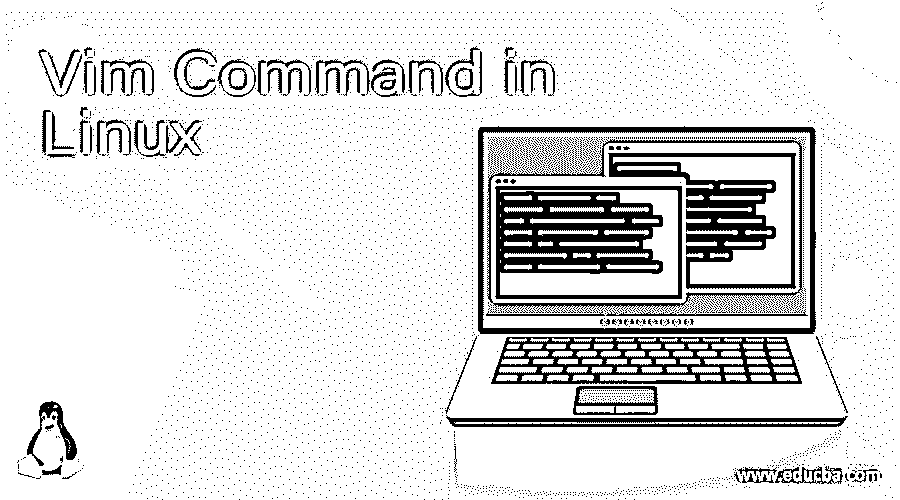
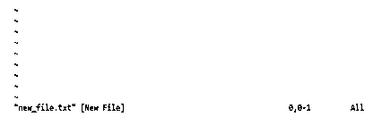
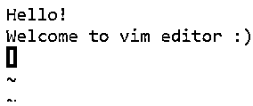
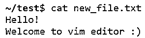

# Linux 中的 Vim 命令

> 原文：<https://www.educba.com/vim-command-in-linux/>

## Linux 中 Vim 命令的定义

Vim 是一个文本编辑器，是 Vi 编辑器的升级版本，与 Vi 更加兼容。vi 编辑器的最大用途是创建一个新文件，编辑一个现有的文件，或者只是读取一个文件。Vim 编辑器在编辑不同种类的纯文本时更有用。这个命令更多的是用在编辑程序中。

Vi editor 有许多升级功能，比如一次可以打开多个窗口、多级撤销选项和缓冲区、语法高亮、文件名完成、命令行编辑、在线帮助等等。

<small>网页开发、编程语言、软件测试&其他</small>

### Vim 命令在 Linux 中是如何工作的？

**vim 编辑器中的操作模式:**

*   **命令模式:**默认情况下，vim 编辑器一启动，命令模式就打开。此命令模式帮助用户复制、粘贴、删除或移动文本。在其他模式下，我们应该按[Esc]键进入命令模式。
*   **插入模式:**每当我们试图打开 vim 编辑器时，它都会默认进入命令模式。要在文件中写入内容，我们必须进入插入模式。按“I”进入插入模式。如果我们想回到命令模式，按[Esc]键。

**语法:**

vim 编辑器的语法如下所示:

`vim filename`

您可以通过发出如下“help”命令来检查 Linux 中 vim 可用的选项:

`vim –help`

**Vim 命令用法:**

`usage: vim [arguments] [file ..]       edit specified file(s)
or: vim [arguments] -               read text from stdin
or: vim [arguments] -t tag          edit file where tag is defined
or: vim [arguments] -q [errorfile]  edit file with first error`

**Vim 命令中可用的选项:**

—仅在此之后的文件名

-g 使用 GUI 运行(如“gvim”)

-f 或–no fork 前台:启动 GUI 时不要分叉

-v Vi 模式(类似于“Vi”)

-e Ex 模式(如“Ex”)

-E 改进的 Ex 模式

-s 静默(批处理)模式(仅适用于“ex”)

-d 差分模式(如“vimdiff”)

-y 简易模式(如“evim”，无模式)

-R 只读模式(类似于“视图”)

-Z 受限模式(如“rvim”)

-m 不允许修改(写文件)

-M 不允许修改文本

-b 二进制模式

-l Lisp 模式

-C 与 Vi 兼容:“兼容”

-N 不完全兼容 Vi:“不兼容”

-V[N][fname]详细[N 级][将消息记录到 fname]

-D 调试模式

-n 没有交换文件，仅使用内存

-r 列出交换文件并退出

-r(带文件名)恢复崩溃的会话

-L 和-r 一样

-以阿拉伯语模式开始

-H 以希伯来语模式开始

-F 以波斯语模式启动

-T <terminal>将端子类型设置为<terminal></terminal></terminal>

-c <command></command>加载第一个文件后执行<command></command>

-S <session>源文件<session>加载第一个文件后</session></session>

-s <scriptin>从文件<scriptin>中读取正常模式命令</scriptin></scriptin>

-w <scriptout>将所有键入的命令追加到文件</scriptout>

-W <scriptout>将所有键入的命令写入文件</scriptout>

-x 编辑加密文件

-X 不要连接到 X 服务器

–干净“不兼容”，Vim 默认值，无插件，无 viminfo

-h 或–Help 打印帮助(此消息)并退出

–版本打印版本信息并退出

### Linux 中使用的 Vim 命令示例

**步骤 1:** 创建新文件:要创建新文件，可以使用下面的语法:

**语法:**

`vim filename.txt`

**举例:**

`vim new_file.txt`

**命令模式:**下图是 vi 编辑器处于命令模式时的截图。

**步骤 2:** 进入插入模式:要从命令模式切换到插入模式，请按键盘上的‘I’。在编辑器的底部，你可以看到‘INSERT’的写法如下所示:

**第三步:**写入内容:一旦编辑器处于插入模式，就可以开始在文件中写入内容了。

**第四步:**保存文件并退出编辑器:要保存文件并退出编辑器，可以按[Esc]键和':wq '。

**语法:**

`[Esc] + :wq`

**举例:**

**第五步:**检查数据是否创建成功:要查看文件中的内容，可以使用 unix 中的 cat 命令。

**语法:**

`cat filename.txt`

**举例:**

`cat new_file.txt`

### Linux 中使用的基本 Vim 命令

下面是 Linux 中使用的几个命令，它们将帮助打开或关闭文档以及保存文件。编辑器中使用的基本 vim 命令有:

*   shift+:e[文件]–打开您想要打开的[文件]。这里[文件]是您要打开的文件名。
*   ESC+:w–保存文件，但不退出。
*   Esc + :q！–退出文件，而不先保存您正在处理的文件。
*   ESC+:wq–保存文件并退出 vim。

### Vim 中的快捷命令

vim 编辑器中有一些快捷命令可以将光标从上次结束的位置移开。为了便于移动光标，下面是其中的几个:

*   h-向左移动光标
*   l-向右移动光标
*   将光标向上移动一行
*   H-将光标移动到屏幕的开头
*   移动光标到屏幕的中间
*   L-将光标移动到屏幕底部
*   j-将光标向下移动一行
*   移动光标到一个单词的末尾
*   将光标移动到一个单词的末尾
*   将光标移动到下一个单词的开头
*   gg-将光标移动到文件的开头
*   G-将光标移动到文件的末尾

### 结论

在 Unix Shell 脚本中，VIM 编辑器是使用最多且非常有用的文本编辑器之一。它是安装在 Unix 操作系统中的默认编辑器。vim 编辑器的最大用途是创建一个新文件，编辑一个现有的文件或者只是读取一个文件。这个编辑器默认存在于所有 Linux 或 Unix 操作系统中。vim 编辑器的最大用途是创建一个新文件，编辑一个现有的文件或者只是读取一个文件。该编辑器界面友好，使用起来非常灵活。因此，用户更喜欢根据自己的需要使用这个编辑器。

### 推荐文章

这是 Linux 中 Vim 命令的指南。在这里，我们还将讨论 Linux 中 Vim 命令的定义和工作原理。以及不同的示例、代码实现和 Linux 中使用的基本 Vim 命令。您也可以看看以下文章，了解更多信息–

1.  [Linux 加入](https://www.educba.com/linux-join/)
2.  [Kali Linux 命令](https://www.educba.com/kali-linux-commands/)
3.  [Linux 过滤命令](https://www.educba.com/linux-filter-commands/)
4.  [Linux 分割命令](https://www.educba.com/linux-split-command/)

