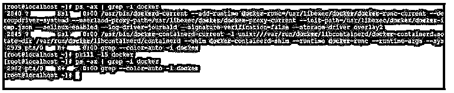
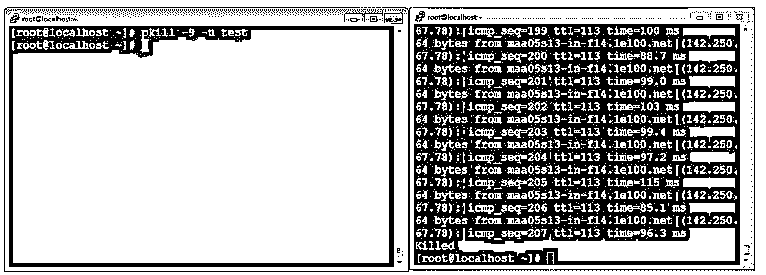
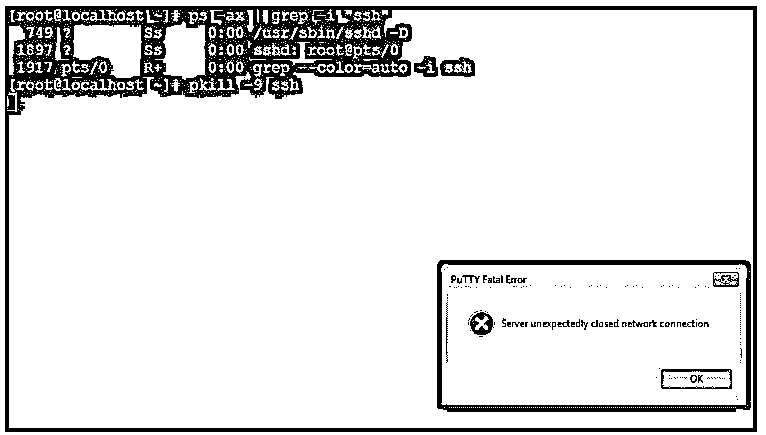

# Linux pkill

> 原文：<https://www.educba.com/linux-pkill/>

## Linux pkill 简介

在 Linux 操作系统中，pkill 用于终止环境中当前或正在运行的进程。根据特定的标准，pkill 命令行实用程序将单个消息发送到正在运行的进程。在 pkill 命令中，我们可以用各种方式定义进程，如进程的全名、进程将从哪个用户运行(用户名)、部分进程名、其他属性等。

最初，pkill 命令是为 Solaris 7 操作系统编写的。它写于 1998 年。pkill 命令行实用程序允许尝试使用扩展的正则表达式模式。pkill 命令行实用程序是由 Kjetil Torgrim Homme 编写的。

<small>网页开发、编程语言、软件测试&其他</small>

**pkill 命令的语法:**

`pkill [options] pattern`

*   **pkill:** 我们可以在语法或命令中使用“pkill”关键字。它需要不同的参数，比如选项和模式。根据所提供的参数，它将把这些信号发送给环境中正在运行的进程，并对其执行必要的操作。
*   **选项:**我们可以提供不同的标志作为与“pkill”命令兼容的选项。
*   **模式:**在扩展正则表达式或语言的帮助下，我们可以创建模式并在同一个 pkill 命令中使用它。

### Linux pkill 命令是如何工作的？

在 Linux 操作系统中，我们有多种选择来终止正在运行的进程。pkill 命令就是其中之一。pkill 命令将处理选项和模式这两种不同的参数。我们可以提供与“pkill”命令兼容的不同选项。例如，在模式中，我们可以在其中使用扩展的正则表达式。根据输入，pkill 命令将终止环境中正在运行的进程。

**Note:** While working with pkill command, it is recommended to the first list out the commands and make sure that the process is needed to kill or not. Once we have confirmation, then only kill the process.

以下是与 pkill 命令兼容的选项列表。

| **服务请求编号** | **选项** | **描述** |
| One | - <sig>，–信号</sig> | 它用于根据名称的编号发送信号。 |
| Two | -e-回声 | 它用来显示什么被杀死了。 |
| Three | -c，–计数 | 这将有助于统计匹配过程。 |
| Four | -f，–满 | 它用于匹配完整的进程名。 |
| Five | -g，–p group | 它用于在组 id 的帮助下匹配进程列表。 |
| Six | -G，–组 | 这将有助于匹配真实的组 id。 |
| Seven | -n，–最新 | 它用于识别或选择最近启动的。 |
| Eight | 最老的 | 它用于识别或选择最后或旧的流程。 |
| Nine | -P，–父级 | 这将有助于只匹配给定父进程名称的子进程。 |
| Ten | -s，–会话 | 这将有助于匹配会话 id。 |
| Eleven | -t，–端子 | 控制终端会有助于匹配。 |
| Twelve | -u，–euid | 这将有助于通过有效的身份证进行匹配。 |
| Thirteen | -U，–uid | 这将有助于通过真实 id 进行匹配。 |
| Fourteen | -x，–精确 | 这将有助于与命令名完全匹配。 |
| Fifteen | -F, –pidfile | 它用于从输入文件中读取 PID。 |
| Sixteen | -L，–logpid file | 如果 PID 文件未被锁定，它将失败。 |
| Seventeen | 救命啊 | 它将打印 pkill 命令的帮助信息并退出。 |
| Eighteen | -V，-版本 | 它将显示 pkill 命令的版本信息并退出。 |

### Linux pkill 的例子

下面给出了 Linux pkill 的例子:

#### 示例#1

pkill 命令–正常停止。

在 pkill 命令中，我们有多个选项来终止或停止 Linux 环境中的任何进程。根据需求，我们可以优雅地停止正在运行的进程。为了正常停止进程，我们需要在 pkill 命令中使用数字“15”。

**代码:**

`pkill -15 docker`

**说明:**

*   按照上面的命令，我们将整数值“15”用于 docker 进程的正常停止。因此，它将从环境中停止所有 docker 运行进程。

**输出:**

**

** 

#### 实施例 2

pkill 命令–带有完整的参数列表。

在 pkill 命令中，它只接受进程名。但是在“-f”选项的帮助下，它将考虑完整的参数列表。

**代号** **:**

`pkill -9 -f "ping google.com"`

**说明:**

*   我们已经确定 ping 命令处于运行状态。因此，在命令名的帮助下，我们可以杀死“ping”进程。

**输出:**

#### 实施例 3

pkill 命令–终止使用特定用户运行的进程。

在 pkill 命令中，我们可以终止使用特定用户名运行的进程。

**代码:**

`pkill -9 -u test`

**说明:**

*   在上面的 pkill 命令中，我们终止了由不同用户(即“测试”用户)启动的进程。
*   在第二个屏幕截图中，我们删除了 ping 命令，但是模式名为“test”(用户名)。一旦我们终止了用户名为“test user”的进程，所有正在运行的进程都会终止那些由“test”用户发起的进程。

**输出:**

#### 实施例 4

pkill 命令–终止进程。

在 Linux 环境中，我们有终止正在运行的进程的功能。因此，我们需要在 pkill 命令中使用整数值“9”。

**代码:**

`pkill -9 ssh`

**说明:**

*   按照上面的命令，我们直接终止了“ssh”服务。所以会直接杀死“ssh”所有正在运行的进程。

**输出:**

### 结论

我们已经看到了“Linux pkill 命令”的完整概念，以及正确的示例、解释和具有不同输出的命令。pkill 命令将向正在运行的进程发送信号，并帮助终止具有特定模式的进程。在 pkill 命令的帮助下，pgrep 正在运行的服务，然后只终止必要的服务，这一点很重要。

### 推荐文章

这是一个 Linux pkill 的指南。这里我们讨论一下简介，Linux 的 pkill 命令是如何工作的？和示例。您也可以看看以下文章，了解更多信息–

1.  [Linux Zcat](https://www.educba.com/linux-zcat/)
2.  [Linux 睡眠](https://www.educba.com/linux-sleep/)
3.  [Linux 读取](https://www.educba.com/linux-read/)
4.  [Linux 用户](https://www.educba.com/linux-users/)

