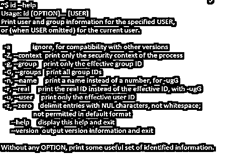

# Linux id

> 原文：<https://www.educba.com/linux-id/>

## Linux id 简介

id 是 Linux 中的一个命令行实用工具，用于找出用户名和组名以及当前用户或服务器中任何其他用户的真实 id。

它还为我们提供了用户所在组的列表，并在与命令的不同可用选项一起使用时显示当前用户的安全上下文。这主要用于服务器中的用户管理。它是打印真实有效的 UID(用户 ID)和 GID(组 ID)的命令。一个组中的多个 UID 称为 GID。

<small>网页开发、编程语言、软件测试&其他</small>

### Linux 中 id 命令的优势

Id 命令用于查找用户和组的详细信息。下面是在 Linux 中使用 id 命令的几个更有用的选项。

*   找出系统中的用户名和真实用户 id。
*   获取指定的用户 id UID。
*   获取用户的 UID 和组 ID 的所有详细信息。
*   列出用户所属的所有组。
*   显示当前用户的安全流程。
*   它还有助于找出 Linux 用户组和有效的组 id (GID)。

### id 命令的语法

id 命令的语法如下所示:

`id [options] [user]`

**用法:**

`id
id [username] id [options] id [options] [username]`

**注意:**当我们使用 id 命令而不附带任何选项时，它将打印每个用户指定的信息。

### id 命令在 Linux 中是如何工作的？

下面是我们可以在 Linux 中与 id 命令一起使用的选项，以便获得所需的与用户相关的详细信息。

| **选项** | **描述** |
| ［构成动植物的古名或拉丁化的现代名］ | 忽略与我们系统中其他版本的兼容性。 |
| -Z，–上下文 | 显示流程的安全性文本。 |
| -g，–组 | 要显示有效的组 ID |
| -G，–组 | 显示所有组 id。 |
| -n，-名称 | 要显示名称而不是数字，请使用-ugG |
| -真的吗 | 要显示真实 ID 而不是有效 ID，请使用-ugG |
| -u，–用户 | 只显示有效的用户 ID |
| -z，-零 | 删除含有 NUL 字符的条目，而不是空格。默认格式中不允许 |
| 救命 | 要打印此帮助并退出 |
| –版本 | 显示输出版本信息并退出 |

### Linux 中 id 命令的例子

以下是 id 命令及其选项的示例。

#### 1.选项 id

当我们在 Linux 中只键入 id 命令时，它会提供当前登录用户的详细信息，即用户 id 和组 id 以及用户所在组的列表。

**命令:**

`id`

**输出:**

#### 2.选项用户名

当我们在 Linux 中对任何用户名使用 id 命令时，它会提供用户指定的详细信息。

**语法:**

`id username`

**命令:**

`id user`

**输出:**

#### 3.选项–u

为了只显示用户的用户 id，我们可以使用 id 命令和选项 u。

**语法:**

`id -u username`

**命令:**

`id -u master`

**输出:**

#### 4.选项–g

为了只显示用户的组 id，我们可以使用 id 命令和选项 g

**语法:**

`id -g username`

**命令:**

`id -g master`

**输出:**

#### 5.选项–G

要显示用户所在的所有组的 id，我们可以使用 id 命令和选项 g。

**语法:**

`id -G username`

**命令:**

`id -G himanshu`

**输出:**

#### 6.选项–n

要显示用户名和他所在的所有组的名称，我们可以将 id 命令与选项 n 和选项 u/G/g 一起使用。

**语法:**

`id –nu username/id –ng username/id –nG username`

**命令:**

`id -nG master`

注意:这些命令给出用户或组的名称，而不是 id。

**输出:**

#### 7.选项–r

显示用户的真实身份。该选项可与选项 u/g/G 一起使用。

**语法:**

`id –ru username/id –rg username/id –rG username`

**命令:**

`id -r -G master`

**输出:**

#### 8.选项–Z

要显示用户的安全上下文，我们可以使用 id 命令和选项–z。

**语法:**

`id -Z username`

**命令:**

`id -Z master`

注意:只有在 SELinux 被启用的情况下才有效；，它会给出错误消息。

**输出:**

#### 9.选项–z

当 id 命令与此选项一起使用时，它会用空字符而不是空格来分隔输出字符。

**语法:**

`id -z username`

**命令:**

`id -z user`

**输出:**

#### 10.选项–帮助

要显示 id 命令的可用选项列表及其语法，我们可以使用此选项–help。

**语法:**

`id --help`

**命令:**

`id --help`

**输出:**

#### 11.选项–版本

显示版本和其他信息

**命令:**

`id --version`

**输出:**

#### 12.选项-un

这个选项将允许我们打印姓名而不是号码。我们可以将这个选项与-u 或-G 或-g 结合使用。

**命令:**

`id -un`

**输出:**

#### 13.选项 a

id 命令中的该选项有助于打印用户所属组的用户名和 UID。

**命令:**

`id -a`

**输出:**

### 结论

id 命令在 Linux 中非常容易理解和使用。但是，与 id 命令相关的选项非常有限，上面的示例中解释了其中的大部分。

id 命令主要用于了解登录到服务器上的任何用户的基本信息。当我们指定用户名时，它给出了指定用户的详细信息；否则，它会提供当前登录用户的详细信息。id 是 Linux 中的一个命令行实用工具，用于找出用户名和组名以及当前用户或服务器中任何其他用户的真实 id。它还为我们提供了用户所在组的列表，并在与命令的不同可用选项一起使用时显示当前用户的安全上下文。这主要用于服务器中的用户管理。

### 推荐文章

这是一个 Linux id 的指南。这里我们讨论 id 命令在 Linux 中是如何工作的，以及它的优点和例子。您也可以看看以下文章，了解更多信息–

1.  [Linux More 命令](https://www.educba.com/linux-more-command/)
2.  [Linux 过滤命令](https://www.educba.com/linux-filter-commands/)
3.  [Linux 自由命令](https://www.educba.com/linux-free-command/)
4.  [Linux tac](https://www.educba.com/linux-tac/)

