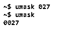
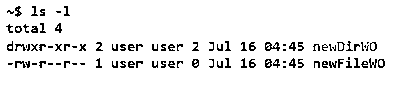
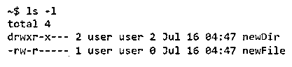

# Linux Umask

> 原文：<https://www.educba.com/linux-umask/>

## Linux Umask 简介

UMASK 是用户掩码的缩写，有时也称为用户文件创建掩码。在 Linux 中，有许多情况下，人们需要根据用例需求创建文件或目录。在这样做的时候，需要确保新创建的文件或目录的权限应该符合用例场景。现在，假设一个 Linux 系统用于开发只适合一种场景处理的应用程序。在这种情况下，通常需要更改新建文件或文件夹的基本权限或默认权限。UMASK 是一个很方便的命令，它可以将默认权限设置为在 Linux 环境下开发的大多数应用程序通常都具有的权限。

### 句法

在我们开始了解 umask 将有助于什么场景或 umask 的工作原理是什么之前，了解 umask 背后的语法是有益的，这样在了解工作原理时，我们可以记住语法。

<small>网页开发、编程语言、软件测试&其他</small>

#### 语法#1

`umask <1st number><2nd number><3rd number>`

这里，umask 是实例化 umask 动作的关键字或命令。<1 st 号>是给车主的号< 2 nd 号>是给组< 3 rd 号>是给其他人的号。现在，这些数字是根据我们对每个目标受众的八进制记数法来判定的。八进制数字从 0 到 7 不等，每个数字代表特定的权限。这些数字与您期望看到的文件权限数字不同。原因是有一个计算发生，以获得许可。因此，下面列出的数字将用于获得所需的权限，下面列出的数字不一定表示权限列表。不同的场景(对于目录)是:

0:读写并执行

1:读写

2:读取并执行

3:只读

4:编写和执行

5:只写

6:仅执行

7:不允许

如果您回忆一下以前对文件权限的理解，您会发现这些数字与实际的文件权限数字正好相反。原因就是我们要讲的计算。使用 umask 中的数字，您会看到文件或目录的权限是您期望的文本，而不是上面列出的数字。因此，例如，在计算之后，如果 umask 是 1 st number 是 0，那么在计算之后，你将得到 7 或 6 作为 1 st number，并且这正是分别用于读取、写入和执行文件或目录的数字。

#### 语法#2

`umask u=rwx, g=, o=`

这里 umask 是同一个关键词，u 指用户，g 指群体，o 指其他。字母 r 表示读，w 表示写，x 表示执行。这里也有一个计算过程，它将得到实际的文件权限。

### Umask 在 Linux 中是如何工作的？

为了理解 umask 在 Linux 中是如何工作的，更重要的是要注意一些重要的参数，这些参数成为获得文件权限的基础。默认情况下，文件的基本权限是 666，目录是 777。7 号不存在，6 号在文件**的情况下会有无权限的动作。**这是因为 Linux 不允许创建具有执行权限的文件，这是一条经验法则，用户需要在文件创建后单独创建文件！

接下来的事情是我们如何以及在哪里改变 umask 的价值。这需要在~/中更改。bashrc 文件。~/.bashrc 允许您为终端会话设置参数、属性或配置。如果您只需要更改当前会话的 umask，您需要将其作为命令行输入。

`umask 027
umask`

**输出:**

一旦设置了 umask 值，这些值将尝试用作 NOT 运算符来计算文件权限。如前所述，文件的默认基本权限是 666。目录是 777；让我们看两个不同的计算(对于文件和目录)来理解我们如何从 umask 代码中得到许可数。

**场景:**进入一个目录，只有用户可以读写；群组只能进入目录阅读&其他人没有权限(umask 027)

#### 获取文件权限

目的是从基本权限中减去 umask 号，以获得实际的文件权限。例如，如果 umask 是 027 [0(用户的读写权限)、2(组的只读权限)、7(其他人没有权限)]，则计算如下:

**基本权限:** 666

umask: 027

**文件权限:**666–027 = 640 *(rw-r ——)

*请注意，6–7 是-1，但在 Linux 中，调整为 0。

#### 获取目录权限

目的是从基本权限中减去 umask 号，以获得实际的文件权限。例如，如果 umask 是 022 [0(用户的读、写和执行)，2(组和其他用户的读和执行)]，则计算如下:

**基本权限:** 777

umask: 027

**文件权限:**777–022 = 750(rwxr-x—)

在上面的场景中，用户可以在一个目录中读取、写入和执行，也可以在其中的一个文件中读取和写入。

组可以读取和执行目录，但只能读取其中的文件。

其他人什么也不能做，即没有许可。

##### 没有 umask

**代码:**

`mkdir new DirWO
touch new FileWO
ls -l`

**输出:**

##### 使用 umask

**代码:**

`umask 027
mkdir newDir
touch new File
ls -l`

**输出:**

一个有用的提示:试着先理解基本场景，然后留意数字形式的许可。然后从基本权限中减去它，得到 umask 数。

### 结论

在本文中，我们已经了解了如何使用基于场景的编号来理解默认的 umask 编号，然后根据这一点，我们在 bashrc 中设置 umask，或者仅根据需要为该终端设置 umask。

### 推荐文章

这是一个 Linux Umask 的指南。这里我们讨论 Umask 如何在 Linux 和掩码中工作，以及没有掩码代码和输出的情况。您也可以看看以下文章，了解更多信息–

1.  [Linux 网络命令](https://www.educba.com/linux-network-command/)
2.  [Linux 别名命令](https://www.educba.com/linux-alias-command/)
3.  [Linux rm 命令](https://www.educba.com/linux-rm-command/)
4.  [Linux tr 命令](https://www.educba.com/linux-tr-command/)

