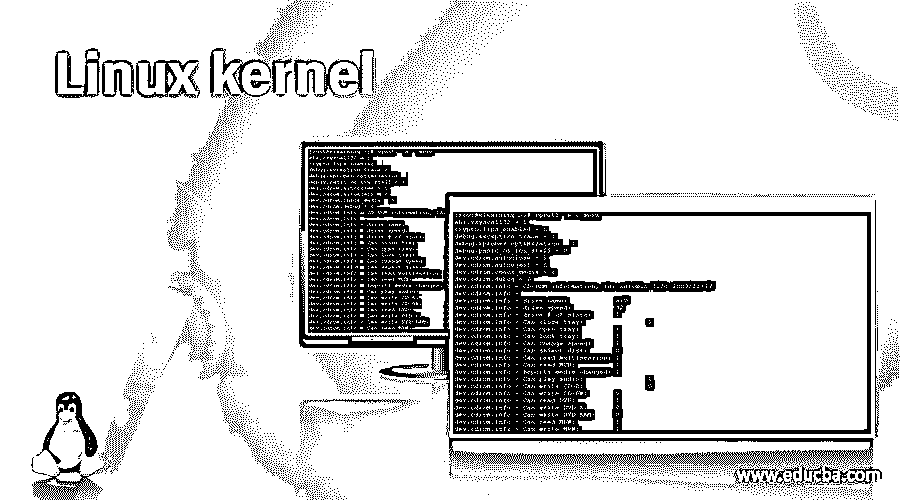
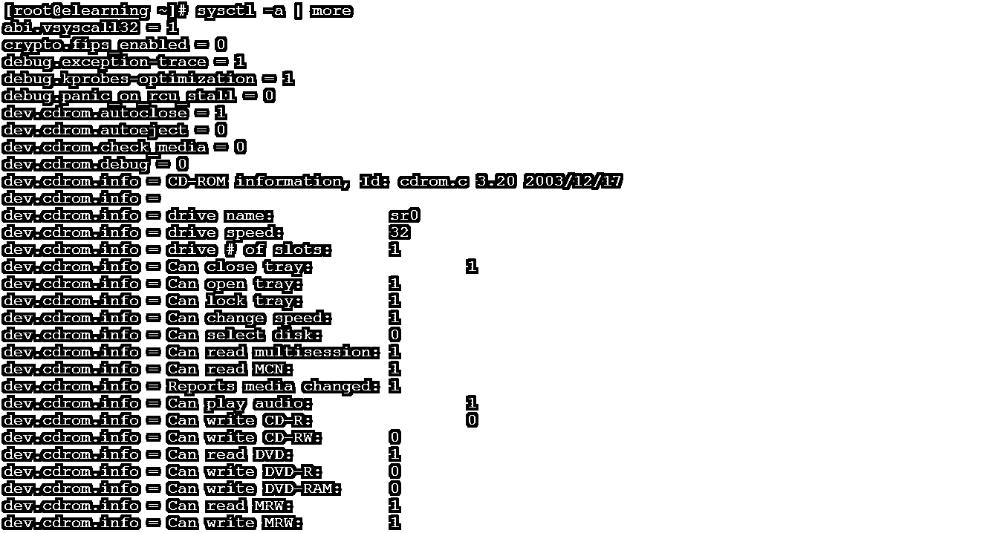

# Linux 内核

> 原文：<https://www.educba.com/linux-kernel/>

## Linux 内核介绍

在 Linux 操作系统中，内核是非常重要的一部分。换句话说，我们可以说它是操作系统的心脏。Linux 内核是计算机硬件和应用程序或软件或进程之间的接口。Linux 内核由 worldwide 开发。它是开源的，即不需要为它支付任何费用。所以，我们可以拿 Linux 内核来说。然后，根据需要，我们可以对它进行修改，使 Linux 操作系统符合自己的要求。

1991 年，Linus Torvalds 开发了第一个 Linux 内核。

<small>网页开发、编程语言、软件测试&其他</small>

### Linux 内核是什么？

Linux 内核充当硬件级和应用程序级之间的桥梁。当我们从任何应用程序获得任何输出时。唯一的应用没有到位。它是硬件(使用键盘或鼠标作为应用程序的输入)和应用程序(处理输入数据)的组合。在这里，内核起着至关重要的作用。

### Linux 内核是做什么的？

就 Linux 内核而言，它执行 4 个主要任务，如内存管理、进程管理、设备驱动程序、系统调用和安全性。

*   内存管理:这将有助于在内存管理方面保持适当的跟踪。它将记录使用了多少内存，有多少可用内存，以及内存在哪里。
*   进程管理:它保持对中央处理器的正确跟踪。它将确定哪个应用程序或哪个进程正在使用 CPU。何时使用以及该过程持续了多长时间
*   设备驱动程序:它充当硬件级和进程或应用程序级之间的桥梁。
*   系统调用和安全性:这是内核的一个非常重要的特性。它将接收来自不同应用程序或进程的服务请求。

内核，如果 Linux 内核实现正确，那么它对普通用户或环境可用用户是不可见的。内核将在它自己的小空间里工作。已知的最小空间称为内核空间。在这里，内核将分配内存并跟踪一切。在系统调用接口的帮助下，应用程序正在与内核交互。

#### 1.整体内核

单片内核广泛应用于操作系统中。单片内核架构将动态加载和卸载操作系统的各种模块。在单片体系结构中，它将允许简单的扩展并扩展操作系统的能力。对单片内核进行维护是很容易的。由于所涉及的模块，这是容易的，即装载和卸载模块是非常容易的。如果任何模块中有任何错误，都很容易修复。

#### 2.微核内核

微核内核也被认为是单片内核的替代品。在单片内核中，主要问题是庞大的内核代码。哪个单片内核没有做到这一点？但是微内核体系结构允许基本的服务，如设备驱动程序管理、协议栈、文件系统等。，在用户空间中运行。因此，它将提高操作系统的生产率，提高安全性，减少代码，并确保环境的稳定性。

这将有助于限制损害或受影响的区域。没有任何中断，它会让系统的其余部分正常运行。微内核体系结构中的程序可以使用操作系统的所有基本服务。它将在 IPC(进程间通信)中。它将有助于或允许硬件和设备驱动程序之间的直接通信。

#### 3.混合核

混合内核将决定在用户模式下运行什么，在管理员模式下运行什么。文件系统 I/O(设备驱动程序)将在用户模式下运行，服务器调用(IPC)将在管理员模式下运行。混合内核将提供两个世界的最佳体验。

### Linux 内核的例子

下面提到了不同的例子:

#### 示例 1–查看 Linux 内核参数

查看内核参数有不同的方式。例如，在这里，我们看到的是系统启动时的内核参数。因此，我们可以在系统启动时传递不同的参数。

**命令:**

`cat /proc/cmdline`

**说明:**

按照下面的命令输出，在引导 Linux 操作系统时，有不同的参数传递给 Linux 内核。我们在引导 Linux 操作系统时使用了不同的参数，比如引导镜像是“/vmlinuz-3 . 10 . 0-1127 . 18 . 2 . el7 . x86 _ 64”，硬盘 UUID 是“UUID = 247 f 01 ab-5f 39-4 ac9-be71-098 e 94 ba 3 b 8 f”，语言是“英语印度(en_IN。UTF-8)”等。

**输出:**

#### 示例 2–显示 Linux 内核参数

在 Linux 环境中，有不同的参数可用于 Linux 内核。根据需求，我们可以使用这些参数并在环境中使用它们。

**命令:**

`sysctl -a | more`

**说明:**

按照上面的命令，我们列出了内核参数选项的数量。因此，它将显示所有内核选项及其参数的列表。

**输出:**

#### 示例 3–修改 Linux 内核参数

在 Linux 生态系统中，我们可以添加或修改现有的 Linux 内核属性。根据生态系统或应用程序的要求，我们可以更改 Linux 内核参数。

**命令:**

`vim /etc/sysctl.d/my-security.conf
insert value
{ ## Reboot the machine soon after a kernel panic
kernel.panic=5 }
sysctl -p`

**说明:**

按照上面的命令，我们在“/etc/sysctl.d/my-security.conf”文件中添加了自己的内核条目。所以一旦参数添加到文件中。接下来，我们需要借助“sysctl -p”命令重新加载系统 ctl 设置。

**输出:**

### 结论

我们已经看到了“Linux 内核”的未删节概念，以及带有不同输出的正确解释和命令。它是操作系统的核心。它充当硬件和软件前端之间的桥梁。

### 推荐文章

这是一个 Linux 内核的指南。这里我们已经讨论了 Linux 内核的概念，并给出了示例、解释和命令输出。您也可以看看以下文章，了解更多信息–

1.  [Linux 列表组](https://www.educba.com/linux-list-groups/)
2.  [Linux WC](https://www.educba.com/linux-wc/)
3.  [Linux tracepath](https://www.educba.com/linux-tracepath/)
4.  [Linux comm](https://www.educba.com/linux-comm/)

