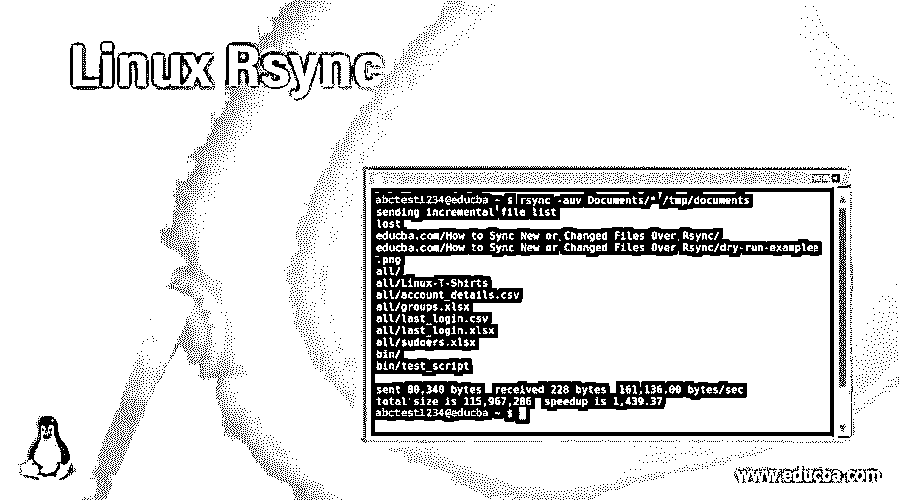
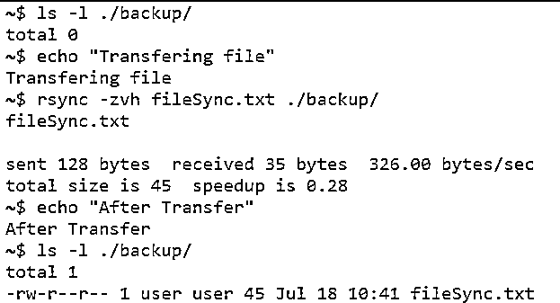
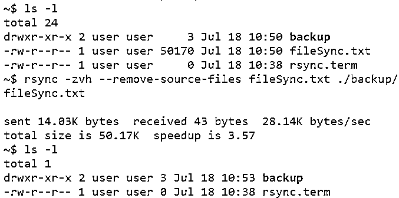

# Linux Rsync

> 原文：<https://www.educba.com/linux-rsync/>

## Linux Rsync 简介

Rsync 是命令行中的一个实用程序，它使用户能够在整个连接网络中的计算机和外部硬盘之间高效地传输和同步文件。这个工具是通过比较修改时间和文件大小来实现的。这个同步实用程序是用 C 语言编写的，该应用程序作为单线程应用程序执行。当有人谈到 rsync 时，你会经常听到的另一个术语是，这个实用程序是一种 delta 编码。增量编码本质上是一种将数据存储或传输为文件差异的方式，或者换句话说，是一种顺序数据的方式。该实用程序需要在用户和主机之间设置，一旦设置了同步，该实用程序将自己确定需要在用户和主机之间传输的本地文件部分，以保持同步。在这个主题中，我们将学习 Linux Rsync。

**语法**

<small>网页开发、编程语言、软件测试&其他</small>

在我们开始理解 rsync 将有助于什么场景或 rsync 的工作原理之前，理解 rsync 背后的语法是有益的。然后，在浏览工作原理时，我们可以记住语法。

`rsync [-OPTION1] [-OPTION 2] [-OPTION 3] … [-OPTION n]SOURCE  [USERNAME@]HOST:DESTINATION`

**或**

`rsync [-OPTION1] [-OPTION 2] [-OPTION 3] … [-OPTION n][USERNAME@]HOST:SOURCE [DESTINATION]`

上述语法的使用完全取决于开发人员的舒适程度和信心。因此，使用任何一种语法都不会有什么好处。如果您仔细观察，就会发现区别仅在于源地址的提及方式，每个人对使用哪一个地址都有自己的信心，因此效用也相应不同。

这里，SOURCE 是文件或目录将被复制的地方，DESTINATION 是文件和目录被复制到的地方。现在，这两个参数或自变量是强制的，而方括号“[]”中的参数或自变量是可选的，可以根据正在开发的功能的需求来使用。接下来，我们将讨论当今行业中广泛使用的大多数选项。

### rsync 在 Linux 中是如何工作的？

在简介中，我们已经了解到 rsync 是一个命令行实用程序，有助于同步网络中的 Unix 客户端。在将一个系统中的文件备份到仅用于备份文件的另一个系统的情况下，该实用程序非常方便。Rsync 实用程序还能够以守护模式运行，这种模式允许应用程序在后台运行，而不是在用户的主动控制下运行。守护进程模式超出了本文的范围，但有趣的是，语法如下所示:rsync://

从这里开始，我们将逐个查看我们在语法中谈到的不同选项，并且我们将尝试为每个选项或选项的组合附带一个代码片段以及与其对应的预期输出！

| **选项** | **会用在什么地方？** |
| -v，–详细 | 如果用户想知道计算机在执行命令时到底在做什么，就使用这个选项。 |
| -q-安静 | 如果用户不需要输出消息，该选项可用于抑制输出。 |
| -一个…-存档 | 该选项可用于在进行同步时归档文件。 |
| -r，–递归 | 对于递归同步文件和目录，可以使用此选项。 |
| -b-后援 | 在进行同步时，如果需要备份文件或增量，即使通信中断，也可以最大限度地减少数据泄漏。 |
| -u，–更新 | 如果用户不希望目标位置的文件比源位置的文件更新，那么这个选项可以用来成功地实现这个用例。 |
| -l，–链接 | 此选项用于符号链接(符号链接)只作为符号链接复制的情况。 |
| -n，–试运行 | 当我们需要在没有实际同步的情况下进行试运行时，可以使用这个选项。这样做是为了让我们理解我们试图解决的用例，以及实现的解决方案是否真正迎合了问题。 |
| -e，–rsh =命令 | 当使用此选项时，备用远程 shell 程序用于远程和本地副本之间的通信。 |
| -z，–压缩 | 为了最大限度地减少同步过程中的数据消耗，此选项可用于压缩正在发送的文件。 |
| -h，–人类可读 | 为了以人类可读的格式显示输出以便解释，使用了这个选项。 |
| –进步 | 当同步的进度需要显示为输出时，这个选项非常方便！ |
| –移除源文件 | 在某些情况下，用户可能希望在源位置删除文件，这样就不会有重复的文件，并且可以优化空间。这是获得该实用程序的选项！ |

### Linux Rsync 的例子

下面给出了 Linux Rsync 的例子:

#### 示例#1

文件的本地拷贝或同步

**代码:**

`mkdir backup
ls -l ./backup/
rsync -zvh fileSync.txt ./backup/
ls -l ./backup/`

**输出:**

在这个场景中，我们利用了上面列出的选项组合，在 rsync 执行期间产生了一个详细的(-v)输出。在突出显示的版本中，输出被更改为更易于阅读的格式(-h)。此外，在传输过程中，文本文件被压缩(-z)，以便数据传输可以优化到最大。

#### 实施例 2

文件的本地复制或同步&删除源文件

**代码:**

`ls -l
rsync -zvh--remove-source-files fileSync.txt ./backup/
ls -l`

**输出:**

在的情况下，我们看到 fileSync.txt 存在于初始实例的工作目录中。同步完成后，当我们执行 ls 命令时，我们会看到文件已从该位置移动到命令中指定的新位置，即 Backup。

### 结论

在本文中，我们介绍了通过使用 rsync 可以实现的各种选项。在不同 IP 上执行 rsync 的情况下，只需额外添加用户和系统的 IP 地址即可完成该实用程序。

### 推荐文章

这是一个 Linux Rsync 的指南。在这里，我们讨论 rsync 在 Linux 中是如何工作的，并给出了代码和输出。您也可以看看以下文章，了解更多信息–

1.  [Linux 列表组](https://www.educba.com/linux-list-groups/)
2.  [Linux 用户](https://www.educba.com/linux-users/)
3.  [Linux tracepath](https://www.educba.com/linux-tracepath/)
4.  [在 Linux 中创建文件夹](https://www.educba.com/create-folder-in-linux/)

