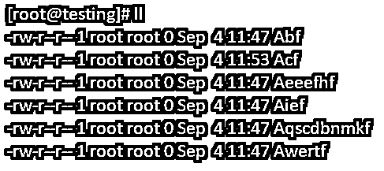
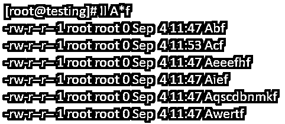
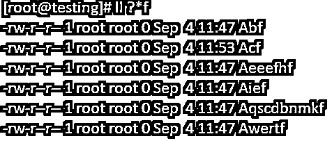
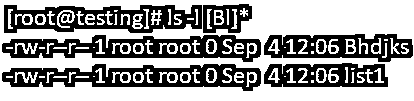
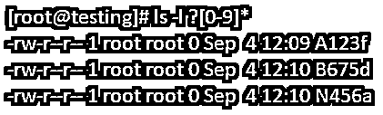
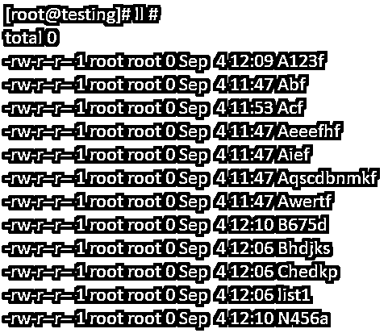

# Linux 通配符

> 原文：<https://www.educba.com/linux-wildcards/>

## Linux 通配符介绍

Linux 中的通配符意味着它可能是代表其他字符的一个符号或一组符号。它通常用于替换任何字符串或字符。在本文中，我们将通过简单的描述和截图来了解 Linux 中可以使用的通配符选项。

**Linux 中使用的通配符语法**

<small>网页开发、编程语言、软件测试&其他</small>

Linux 中的基本通配符集包括以下内容:

*   ***–**该通配符代表所有字符
*   **？–**该通配符代表单个字符
*   **[]–**这个通配符代表一个字符范围。

### Linux 通配符的类型

Linux 中主要有三种类型的通配符。为了更好地理解，下面简要解释了通配符。它们是:

*   **问号通配符“？”**–通配符“？”意味着它将匹配单个字符。比如 S？?n 将匹配以 S 开头，以 n 结尾，中间有两个字符的任何内容。
*   **星形通配符' * '**–通配符' * '表示它将匹配任意数量的字符或一组字符。例如，S**n 将匹配 S 和 n 之间的任何内容。它们之间的字符数不计算在内。
*   **括号值通配符'[]'** :通配符'[]'表示它将匹配方括号中的字符。例如，S[on]n 将只匹配 Son 和 Snn。我们还可以像 S[a-d]n 一样在大括号中指定字符，这将匹配 San，Sbn，Scn，Sdn。

### 通配符在 Linux 中是如何工作的？

通配符主要用于提高 Linux 中搜索的效率和灵活性。它们通常在 shell 命令中使用，以执行用于显示结果的命令。它们也主要用在正则表达式中，以匹配系统中的模式。

下面是可以在 Linux 通配符中使用的选项，用于在 Linux 中查找模式匹配字符串。

| **选项** | **描述** |
| * | 列出所有的文件。 |
| A* | 任何以字母“a”开头的文件 |
| A*txt | 任何以字母“A”开头并以 txt 结尾的文件 |
| 列表？? | 任何以 List 开头后跟 2 个字符的文件。 |
| [abc]* | 以' a '或' b '或' c '开头并以任意数量的字符结尾的任何文件。 |
| [[:upper:]] | 任何以大写字母开头的文件 |
| [![:digit:]]* | 任何不以数字开头的文件 |
| 【a-d】？ | 从 a-d 范围开始，后面紧跟一个字符的任何文件。 |
| 答？?英语字母表中第六个字母 | 任何以字母“A”开头，后跟两个字符并以“f”结尾的文件。 |

### Linux 中通配符的例子

让我们以下面的例子为例，其中有几个文件。我们将以这个例子为例，在 Linux 中使用通配符进行模式匹配。

#### 1.带“？”的选项

当我们将通配符用作“？”时，它将搜索以 S 开头、以 f 结尾的字符以及它们之间的一个字符。

**语法:**

`ll A?f`

**示例:**在这里，我们可以看到以‘A’开头，后跟一个字符，以‘f’结尾的文件被显示出来。

#### 2.带“* .”的选项

通配符' * '表示它将匹配任意数量的字符或一组字符。例如，S**n 将匹配 S 和 n 之间的任何内容。它们之间的字符数不计算在内。

**语法:**

`ll A*f`

**示例:**这里，我们可以在结果中看到，显示了以‘A’开头，以‘f’结尾的文件。这里的“*”可以包含任意数量的字符。

#### 3.带[]的选项

通配符'[]'表示它将匹配方括号中的字符。

**语法:**

`ll A[b-c]f`

**示例:**在这里，我们可以在结果中看到，显示了以‘A’开头，后跟从 b 到 c 的一系列字符，以 f 结尾的文件。

#### 4.所有通配符的组合

当我们试图在 Linux 中搜索任何模式时，可能会有这样一种情况，我们需要组合一个或多个通配符来匹配我们正在搜索的模式。

**语法:**

`ls -l ?*f`

**示例:**这里显示一个字符和任意数量的字符，以 f 为结尾字符显示在结果集中。

#### 5.带通配符的选项

当我们试图在 Linux 中搜索任何模式时，可能会有这样的情况，我们需要组合一个或多个通配符来匹配我们正在搜索的模式。

**语法:**

`ls -l [Bl]*`

**示例:**在结果集中，我们可以看到显示了带有‘B’或‘l’的文件，后跟任意数量的字符。

#### 6.带数字的选项

我们还可以在括号值通配符中使用数值范围来查找模式匹配字符串。

**语法:**

`ls -l ?[0-9]*`

**示例:**我们还可以在括号中的值通配符中使用数值范围来查找模式匹配字符串。这里，结果的开头应该正好是一个字符，后跟一个从 0 到 9 的数字范围。

#### 7.通配符' # '的选项

通配符' # '也类似于通配符' * '，它将显示系统中的所有内容。

**语法:**

`ls -l  #`

**示例:**要显示系统中的所有文件，我们可以使用通配符选项' # '。

### 结论

Linux 中的通配符意味着它可能是代表其他字符的一个符号或一组符号。它通常用于替换任何字符串或字符。通配符主要用于提高 Linux 中搜索的效率和灵活性。它们通常在 shell 命令中使用，以执行用于显示结果的命令。它们也主要用在正则表达式中，以匹配系统中的模式。

我们希望上面的文章能够让您全面了解 Linux 中的通配符命令。

### 推荐文章

这是一个 Linux 通配符指南。这里我们讨论通配符在 Linux 中是如何工作的，并给出了语法示例。您也可以看看以下文章，了解更多信息–

1.  [Linux Zcat](https://www.educba.com/linux-zcat/)
2.  [Linux 用户](https://www.educba.com/linux-users/)
3.  [Linux 挂载命令](https://www.educba.com/linux-mount-command/)
4.  [Linux mdadm](https://www.educba.com/linux-mdadm/)

