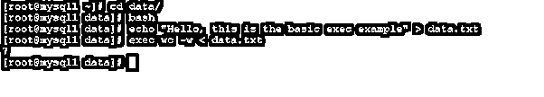

# Exec Linux

> 原文：<https://www.educba.com/exec-linux/>

## Exec Linux 简介

在 Linux 环境中，我们需要在不同的应用程序和作业级别上工作。根据命令，我们需要运行作业或 shell 或 bash 作业的次数。exec 将为 bash 作业发出命令。如果我们多次运行 bash 命令，那么它将在后台创建多个进程。但是如果我们在 exec 命令的帮助下运行 bash 作业，那么它不会在 Linux 环境下创建多个进程。当我们在 Linux exec 实用程序的帮助下作为命令执行 bash 作业时，我们不能返回或调用进程。

**Exec Linux 语法**

<small>网页开发、编程语言、软件测试&其他</small>

`exec [ -cl ] [ -a name ] [ command [ arguments ] ] [ redirection ... ]`

1) exec:我们可以在语法或命令中使用 exec 关键字。它将接受不同的参数，如名称、命令、不同的参数等。根据所提供的输入，exec 将能够将 bash shell 作业转换成特定的命令。该命令在 Linux 环境中可以不同的方式运行。这里，不需要运行 bash 或 shell 作业。我们可以直接运行该命令。它将在环境上运行特定的进程。exec 命令将有助于管理不同的 bash 相关任务或作业。选项:Linux exec 有多种选项可用。我们可以使用不同的选项，如空环境(-cl)、名称、不同的命令、参数等。根据需要，我们可以使用不同的标志作为与 exec 命令兼容的选项。
3)重定向:根据需要，我们可以在 exec 命令中使用不同的重定向选项。

### Exec Linux 如何工作？

在 Linux 环境中，我们有多个应用程序和作业在其上运行。当我们有多个 bash 作业或脚本时。当我们手动运行时，很难管理多个作业。为了避免这种情况，我们需要借助 exec 命令来处理这种情况。这里，我们需要用特定的 bash 值替换特定的命令。这将有助于用特定的命令管理 bash 文件或作业的数量。

下面是可在 exec 命令中使用的选项列表。

1.–p:它将打印 readline 函数和绑定的名称。它将以这样一种方式来定义，即它们可以被重新读取。
2。–l:列出环境
3 中可用的所有 readline 函数名称会有所帮助。–P:它将打印 readline 函数名称和绑定的当前列表。
4。–s:它将打印绑定到宏的 readline 键序列。字符串输出表明它们可以被重新读取。
5。–S:它将显示绑定到宏的 readline 键序列。字符串与输出相关。
6。–v:它将打印 readline 变量名和值的列表，以便它们可以被重新读取。
7。–V:它将显示当前的 readline 变量名和值。
8。-f filename:它将从文件名中读取键绑定。
9。-q function:与查询哪些键调用了函数名有关。
10。-u function:它将解除绑定到命名函数的所有键。
11。-r keyset:它将有助于删除 keyseq 的所有当前绑定。
12。-x keyseq : shell-command:只要 keyseq 被扩展，shell-command 就会被执行。当执行 shell 命令时，shell 在 READLINE_LINE 变量中设置。readline 的内容是缓冲区。READLINE_POINT 是当前位置(插入点)的变量。如果我们执行了命令更改，那么读取线 _ 线或读取线 _ 点的值和新值将反映在编辑状态中。
13。-C 命令:它将有助于在 subshell 环境中运行该命令。输出被用作可能的完成。
14。-F 函数:在该选项的帮助下，该函数在当前或工作的 shell 环境中执行。当函数执行完成时，从 COMPREPLY 数组变量中检索可能的完成。
15。-G globpat:在此选项的帮助下，globpat 的路径名扩展模式被扩展以生成可能的完成。
16。-P 前缀:我们可以在每个可能完成的开头添加前缀。毕竟，其他的选择已经被应用了。
17。-S 后缀:在这个选项的帮助下，后缀被附加到每个可能的完成。毕竟，其他的选择已经被应用了。
18。-W wordlist:在此选项的帮助下，使用 IFS 特殊变量中的字符作为分隔符来拆分列表。一旦列表将被分割并且每个结果单词被扩展，则可能的完成是从开始匹配该单词的结果列表的成员。
19。-X filterpat:在这个选项的帮助下，我们可以过滤用于路径名扩展的部分模式。它将能够应用由前面的选项和参数生成的可能的完成列表。每个完成将匹配过滤器部分，并将其从列表中删除。

### 例子

Exec Linux:使用 Exec 命令。在 Linux 环境中，我们能够在 exec 命令的帮助下运行 bash shell。

**命令:**

`bash
echo "Hello, this is the basic exec example" > data.txt
exec wc -w < data.txt`

**说明:**

按照上面的命令，我们在 exec 命令的帮助下运行 wc 命令。

**输出:**

### 结论

我们已经看到了“exec Linux”的完整概念，以及正确的示例、解释和带有不同输出的命令。exec 命令有助于根据 bash 执行命令。一旦命令被触发，它将不会返回到调用进程。

### 推荐文章

这是一个 Exec Linux 的指南。在这里我们讨论介绍，如何执行 Linux 工作？和命令。您也可以看看以下文章，了解更多信息–

1.  [Linux 管道命令](https://www.educba.com/linux-pipe-command/)
2.  [卡莉 Linux KDE](https://www.educba.com/kali-linux-kde/)
3.  [Linux Curl 命令](https://www.educba.com/linux-curl-command/)
4.  [Linux 中的 GREP 命令](https://www.educba.com/grep-command-in-linux/)

