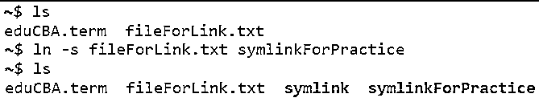
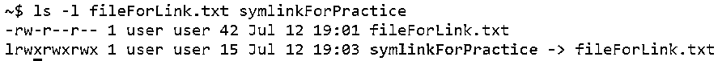

# Linux 符号链接

> 原文：<https://www.educba.com/linux-symbolic-link/>

## Linux 符号链接简介

在计算领域，符号链接是一个术语，通常被称为方法，其中文件或目录的引用通过绝对或相对路径包含在另一个文件中。在 1978 年，这个术语经常在 DEC 和 RDOS 微型计算机中使用。在当今世界，这种方法在 POSIX 操作系统(如 Linux)中被广泛用作标准，而在 Windows 操作系统(如 Vista 和 Windows 7)中支持有限。由于 windows 更著名，人们可能会瞥见 Windows 操作系统中的快捷文件，这给人一种符号链接的感觉。在这个主题中，我们将学习 Linux 符号链接。

**语法**

<small>网页开发、编程语言、软件测试&其他</small>

接下来要理解的是语法。Linux 中的符号链接是通过 ln 命令实现的。ln command 是一个实用程序，可以通过 Linux 中的命令行使用，默认情况下，它们用于创建硬链接。我们将在下一节讨论不同类型的链接，因为在这里我们将讨论语法，它是这样的:

`ln -s [OPTIONS] FILE LINK`

这里，[OPTIONS]是一个可选参数，仅在使用文件和链接时起作用。另外，LINK 是文件链接到的符号链接。这个文件可以是文件，甚至可以是目录。如果目录取代了文件，那么链接也应该是目录。

### 符号链接在 Linux 中是如何工作的？

在我们开始理解符号链接在 Linux 中是如何工作的之前，我们将首先理解 Linux 中可能的不同类型的链接。可能有两种类型的链接:

*   **硬链接:**硬链接就像一个文件的替代名或附加名。在同一个索引节点的帮助下，两个或多个文件被关联。不过，这个选项只对文件系统或分区有效，对目录无效。
*   **软链接也称为符号链接:**软链接类似于 Windows 中的快捷方式。如果你不知道这个特性，快捷方式只不过是包含实际文件或目录位置的文件，它所做的是在链接被调用时指向实际位置。

现在是时候理解符号链接的工作原理了，一旦我们知道了它的工作原理，我们就可以通过一些例子以及符号链接的不同选项来看看实际的工作原理了。

我们已经知道，符号链接是一个文件，其内容是文件的实际位置或目录。它在目录条目中保留一个标志，表示它是一个符号链接，通常称为符号链接。现在，当这个符号链接打开时，操作系统将读取文件的内容，这表示文件的实际位置，并跟随该位置找到目标文件。现在，在某些情况下，当该位置中的文件也是符号链接时，遵循相同的过程，直到它到达的最后一个文件不是符号链接。然后，操作系统获取例程到达的最终文件的索引节点(inode)。这个 inode 包含文件的所有细节，比如元数据、修改时间、指向文件数据的指针以及许多其他类似的信息。这个 inode 现在被打开，从现在开始，用于读写文件。

在大多数情况下，显然除了一些例外，对符号链接上的文件数据的任何操作都会自动反映到它所引用的最终文件中。相反，任何与元数据相关的操作，例如重命名或删除，都会影响符号链接。下面的一个小例子可以总结我们在这一段的整个讨论。

以下是在 Linus 操作系统中使用符号链接时应该注意的几点。

*   即使不影响数据实际存在的文件，删除符号链接也是可能的。背后的原因很简单，数据链接所在的索引节点是实际文件的索引节点，它不同于符号链接的索引节点。因此，即使删除了符号链接，也只是丢失了到达最终文件的连接，而不是实际的文件。
*   使用符号链接，可以跨越文件系统。
*   正如我们已经讨论过的，使用符号链接可以链接文件和目录
*   通过查看出现所有权限相关信息的位置前的字符，可以很容易地判断出文件是否是符号链接。

#### 1.创建符号链接

**代码:**

`ln -s fileForLink.txt symlinkForPractice
ls`

**输出:**

#### 2.验证符号链接

**代码:**

`ls -l fileForLink.txt symlinkForPractice`

**输出:**

在这里，我们可以找到两个要点:

*   练习开始时出现字符
*   将文件从符号链接链接到目标文件的位置。该目标文件是链接的目标，而不是最终文件。

#### 3.移除符号链接

**代码:**

`rm symlinkForPractice
ls -l fileForLink.txt symlinkForPractice`

**输出:**

必须注意的一件重要事情是，symlinkForPractice 不再是一个完全存在于内存中的链接，因此当我们命令 Linux 获取该链接时，我们最终会出错。现在，如果我们有另一个链接指向被删除的链接，我们希望观察输出的效果，我们会看到一些突出显示，通知开发人员有关连接的一些问题，因为另一个链接的目的地什么也不是，只是被删除的链接不可用。下面是一个快照，提到了同样的问题。

`ls -l fileForLink.txt symLinkToLink`

### 结论

在本文中，我们全面了解了符号链接中存储的内容以及与之相关的其他元素。通常最好使用符号链接而不是硬链接，因为符号链接也具有包含目录的能力，而硬链接则没有，主要原因是在硬链接中，如果允许目录链接，将会破坏文件系统结构。

### 推荐文章

这是一个 Linux 符号链接指南。这里我们讨论符号链接在 Linux 中是如何工作的，以及代码和输出。您也可以看看以下文章，了解更多信息–

1.  [Linux 读取](https://www.educba.com/linux-read/)
2.  [Linux mdadm](https://www.educba.com/linux-mdadm/)
3.  [Linux 用户](https://www.educba.com/linux-users/)
4.  [Linux rm 命令](https://www.educba.com/linux-rm-command/)

