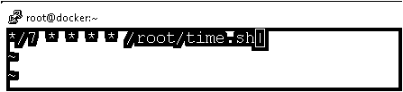
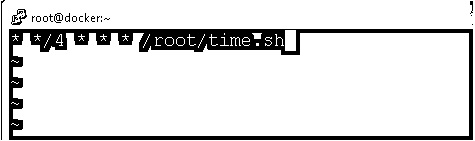
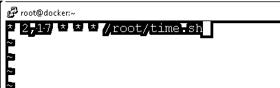
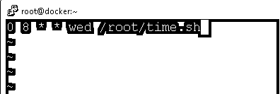
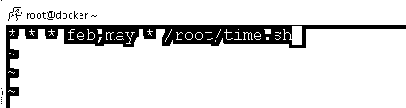

# Cron 时序格式

> 原文：<https://www.educba.com/cron-timing-format/>

## Cron 时序格式介绍

在 Linux 环境中，我们有能力支持多用户。它将处理和支持多个用户以及应用程序。在这样的环境中工作时，我们需要运行多个作业并处理许多情况。如果我们将手动管理这些类型的条件，那么将很难管理它们。为了克服这个问题，我们需要在 Linux 环境中使用 cron 工具。它将有助于在 Linux 生态系统上调度不同类型的作业，并在特定或定义的时间框架内执行相同或调度的作业。cron 实用程序中的作业调度非常简单。但是我们需要确保我们需要在特定的时间框架内安排工作。在这里，cron 计时格式开始出现。cron 时间格式将有助于定义特定的参数，这些参数将有助于在特定的时间范围内运行计划的作业。当我们在一个复杂的环境中工作时，在先前运行的作业上存在许多依赖关系。在这样的条件下，前一个作业的执行太重要了。为了处理这种情况，我们使用了 cron 时间格式。这将有助于在特定时间定义作业。

### Cron 时间字符串是五个值-格式

在 Linux 环境下处理 cron 计时格式时，我们需要遵循基本的时间值标准格式。这将有助于按照计划的时间窗口定义作业。在 cron 中调度任何作业或命令时，我们需要处理五星时间值。请找到下面的语法。

<small>网页开发、编程语言、软件测试&其他</small>

`[ * (MINUTE TIME FORMAT) ] [ * (HOUR TIME FORMAT) ] [ * (DAY OF THE MONTH TIME FORMAT) ] [ * (REPRESENT MONTH TIME FORMAT) ] [ * (DAY OF WEEK TIME FORMAT) ] [ PATH OF THE SCRIPT OR JOBS or APPLICATION ]`

1.(分钟时间格式):在分钟值中，我们可以根据分钟窗口来调度 PHP 作业或应用程序。它将采用从 0 到 59 的默认值。

2.(小时时间格式):在小时值中，我们可以根据小时窗口来调度 PHP 作业或应用程序。它将采用从 0 到 23 的默认值。

3.(一个月中的某一天的时间格式):我们可以根据一个月中的某一天的时间值来调度 PHP 作业或应用程序。它将采用从 1 到 31 的默认值。

4.(月份时间格式):我们可以根据月份字段时间来调度 PHP 作业或应用程序。它将采用从 1 到 12 的默认值。
5。(星期几时间格式):我们可以根据星期几时间来调度 PHP 作业或应用程序。它将采用从 0 到 6 的默认值。
6。脚本或作业或应用程序的路径:根据需求或应用程序的需要，我们需要添加我们需要在特定时间范围内运行的作业或脚本的正确路径。

### 创建 cron 时间字符串的示例

*   [T0】 Cron time string: cron shell job is scheduled to be executed every 7 minutes

在 Linux 环境中，我们能够每 7 分钟调度一次 cron shell 作业。它将每隔 7 分钟自动运行一次。

**命令:**

`*/7 * * * * /root/time.sh`

**说明:**

按照上面的命令，我们计划每七分钟运行一次 time.sh shell 脚本。

**输出:**

*   [T0】 Cron time string: schedule cron shell job every 4 hours

在 cron 实用程序的帮助下，我们可以每 4 小时调度一次 shell 作业。

**命令:**

`* */4 * * * /root/time.sh`

**说明:**

按照上面的命令，我们计划每四小时运行一次 time.sh shell 脚本。

**输出:**

*   [T0】 Cron time string: schedule cron shell job twice a day

我们拥有一天两次安排 shell 作业的功能。

**命令:**

`* 2,17 * * * /root/time.sh`

**说明:**

按照上面的命令，我们将 time.sh shell 脚本安排在每天凌晨 2 点和下午 5 点。

**输出:**

*   [T0】 Cron time string: schedule cron shell job every Tuesday at 7am

在 Linux 环境中，我们拥有每周三安排 shell 作业的功能。

**命令:**

`0 8 * * wed /root/time.sh`

**说明:**

按照上面的命令，我们将 time.sh shell 脚本安排在每周三上午 08 点。

**输出:**

*   [T0】 Cron time string: schedule cron shell job in a specific month.

在 cron 实用程序的帮助下，我们能够安排特定月份的 shell 作业。

**命令:**

`* * * feb,may * /root/time.sh`

**说明:**

按照上面的命令，我们将 time.sh shell 脚本安排在二月和五月。

**输出:**

*   [T0】 Cron time string: schedule cron shell job on a specific day

我们能够将 shell 作业安排在一个月中的某一天。

**命令:**

`0 7 * * tue /root/time.sh`

**说明:**

按照上面的命令，我们将 time.sh shell 脚本安排在每周二上午 7 点。

**输出:**

*   [T0】 Cron time string: plan the basic cron shell job every week

在 Linux 环境中，我们能够每周计划一次 shell 作业。

**命令:**

`@weekly /root/time.sh`

**说明:**

按照上面的命令，我们每周都要执行 time.sh shell 脚本。

**输出:**

### 结论

我们已经看到了“cron 计时格式”的完整概念，以及正确的示例、解释和带有不同输出的命令。理解 cron 计时格式非常重要。这将有助于在特定的时间窗口内安排作业或命令。当存在对作业先前执行状态的依赖性时，cron 计时格式非常重要。

### 推荐文章

这是一个 Cron 定时格式的指南。在这里，我们讨论了概述，Cron 时间字符串是五个值-格式，例子与代码，以便更好地理解。您也可以看看以下文章，了解更多信息–

1.  [Scala 字符串格式](https://www.educba.com/scala-string-format/)
2.  [PLSQL 格式日期](https://www.educba.com/plsql-format-date/)
3.  [PL/ SQL 格式化程序](https://www.educba.com/pl-sql-formatter/)
4.  [文件格式](https://www.educba.com/file-formats/)

