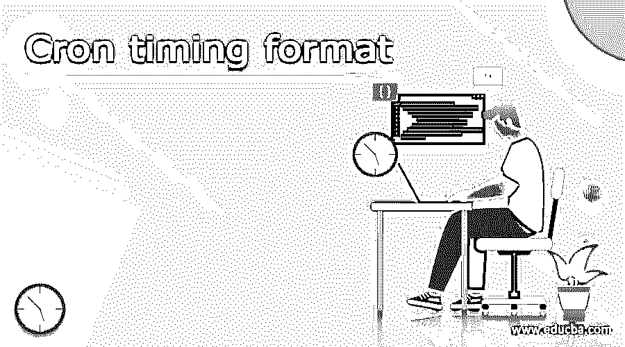
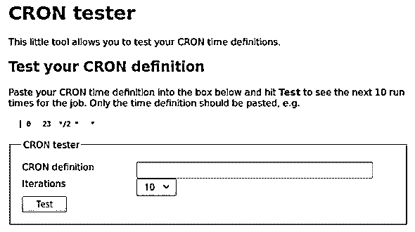
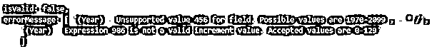

# Cron 验证程序

> 原文：<https://www.educba.com/cron-validator/>

## Cron 验证器简介

Cron validator 用于检查为创建或操作 Cron 作业而指定的表达式的格式。Cron 作业是根据我们在 Linux 平台中指定的时间间隔定期自动执行的任务。我们可以通过使用 cron 验证器来检查指定的 cron 作业命令表达式是否正确。在本文中，我们将看看什么是 cron 表达式或指令的理想格式，cron validator 的概述，它的应用程序，特性，以及在某些例子的帮助下看看它的实现。

### 什么是 cron 验证器？

cron validator 是一个节点的模块，它帮助确定指定的 quartz cron 表达式是否正确，如果有错误消息的话，它还会提供一些错误消息。cron 表达式由七到六个与日期和时间相关的参数或字段组成，并使用空格相互分隔，这有助于指定计划作业的周期性参数。

<small>网页开发、编程语言、软件测试&其他</small>

cron 作业表达式的格式或语法如下所示。

秒分钟小时日月工作日年

最后一个年份字段实际上是可选的。cron 作业的一些有效示例如下所示

`0 0 6 * * ? *`

上面的 cron 作业表达式被安排在每天早上 6 点执行。

下表说明了可以为 cron 表达式中的每个字段指定的值的完整列表

| 参数或字段 | 允许值 | 通配符符号 |
| 年 | 1970 年至 2199 年 | * .– / |
| 小时 | 0 到 23 | * .– / |
| 天 | 1 至 31 岁 | * .– / ?L W |
| 月份 | 1 月至 12 月或 1 日至 12 日 | * .– / |
| 平日 | 孙对 SAT 还是 1 比 7 | * .我？# |
| 分钟 | 0 到 59 岁 | * .– / |

为了理解 cron 验证器，理解 quartz 非常重要，因为 cron 验证器节点模块只帮助检查和验证 quartz cron 表达式。Quartz 是用于调度的库，是完全开源的，可以与使用 Java 编程语言编写的其他应用程序集成。这在执行复杂或简单的大规模作业时非常有用。

为了找到 cron 节点模块的官方参考，你可以参考这个网站。

### 用法 cron 验证程序

名为 isValidCronExpression 的 cron 验证器模块提供的方法在指定 cron 表达式的 string 参数中被采用，并给出包含布尔值 true 或 false 的输出，表明表达式是否有效。cron 验证器的使用方法如下

`var sampleEDUCBAvalidator = require (“cron-expression-validator”);
var whetherValid = sampleEDUCBAvalidator. isValidCronExpression(“0 0 6 * * ? *”);`

上述代码片段的输出如下所示

您还可以在如下所示的 if 条件中使用此方法，并在有条件的基础上执行某些代码。如果条件为真，这意味着它是一个有效的表达式，那么将执行代码块，否则不执行。

`If (sampleEDUCBAvalidator. isValidCronExpression(“0 0 6 * * ? *”)) {
// Code to execute if cron expression is valid
}`

cron 验证器的使用也可以与传递错误消息的附加参数一起完成，这将有助于检索错误发生的确切原因。例如，我们可以在 if 条件的第二个参数中添加 JSON 格式的错误:true

`If (sampleEDUCBAvalidator. isValidCronExpression(“0 0 66/2 * * ? *”, {error : true})) {
/* Code will return the object containing isValid key with false value and errorMessage key with the message saying Hour value must have value between 0 to 23 */
}`

### 特征

cron 表达式验证器的特性如下所示

*   我们可以安排任务。
*   cron 的表达式可以与特定的日期和时间值匹配。
*   验证指定的 cron 表达式。
*   生成两个指定日期时间值之间的匹配日期和时间值。

### 运行测试

cron 表达式可以通过使用 cron 测试器来测试，我们可以简单地在提供的定义字段中输入 cron 表达式并测试它。此后，cron 作业的迭代次数以及执行日期和时间将会在这里列出。cron 测试仪

### Cron 验证器示例

cron 验证器的例子包括使用它在 cron 表达式验证的条件基础上执行特定代码，或者解析表达式以在特定变量中获得有效或无效，甚至匹配日期和时间值。

让我们考虑一些例子。假设我们必须在 cron 作业验证的 java 程序中打印一条消息。cron 表达式是

`var sampleValidator = require (“cron-expression-validator”);
If (sampleValidator. isValidCronExpression(“0 0 8 * * ? *”)) {
print (“ The specified cron expression is valid.”);
}`

执行上述代码片段的输出如下所示

让我们再考虑一个例子，我们将尝试执行一个格式无效的 cron 表达式。我们有一个表达式* * * * * 456/986，我们将 error 参数作为 true 传递，以便在运行 isValidCronExpression 方法时显示错误。代码片段如下所示

`var sampleValidator = require (“cron-expression-validator”);
If (sampleValidator. isValidCronExpression(“* * * * * 456/986”, {error : true})) {
// some code to execute is expression is valid
}`

上述代码的输出如下所示

### 结论

Cron validator 是节点的模块，用于检查输入的表达式是否正确。这也可以用于上述文章中指定的各种其他场景。

### 推荐文章

这是一个 Cron 验证器的指南。这里我们讨论什么是 cron 验证器，用法，运行测试，例子来更好的理解。您也可以看看以下文章，了解更多信息–

1.  [休眠验证器](https://www.educba.com/hibernate-validator/)
2.  [JavaScript 验证器](https://www.educba.com/javascript-validator/)
3.  [CSS 验证器](https://www.educba.com/css-validator/)
4.  [ASP.NET 要求现场验证器](https://www.educba.com/asp-dot-net-requiredfieldvalidator/)

