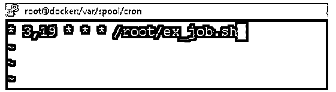

# Cron 作业调度程序

> 原文：<https://www.educba.com/cron-job-scheduler/>

## Cron 作业调度程序简介

下面的文章提供了 Cron 作业调度器的概要。在 Linux 环境中，我们拥有调度作业的功能。根据需求或应用程序的需要，我们需要选择各自的作业调度程序。我们可以使用 cron 实用程序来调度 Linux 生态系统上不同类型的作业。这是在 Linux 环境中调度作业的最合适或推荐的解决方案。在调度任何类型的作业之前，首先，我们需要理解不同的调度概念以及我们需要如何调度作业。在 cron 工具中，有三个主要组件，即 cron、crontab、crond。

每个组件都有自己的工作方式和意义。cron 组件对于在 Linux 环境中调度作业非常有用。crontab 是根据 cron 表帮助管理 cron 的组件。我们需要以特定的格式定义 crontab 中的作业。crond 只不过是守护进程。它运行在后台环境中。它还读取 crontab 文件，并帮助采取必要的措施。注意 crontab 信息或 cron 表保存为一个简单的文件。但是强烈建议我们使用 crontab 实用程序来编辑或列出作业。

<small>网页开发、编程语言、软件测试&其他</small>

### 字符串格式

我们需要使用下面的字符串格式，同时与调度程序。

[ MINUTE ] [ HOUR ] [ DAY OF MONTH ] [ MONTH ] [ DAY OF WEEK ] [ COMMANDS or JOBS ]

*   **分钟:**在分钟值中，我们可以按照分钟级别调度作业。它将接受从 0 到 59 的值。
*   **小时:**在小时值中，我们可以根据小时级别来调度作业。它将接受从 0 到 23 的值。
*   **一月中的某一天:**我们可以根据月份时间值来安排作业。它将接受从 1 到 31 的值。
*   **月:**我们可以根据月字段时间值来安排作业。它将接受从 1 到 12 的值。
*   **星期几:**我们可以根据星期几的时间值来安排作业。它将接受从 0 到 6 的值。
*   **作业或命令:**根据需要，我们可以调度作业或命令。

### 特殊字符

在 crontab 中调度作业或命令之前，首先，我们需要理解格式。然后，我们需要了解我们需要如何定义作业调度时间窗口的每一步。以便作业仅在特定的时间范围内触发和执行。在某些情况下，作业可能提前或推迟触发；这可能是由于不适当的时间定义。为了避免这样的情况，我们需要在正确的格式下进行调度。

| **Sr 号** | **字符** | **字符的含义** | **描述** |
| One | * | “*”字符被称为星号。 | “*”字符表示该字段的所有或所有可能的值。因此，如果我们将定义“*”字符，那么它将考虑整个值，即，如果我们将它设置为分钟字段，那么它将考虑每一分钟。 |
| Two | ? | 那个“？”性格被称为问号。 | 字符“？”(问号)表示没有具体值。那个“？”当我们需要在单个文件中定义任何东西，但需要在两个不同的选项中定义时，将使用。从两个选项中，第一个字段将被允许，但第二个字段将不被允许。 |
| Three | – | “-”字符称为连字符。 | “-”(连字符)有助于定义具体的范围，即在某些情况下，我们需要定义从 5 到 10 的小时数，然后我们不定义像 5，6，7，8，9，10。我们可以直接使用范围(连字符)，即 5-10。 |
| Four | , | “，”字符被称为逗号。 | “，”(逗号)有助于分离活动。这将有助于区分多个允许的选项或值。例如，在 cron 中，我们可以在“，”(逗号)字符的帮助下定义多工作日选项，如“TUE，THU，星期一” |
| Five | / | The “/” character is known as slash. | “/”(斜线)字符将有助于增量。如果我们需要从一个特定的数字开始增加任何值，那么我们可以借助“/”来表示增量。让我们举一个例子，如果我们将定义斜线，即“0/5”，那么 0，5，10，15 等。 |
| Six | 英语字母表中第十二个字母 | It is an uppercase “L” letter. | 大写字母“L”有助于表示最后的值。例如，在某些情况下，我们需要在月份字段中定义“L”字符，那么它将指向该月的最后一天。 |
| Seven | 英语字母表中第二十三个字母 | It is an uppercase “W” letter. | 大写字母“W”有助于表示最近的工作日。最近的工作日将考虑指定的日期。因此，例如，如果我们将“15W”设置为输入值，它将考虑最近的工作日，即，如果“15 号”是星期天，那么它将在星期一触发。 |
| Eight | # | The “#” character is known as hash. | “#”(散列)字符将有助于定义一个月的第 n 天。哈希表示一个月的第 n 天。如果我们将在星期几字段中使用散列字符，即“2#1”，它意味着“每月的第一个星期一” |

### 预防措施

在调度 cron 作业时，我们需要正确定义时间窗口，并提供需要执行的正确路径。

### 在 Linux 中设置 Cron 作业调度程序的示例

下面提到了不同的例子:

设置 Cron 作业:调度 shell 作业。

在 Linux 环境中，我们可以调度 cron 作业。

**代码:**

`* 3,19 * * * /root/ex_job.sh`

**说明:**

*   按照上面的命令，我们将 ex_job.sh shell 脚本安排在每天凌晨 3 点和下午 7 点。

**输出:**

### 结论–Cron 作业调度程序

我们已经看到了“cron job schedule”的完整概念，以及正确的示例、解释和带有不同输出的命令。当我们需要在特定的时间窗口自动运行任务时，cronjob 的调度是非常重要的。

### 推荐文章

这是一个 Cron 作业调度指南。这里我们讨论介绍、字符串格式、特殊字符、注意事项和示例。您也可以看看以下文章，了解更多信息–

1.  [Crontab in Unix](https://www.educba.com/crontab-in-unix/)
2.  [Linux Crontab](https://www.educba.com/linux-crontab/)
3.  [LINQ 相交](https://www.educba.com/linq-intersect/)
4.  [Linux QT](https://www.educba.com/linux-qt/)

