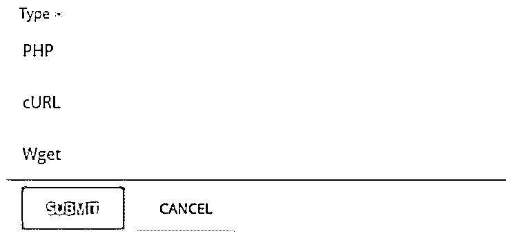
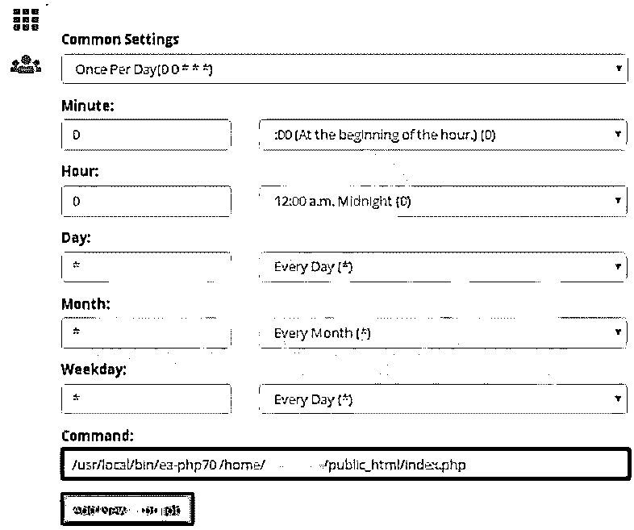
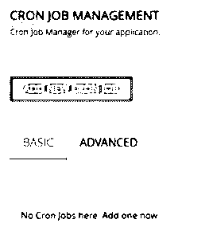
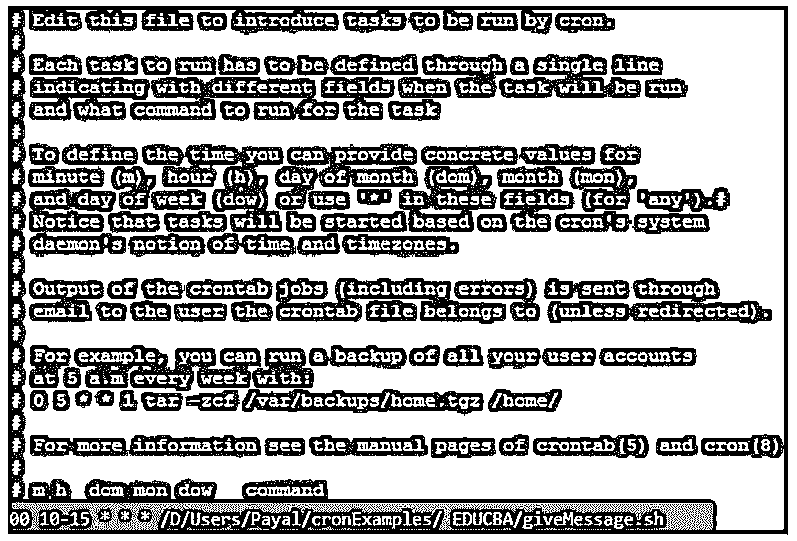
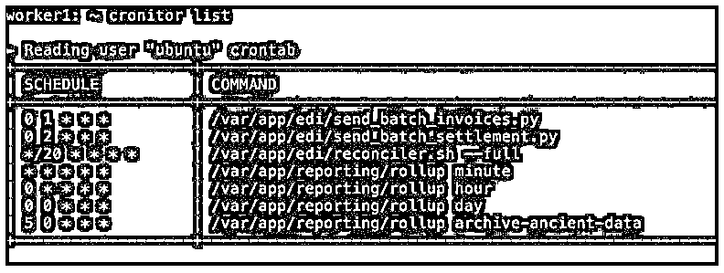

# Cron 命令

> 原文：<https://www.educba.com/cron-command/>

## Cron 命令简介

下面的文章提供了 Cron 命令的概要。Cron 命令将帮助我们运行特定的任务，并在某个时间段后自动调度相同的任务。用户可以调度特定的重复任务，并且可以通过使用 cron 命令来调度特定时间间隔之后要执行的任务，cron 命令负责执行以任何编程语言编写的脚本中的任务。Cron 命令在日常生活场景中有着广泛的应用。

### Cron 命令概述

*   在 cron 中，后台运行一个守护线程来全面检查哪些 cron 命令或任务需要在什么时间执行。因此，我们可以准备一个需要定期执行的命令列表，比如备份某个服务器、更新某个页面，或者在特定时间间隔后同步两个任务。
*   它关注每一个调度的任务，当创建 cron 任务时提到的周期或时间与当前时间相同时，它执行那些特定的命令。您不必做任何额外的工作来启动 cron，因为它会在您进入基于多用户的运行级别时自动启动。
*   cron 的启动发生在通常是 etc/init.d 的文件夹目录中。

### Cron 怎么用？

添加 cron 作业后，运行它就非常简单了。您可以执行命令行指令，甚至可以使用任何提供相同接口的工具。有许多编辑器和工具提供了在 PHP 中使用 cron 作业的接口。其中之一就是 Cpanel。

<small>网页开发、编程语言、软件测试&其他</small>

下面列出了使用 Cpanel for PHP 程序创建 cron 作业的步骤:

*   Cpanel 只有首先登录平台才能访问。
*   您必须首先打开 Cpanel，然后导航到 Home 选项。此外，您可以转到高级选项，然后转到 cron 作业。界面将如下图所示。
*   此外，您可以输入电子邮件地址来接收所有与 cron 相关的通知。之后，你必须点击更新电子邮件按钮。如果您不想接收来自 cron 的任何通知并禁用该功能，那么您可以将该字段留空。
*   单击名为 Add New Cron job 的按钮，并输入下面的时间任务和命令中提到的详细信息。
*   请注意，您可以指定自己的域来代替 usr/local/…字符串，并且可以检索您的域所使用的 php 版本。为了使用多用途管理器，你必须了解你的域名所使用的 PHP 版本。
*   在为 php 创建 cron 作业时，您必须创建一个 php 脚本，您必须运行该脚本并选择下图所示的 php 选项。

*   创建一个 php 文件，其中包含需要使用 cron 作业进行调度的脚本。例如，假设我们已经创建了名为 index.php 的文件，其中包含以下内容。

`<?php
echo "Educba is the best edutech site present on internet";
?>`

*   您可以在命令文本框中输入您希望在 php 脚本路径中执行的命令。

如果您正在使用 cpanel 工具，那么为了运行您已经创建的 php 的 cron 作业，您可以遵循下面提到的步骤:

*   在您提到关于执行频率、需要执行的 php 脚本的路径以及相应的链接的所有细节之后，您可以简单地单击 Apply 按钮。
*   cron 工作申请需要几分钟，之后，您就可以开始工作了。最后，您的 cron 作业将被设置并准备运行。
*   如果你想手动设置 cron 任务，那么你可以点击菜单中的高级选项。

### 服务器上的 Crontab 文件内容

服务器上 crontab 文件的内容可以是特定编程语言(如 PHP)的文件，也可以是扩展名为. sh 的 shell 文件，其中包含要在计划的 cron 作业下执行的命令。

例如，我们可能有一个名为 educbaCron.php 的文件，其中包含以下回显消息的任务。

`<?php
echo "You can come and visit EDUCBA to extend your knowledge in different domains.";
?>`

有一个单独的 crontab 文件，您可以使用 crontab 命令和这里指定的不同选项来编辑和列出该文件。

`Crontab [-l | -e] username`

-l 和-e 选项分别代表编辑和列表，而 username 是对 crontab 文件执行操作时使用的用户名。

### Cron 命令的示例

以下是 Cron 命令的示例:

为了允许特定用户访问和操作 cron 作业，您可以使用以下命令。

**代码:**

`/etc/cron.allow`

**输出:**

如果您希望特定用户限制对 cron 作业的访问，只需执行下面的 deny 命令。

**代码:**

`/etc/cron.deny`

**输出:**

假设您想通过使用命令行界面(如终端)而不是使用任何其他工具(如 Cpanel)来创建 cron 作业。您有一项任务是运行位于特定目录中的特定脚本文件，例如/D/Users/Payal/cron examples/EDUCBA/give message . sh，从上午 10:00 到下午 3:00，每天每小时运行一次，然后您为它创建 cron 作业的命令如下所示。

**代码:**

`00 10-15 * * * /D/Users/Payal/cronExamples/ EDUCBA/giveMessage.sh`

**输出:**

要检查所有 cron 作业计划的完整列表，可以启动以下命令。

**代码:**

`Cronitor list`

**输出:**

### 结论

Cron 命令包括创建一个 cron 作业或使用命令行界面列出计划执行的现有已创建的 cron 作业。

### 推荐文章

这是一个 Cron 命令指南。这里我们讨论一下入门，如何使用 cron？服务器上的 crontab 文件内容和示例。您也可以看看以下文章，了解更多信息–

1.  [Crontab in Unix](https://www.educba.com/crontab-in-unix/)
2.  [Linux Crontab](https://www.educba.com/linux-crontab/)
3.  [LINQ 相交](https://www.educba.com/linq-intersect/)
4.  [Linux QT](https://www.educba.com/linux-qt/)

