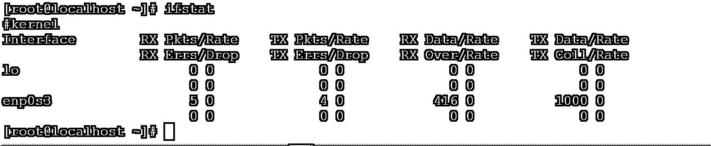
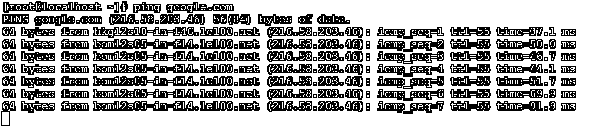
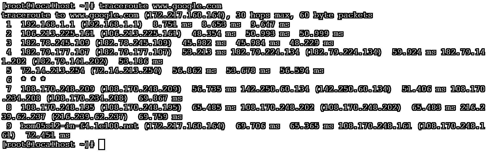
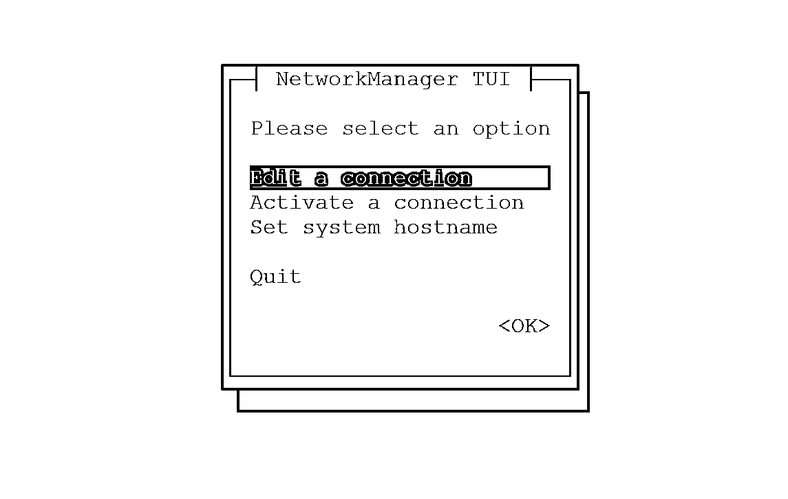

# Linux 网络命令

> 原文：<https://www.educba.com/linux-network-command/>

## Linux 网络命令简介

在 Linux 操作系统中，网络命令用于配置网络参数、网络故障排除、各种应用程序的集成、端口和网络接口管理等。在 Linux 中，网络是一个非常重要的处理部分。对于 Linux 应用程序开发和管理，网络知识是必需的。

**语法:**

<small>网页开发、编程语言、软件测试&其他</small>

`[Different Network Command] [NIC] [Option] [Hostname/IP Address]`

*   不同的网络命令:我们可以在其中使用不同的网络级关键字/命令，如 netstat、ifconfig、traceroute、dig、route 等。
*   **NIC:** 我们可以提供不同的网络接口卡作为网络命令的输入。
*   **选项:**我们可以提供不同的标志作为与网络命令兼容的选项。
*   **主机名/IP 地址:**有时我们需要提供主机名和 IP 地址信息，以便进行配置和故障排除。

### Linux 网络命令是如何工作的？

基本上，network 命令用于在 Linux 生态系统中设置或配置网络相关的东西。它对于网络或应用程序级别的故障排除也很有用。

Linux 环境中有不同类型的网络命令。每个命令都有不同的工作机制和故障排除步骤。但是通常，network 命令接受选项和 NIC/主机名或 IP 地址。相应地，网络命令将给出输出或结果。

### 实现 Linux 网络命令的例子

下面是一些例子:

#### 示例 1–Ifstat 命令

“ifstat”命令提供了与 Linux 环境相关的所有网络接口的进出数据包相关信息。

**命令:**

`ifstat`

**输出:**

**说明:**根据上面的命令，我们可以得到网络接口的数据包相关信息。目前有两个接口，即 lo(用于环回)和 enp0s3(用于网卡)。无论何时，任何数据包都会从接口下面流出。“ifstat”命令将相应地显示结果。

#### 示例 2–Ifup 和 ifdown 命令

在 Linux 中，网络数据包将通过接口跟随。如果我们需要关闭或打开网络接口，那么我们可以使用 ifup 和 ifdown 命令。

**Co**T2】mmand:

`ifdown enp0s3
ifup enp0s3`

**输出:**

**说明:**根据上面的命令，我们能够在 Linux 环境下上下网络接口。在当前的 Linux 环境中，我们有两个接口，即 lo 和 enp0s3。通过 enp0s3 接口建立网络连接。我们可以下界面(参考截图 1 (a))和上界面(参考截图 1 (b))。

#### 示例 3–Ping 命令

Ping 命令是任何操作系统中都有的命令。检查机器是否可达是有用的。

**命令:**

`ping google.com`

**输出:**

**说明:**根据上面的命令，我们正在检查我们的机器是否可以到达 google.com。如果机器是可到达的，那么我们从目的地服务/主机/IP 获得中继，并且我们确保在源和目的地机器之间建立连接。

#### 示例 4–Traceroute 命令

traceroute 命令用于网络故障排除。它将提供源和目的地之间的跳数的详细信息。它还将提供数据包传输路径。

**命令:**

`traceroute www.google.com`

**输出:**

**说明:**根据上面的命令，我们能够从源和目的地服务器或网络中追踪出希望的数量和数据包的传播路径。根据 traceroute 命令，我们可以判断我们的服务器是否可以到达目的服务器。如果不是，问题在哪里？

#### 示例 5–Netstat 命令

Netstat 是另一种类型的网络相关命令，我们将从中获得不同类型的网络相关信息。借助“-r”选项，我们将获得路由表信息。

**命令:**

`netstat -r`

**输出:**

**T2】**

 ****说明:**根据下面的输出截图，我们可以得到服务器的路由表信息。它将定义如何在 Linux 服务器中建立网络。

#### 示例# 6–Ethtool 命令

ethtool 工具用于获取网络接口的详细信息。

**命令:**

`ethtool enp0s3`

**输出:**

**说明:**在一个 Linux 服务器中，有不同的网络接口可用(取决于配置)。按照上面的命令，我们正在获取网络接口的详细信息。设计双工或全双工网络拓扑结构将会非常有用。

#### 示例 7–主机名命令

在配置任何网络拓扑时，主机名都非常重要。在 Linux 环境中，我们可以识别与之相关联的主机名。

注意:如果我们需要给 Linux 服务器分配主机名。我们需要更新“/etc/hosts”文件中的条目。

**命令:**

`hostname`

**输出:**

**解释:**根据上面的命令，我们正在获取 Linux 服务器的主机名信息。当我们访问任何外部应用程序时，主机名非常重要。

#### 示例# 8–nm tui 命令

在 Linux 中，我们可以图形化地配置网络接口，活动或非活动的接口设置主机名。

注意:图形界面命令因 Linux 操作系统而异。以下命令只能在 CentOS7 或 RHEL 7 中使用。

**命令:**

`nmtui`

**输出:**

**说明:**在 Linux 环境下配置网络接口时。我们需要为不同的任务传递不同的命令，如分配 IP 地址、主机名、激活接口等。

但是我们在 Linux 中，我们可以避免它，使用图形界面来配置 IP 地址、主机名、激活接口等。

#### 示例 9–Nslookup 命令

nslookup 命令基于 DNS 或记录。它将提供与主机名相关联的 IP 地址，反之亦然。

**命令:**

`nslookup google.com`

**输出:**

**说明:**根据上面的命令，我们能够找到与 URL 相关联的名称服务器的 IP 地址(即 google.com)。

### 结论

我们已经看到了“Linux 网络命令”的完整概念，以及正确的示例、解释和具有不同输出的命令。网络命令对于排除故障和配置网络相关的东西非常重要。当与不同的应用程序集成时，我们需要处理网络建立的事情。

### 推荐文章

这是一个 Linux 网络命令指南。这里我们也讨论一下 Linux 网络命令的介绍和工作原理。以及不同的示例及其代码实现。您也可以看看以下文章，了解更多信息–

1.  [Linux 触摸命令](https://www.educba.com/linux-touch-command/)
2.  [Linux 列表目录](https://www.educba.com/linux-list-directories/)
3.  [Linux tee 命令](https://www.educba.com/linux-tee-command/)
4.  [Linux 中的 PS 命令](https://www.educba.com/ps-command-in-linux/)

**