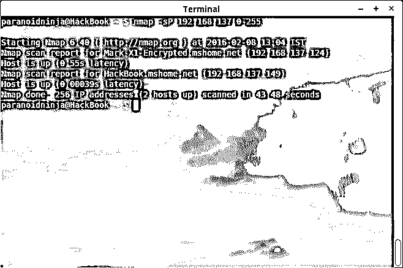

# 配置 Linux 网络环境

> 原文：<https://www.educba.com/configuring-linux-network-environment/>

## 配置 Linux 网络

现在，你们大多数使用 Linux 的人，可能已经知道一些维护网络的工作。对于使用 Windows 2008 或 2012 服务器的人来说，配置 Linux 网络环境将是一件大事。但是，我们这些做了很长时间 Linux 管理员的人知道，配置一个 Linux 网络比 Windows 容易得多，与 Windows 相比只是小菜一碟，只要你知道几乎所有需要的语法。

这个话题已经争论多年了。此外，Linux 和 Windows 之间的竞争永无止境。(我特别没有带 Mac OS 来这里，因为它是一个用于管理网络的外部操作系统，随着你深入了解，它会变得更加复杂。).让我告诉你，当我开始工作时，我也是一名 Windows Server 管理员，因为这是最容易上手的。

<small>网页开发、编程语言、软件测试&其他</small>

但是一路走来，事情变了，变得艰难。后来我接触了 Linux，它让我彻底疯了。但是随着我的学习，我意识到了不同，这就是我在这里要告诉你的。此外，我们还将了解 Linux 网络环境的配置，因为这是有抱负的 L5 管理员、[安全工程师](https://www.educba.com/cybersecurity-basic/ "Cybersecurity Tips and Tricks")和黑客的必备条件。

**关于配置 Linux 网络学习的文章结构如下**

*   [Windows 服务器](#Server)
*   [Linux 网络环境](#Environment)
*   [配置 Linux 网络环境](#Configuring)
*   [在处理 Linux 网络环境时](#Linux)

### Windows 与 Linux 网络之争

在我开始之前，让我告诉你，这篇博客只是为了突出优点和缺点，或者更好地说，是 Linux 网络和 Windows 服务器的缺点。微软视窗服务器有一个基于图形的用户界面，使你认为它实际上是非常容易设置不同的东西。但是是吗？此外，除了易于配置之外，还有一个更重要的部分，那就是安全性。微软视窗是一个纯粹的商业操作系统，这意味着将有安全补丁的更新，并有专门的人来做这项工作。

此外，即使是为了漏洞评估而入侵 windows 也违反了 Windows 本身的协议，被视为重大犯罪。这是为了让 windows 尽可能地保持封闭源代码，使它们免受安全问题的困扰。微软视窗也是世界上使用最多的操作系统，无论是个人使用还是商业使用。另一方面，Linux 很受欢迎，但是用得不多。看一眼 Linux，人们会说它是一个复杂的操作系统，它的软件来自世界各地。但这不就说明它有安全问题吗？是和不是都是。我们稍后会谈到这一部分。现在，大多数配置 Linux 网络发行版都带有预构建的图形用户界面。但是 Linux 开发人员总是更喜欢使用命令行界面来配置 Linux 网络，而不是图形界面，因为他们知道它的缺点和滞后。所以，让我们更深入地研究一下这两者，看看谁会名列前茅。

#### Windows 服务器

首先，让我打破你无知的猜测，告诉你配置一个 windows 网络与配置一个 Linux 网络有太多的不同和困难。在 Windows 中，有两种方法可以设置特定的网络。第一种方法是在“网络设置向导”的帮助下使用设置网络的选项。这是最简单的方法，非常适合没有经验的初学者，因为他们只需要阅读、选择和执行，而 Windows 完成了设置所有环境的大部分工作。然而，第二部分是最艰难的。这里的一切都必须手动完成。用户必须检查所有的机器，检查所有单独的 Linux 网络协议，看它们是否相同，并且必须确保没有出错。这仅适用于有经验的用户，因为这会占用大量时间，而且是一项单调乏味的工作。

设置 Windows 网络环境并不是这里唯一困难的部分。Windows 的主要问题是它速度太慢，这阻碍了整个基础设施的发展。主要原因是来自微软的更新，这使得它相当滞后和缓慢，更不用说一些错误。有时候，感觉不去修补安全，不如做了以后后悔。Windows 更普遍地是为单一用户设计的。有过 Windows 8.1，Server 2012 经验的人会知道我在说什么。但是，看起来事情会随着 Windows 10 而改变。

然而，它仍处于初级阶段，但看起来很有希望。虚拟桌面、多用户流畅度、超快的启动时间，以及许多其他功能，使它看起来很有前途。但尽管如此，Windows 仍然是最受欢迎的用户选择，持续发展的病毒和木马的数量是不可计数的。这是 windows 所能得到的最糟糕的结果，因为安全并不是 windows 所擅长的。但这并不意味着 Windows 网络系统是一个低劣的操作系统。在防火墙、防病毒软件的帮助下，Windows 仍然是安全的，但这也是以速度、效率和费用为代价的。然而，它仍然是很好的小企业或仍在发展中。

**推荐课程**

*   IP 路由课程
*   黑客程序
*   RMAN 培训课程
*   [Python 在线认证课程](https://www.educba.com/software-development/courses/python-certification-course/)

#### Linux 网络环境

另一方面，Linux 拥有最古老的操作系统环境之一。它不是最好的用户友好软件，但至少比 Mac OS 要好。此外，在 Linux 中，安全性从来都不是问题，因为它是开源软件，更好的是，当事情变坏时，没有特定的人去憎恨或诅咒。另一方面，Linux 网络视窗系统，比尔盖茨有很多敌人，更不用说它一直受到蠕虫、恶意软件和特洛伊木马的攻击。大多数人倾向于相信 Linux 没有病毒。这不是真的。Linux 有自己的病毒类型，一旦它们影响到网络系统，就很难清除。

但是，与 Windows 不同，这里没有自动运行功能。Linux 中的一切都是在脚本的帮助下工作的，由管理员决定是否执行它，这也需要手动完成。由于 Linux 是开源的，有很多开发人员在不断测试新的内核和漏洞，社区和支持比微软大得多，因此它在安全问题和修复漏洞方面的更新要快得多。

众所周知，Linux 可以同时运行多个进程，而不会影响稳定性。您可能已经看到，在 Linux 网络 Windows 中，每当您更改或安装软件时，总是需要重新启动。但是在 Linux 中却不是这样，相信我，当我说 Linux 从不崩溃的时候。此外，Linux 管理员可以更好地了解 Linux 发行版中其他正在运行的节点和系统，因为这里的一切都向超级用户开放，但是对于 Windows，其他用户仍然可以做一些管理员看不到的事情，例如隐藏文件。

既然我们知道 Linux 网络环境在服务器处理和管理方面比 Windows 优越得多，那么让我们来看看如何配置 Linux 网络。

#### 配置 Linux 网络环境

为家庭和办公室配置 Linux 网络环境是两码事。如果你已经有一些 Linux 方面的经验，那么你可能知道这里的大部分事情都是通过终端完成的，它类似于 Windows 的命令提示符，但是要高级得多。大多数 Linux 管理员更喜欢为任何网络设置编写脚本。因此，一旦编写了脚本，下一次开始，管理员只需使用“chmod u+x”更改脚本的权限，然后在任何 Linux 网络中执行 shell 脚本。大多数人喜欢使用 Red Hat 或 Debian 系统进行管理。配置 Linux 网络的最佳工具是名为“netenv”的软件，意思是“网络环境”。可以通过键入以下命令来安装该工具:-

| $ sudo apt-get 安装 netenv |

在这里，你可能不需要 sudo，这取决于你是超级用户还是普通用户。netenv 的官方网站是[http://www.netenv.com/](http://www.netenv.com/)。可能还需要使用 nmap 来检查 Linux 网络是否一致。 [Nmap](https://www.educba.com/nmap-commands/) 也有助于扫描有多少系统连接到网络，哪些端口是开放的，哪些服务正在运行，什么是操作系统，以及其他东西。在运行 [Nmap 扫描](https://www.educba.com/what-is-nmap/)之前，我需要为我的其他独立系统设置一个网关，我可以借助以下命令来完成:

 

如你所见，我的网关是 192.168.137.0。一旦您获得网关，您就可以通过使用 Nmap 获得已连接系统的列表。以下是 Nmap 扫描连接到我的家庭 Linux 网络的系统列表的图像:

 

你可以看到，我有两个设备连接在上面，一个是我的手机，另一个是我的 Linux 笔记本电脑本身。人们还可以很好地了解连接的系统类型。同样，您也可以借助以下命令获得关于开放端口、服务和连接的系统的信息:

| ***$ sudo nmap-A-O 192.168 . x . x*** |

在 Ettercap 或 Wireshark 等其他软件的帮助下，用户还可以查看多台计算机之间发送的数据包。在 Aircrack-ng 的帮助下，人们甚至可以尝试限制数据包或关闭网络环境本身。但那是一张长纸条。默认情况下，Linux 发行版有增加或减少包和数据分发的方法。

### 配置 Linux 网络环境时需要知道的重要事情

除了上面的事情，下面是在配置 Linux 网络环境时需要知道的一些其他重要的事情

#### 用于远程联接服务的标准协议或者实现此协议的软件(可为动词)

远程登录是用于远程访问计算机的软件。Telnet 是使用最多的软件之一，也非常流行，但它是终端的，或者更好的是基于控制台的。它基于 [UNIX](https://www.educba.com/software-development/courses/linux-training-certification/ "Complete UNIX & Linux OS Fundamentals Training") 。然而，这个应用程序的主要缺点是非常不安全。任何人都可以查看和跟踪正在发送的 Linux 网络信息。这些信息也可以通过 Ettercap 或 Wireshark 等许多软件被嗅探到。但是，有一个加密版本用来代替基本的远程登录，称为 SSH(安全外壳)，它需要一个 PGP 密钥来验证远程主机。类似的软件也适用于 Windows，即 putty。这两个软件都是可互操作的。SSH 可以通过以下命令安装:

| ***$ sudo apt-get 安装 OpenSSH-server*** |

与 Telnet 类似，还有另一种被称为 rlogin 的软件，它也被广泛使用。

#### x 窗口

X- Window 系统是用于图形 UNIX 工作站的基本标准窗口系统。X-Window 由两部分组成:X- server 和 X- Client。这里的服务器是管理员用来访问客户端工作站的工作站。这非常有用，因为它使用了最少的 CPU 资源。这些系统也被称为 X 终端。

#### VNC

VNC 或更常见的虚拟网络连接是一个图形用户界面，它与 telnet 或 X-window 的工作相同，但基于虚拟机。管理员使用 IP 地址和密码进行身份验证。它有点类似于 Windows 的 mstsc，可以获得远程主机的 GUI，但是 VNC 比 Windows 消耗的资源少得多。大多数时候，Linux 管理员更喜欢 SSH 之类的 Shell 登录，因为它通过终端完成大部分工作，并且是所有方式中消耗资源最少的。

实际上不仅仅是这些应用。隧道、虚拟专用网、[移动 IP](https://www.educba.com/mobile-ip/) ，使用网络管理器和 np-config 配置静态和动态 IP。一旦您掌握了配置 Linux 网络的基本诀窍，所有这些事情都会自然而然地发生。练习配置 Linux 网络的最佳方式之一是使用虚拟机器或 VMware，因为它们都满足必要的需求。

### 相关文章

这是一个配置 Linux 网络的指南。这里有一些文章可以帮助你获得更多关于 Linux 网络环境的细节，所以只要浏览一下链接就可以了。

1.  [Linux 职业生涯](https://www.educba.com/careers-in-linux/)
2.  [Linux 管理职业](https://www.educba.com/careers-in-linux-administration/)
3.  [Linux 应用程序](https://www.educba.com/linux-apps/)
4.  [Linux 面试问题](https://www.educba.com/linux-interview-questions/)

