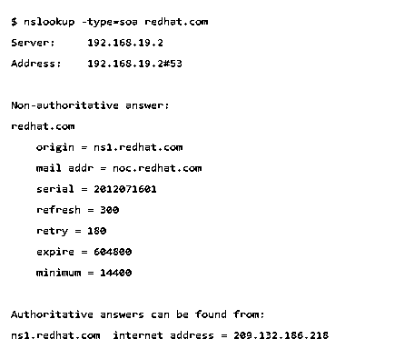
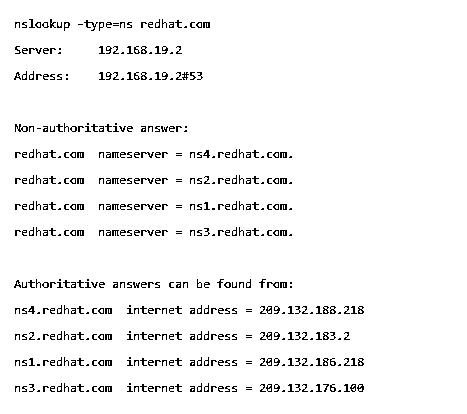

# Linux 中的 DNS 配置

> 原文：<https://www.educba.com/dns-configuration-in-linux/>

## Linux 中的 DNS 配置介绍

DNS(域名系统)是一种互联网服务，它将域名转换为计算机可以理解的 IP 地址。例如，域名 www.domainsystem.com 可以翻译成 198.105.232.4。这个过程是互联网的主干，在服务器中非常重要。在这个主题中，我们将学习 Linux 中的 DNS 配置。

### DNS 配置

在 Linux 中进行 DNS 配置之前，应该首先了解 DNS 的基础知识以及它是如何工作的。

<small>网页开发、编程语言、软件测试&其他</small>

#### 1.域名

以 www.facebook.com 网站为例。这被称为 FQDN(完全限定域名)每个域名由域名组件组成，这些组件之间用点号隔开。

文本 com 是顶级域组件，脸书是二级域组件，而 www 是三级域组件

点称为根域。

#### 2.子域

当你访问像 newsroom.facebook.com 这样的网站时。这里的新闻编辑室是 facebook.com 的一个子域。只有 newsroom.facebook.com 的域名服务器知道其下存在的所有主机，所以脸书回答是否有新闻编辑室子域，根域名服务器对此一无所知。

### DNS 服务器的类型

有三种类型的 DNS 服务器:

**主 DNS 服务器:**主 DNS 服务器保存域配置文件的主副本。它们包含 IP 地址和管理员详细信息等信息。

**辅助 DNS 服务器(从服务器):**它们包含从主 DNS 服务器获得的域信息的只读副本。当主服务器停机时，这很有用。辅助服务器充当备份。

**缓存 DNS 服务器:**缓存 DNS 服务器保存用户最近请求查询的数据，减少主服务器和辅助服务器的工作量。

**安装绑定**

让我们看看如何在不同的 Linux 发行版上安装 bind。

在 Debian/Ubuntu Linux 上，使用以下语法

`$ sudo apt-get install bind9`

在 Redhat/CentOS/Fedora 系统上，使用以下语法

`# yum install bind9`

/etc/bind 目录包含所有 DNS 配置。/etc/bind/named.conf 是包含所有其他所需文件的主要配置。名为/etc/bind/db.root 的文件指定了世界上的根名称服务器。

完成安装后，您可以启动它，并使其在引导时运行。

`$  systemctl  start named
$  systemctl  enable named`

**配置绑定**

服务配置文件是/etc/named.conf 文件

**定义主要区域**

要在/etc/named.conf 文件中定义主区域，语法如下

`Zone      “abcexample.com”   {
Type master ;
File abcexample.com.db
};`

zone 语句允许您定义一个特定的 DNS 区域。

包含区域信息的文件位于目录/var/named 中。

因为这是主要区域，所以类型是主区域。

**定义次级区域**

`Zone        “abcexample.com”      {
Type slave
masters Primary Nameserver IP Address Here; ;
file abcexample.com.db
};`

辅助区域中的域名与主要区域中的域名相同，并且类型为从属，因为这是辅助区域。主服务器的选项是指定主名称服务器的 IP 地址，文件指示主区域文件的路径。

**定义缓存区**

缓存区域减少了 DNS 服务器上的查询。为了定义缓存区域，我们需要定义 3 个区域部分。

`Zone        "." IN {
type hint;
file "root.hint";
};`

这里的点表示根名称服务器。类型提示指示缓存区入口和文件“root . hint”；指定包含根服务器的文件。

`Zone     "localhost" IN {
type master;
file "localhost.db";
};`

第三个区域执行本地主机的反向查找。

`Zone          "0.0.127.in-addr.arpa" IN {
type master;
file "127.0.0.rev";
};`

将这三个区域放在/etc/named.conf 上将使我们的系统像缓存 DNS 服务器一样工作。现在，我们应该键入引用的文件的内容，如 abcexample.com.db、localhost.db 和 127 . 0 . 0 . rev。这些文件包含每个区域的 DNS 记录类型和某种选项。让我们看看这些记录类型。

**DNS 记录类型**

**SOA :** 授权记录的开始

SOA 记录是存储在 DNS 区域中的关于该区域和其他记录的信息。它定义了区域的属性。

它应该包含以下信息

区域的名称

IN(区域类)IN 代表互联网

主要主名称服务器

区域的序列号

刷新、重试、过期和 TTL 时间(秒)

**语法**

`abcexample.com.      86400      IN      SOA      ns1.abcexample.com.mail.abcexample.com. (
2020020204  ;serial
86400 ;refresh, seconds
8200 ;retry, seconds
3600000 ;expire, seconds
86400 ;minimum, seconds
)`

使用以下命令查询 SOA 记录

`-query=soa`

**名称服务器记录(NS)**

它用于指定区域的名称服务器。

**语法**

`IN           NS         ns1.abcexample.com.
IN           NS         ns2.abcexample.com.`

使用以下命令查询 NS 记录

`-query=ns`

**地址记录(一个& AAAA)**

该记录将主机名映射到相应的 IP 地址

**语法**:

`support IN          A             192.168.1.5`

**指针记录(PTR)**

该记录与地址记录相反。它会将 IP 地址映射到主机名

**语法**

`192.168.1.5        IN            PTR      support.example.com.`

**邮件交换记录(MX)**

这是一种 DNS 记录，用于指定负责代表域接受电子邮件的邮件服务器。

**语法**

`Domain                     TTL    Class   Type      Priority                           Host
abcexample.com.      1936    IN      MX          10              onemail.abcexample.com
abcexample.com.      1936    IN      MX          10             twomail.abcexample.com`

这里，优先级表示应该首选哪个邮件服务器。优先级值越高，优先级越高。

使用以下命令查询 MX 记录

`-query=mx`

**规范名称记录(CNAME)**

规范名称记录是一种为主机指定别名或昵称的 DNS 记录。

`NAME                                    TYPE            VALUE
--------------------------------------------------
abc.example.com.        CNAME      cab.example.com.
cab.example.com.        A          192.0.2.23`

**文本记录(TXT)**

文本记录是一种 DNS 记录，使您能够添加任何文本，如联系信息或您希望用户了解您的域的任何其他信息。

`abcexample.com.  IN    TXT   “welcome to our website”`

**DNS TTL 值**

TTL 代表生存时间。

TTL 值通知 bind 每个记录的生命周期。使用的单位是秒。常见的 ttl 值是 86400 ( 24 小时)。较低的 ttl 可能会导致权威名称服务器上的流量负载过重。

**捕捉配置错误**

写入区域文件时可能会出错。您可以使用以下语法从日志中诊断这些错误

`$tail -f /var/log/messages`

**主机命令**

成功添加和修改资源记录后，您可以使用以下命令检查主机是否得到正确解析

如果您提供主机名，它将返回相应的 IP 地址

`$ host abcexample.com`

此外，如果您提供 IP 地址，它将返回主机名。

`$ host 192.168.1.5`

谁是指挥

whois 命令用于获取域名所有者的详细信息。细节可以是像联系号码或电话号码这样的信息。

`$ whois abcexample.com`

**RNDC 命令**

rndc 命令用于从本地和远程保护您的名称服务器。为了防止对您的名称服务器进行任何未经授权的访问，必须在选定的端口(默认为端口 953)上配置 rndc

您可以使用以下命令检查 dns 服务器的状态。

`$ rndc status`

如果您对任何区域文件进行了更改，您可以使用以下命令重新加载该服务

`$  rndc  reload    abcexample.com`

您可以使用以下命令重新加载所有区域文件

`$   rndc   reload`

如果添加新区域或更改服务器的配置，可以使用以下命令重新加载配置。

`$    rndc     reconfig`

在本文中，我们已经了解了 DNS 以及如何使用 Linux 安装和配置 DNS 服务器。

### 推荐文章

这是 Linux 中 DNS 配置的指南。这里我们讨论 DNS 配置，首先应该了解 DNS 的基础知识和它是如何工作的。您也可以看看以下文章，了解更多信息–

1.  [Linux 中的帮助命令](https://www.educba.com/help-command-in-linux/)
2.  [Linux 中的 mv 命令](https://www.educba.com/mv-command-in-linux/)
3.  [Linux 中的 Zip 命令](https://www.educba.com/zip-command-in-linux/)
4.  [Linux 中的 CAT 命令](https://www.educba.com/cat-command-in-linux/)

