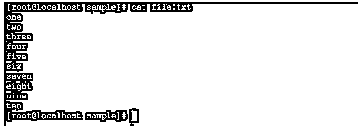
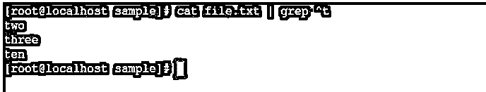
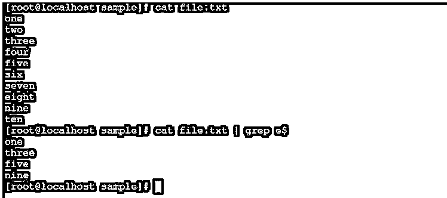
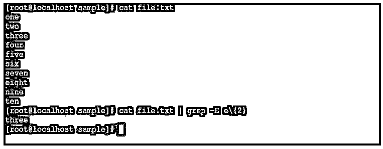
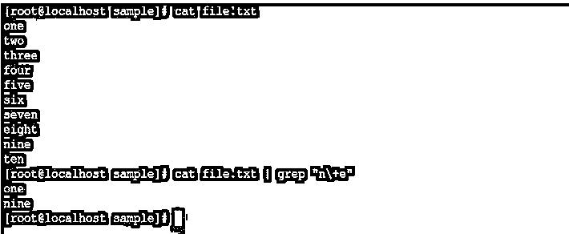
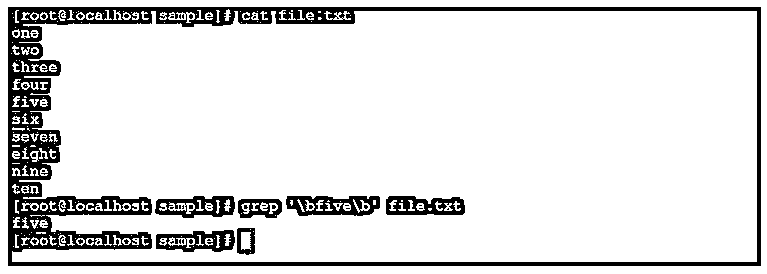
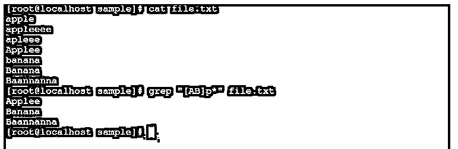
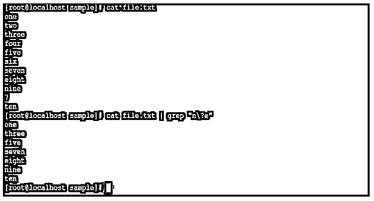

# Linux 正则表达式

> 原文：<https://www.educba.com/linux-regular-expression/>

## Linux 正则表达式简介

Linux 正则表达式，基本上是一个字符或字符串序列，它定义了搜索模式。vim、vi、sed、awk、find、grep 等字符串搜索算法使用这些搜索模式。它是 Linux 中一个非常强大的工具。我们可以使用相同的正则表达式在行和列级别识别或搜索复杂值。Linux 正则表达式也称为 regexp 或 regex。

**正则表达式命令的语法:**

<small>网页开发、编程语言、软件测试&其他</small>

`search/read command<pattern><fileName>`

*   **搜索/读取命令:**我们可以使用 Linux 中的任何搜索或读取命令，如 vim、vi、sed、awk、find、grep 等。
*   **模式:**我们需要在语法中提供正则表达式模式。
*   **文件名:**输入文件。

### Linux 正则表达式命令是如何工作的？

正则表达式只不过是搜索算法中的一种符号表示。在任何搜索算法中，我们都需要通过这些正则表达式来识别输入字符串或输入数据中可用的复杂字符串。

Linux 生态系统中有许多不同类型的正则表达式。

| **Sr 号** | **正则表达式符号** | **描述** |
| One | . | 它将替换任何字符。 |
| Two | /b | 它将匹配边缘的空字符或字符串。 |
| Three | /B | 它将匹配非边缘的空字符或字符串。 |
| Four | ^ | 它将匹配字符串的字符串。 |
| Five | \< | 它将匹配单词开头的空字符串。 |
| Six | 美元 | 它将匹配字符串末尾的字符。 |
| Seven | \> | 它将匹配单词末尾的空字符串。 |
| Eight | \ | 它将代表特殊字符。 |
| Nine | () | 它将对正则表达式进行分组。 |
| Ten | ? | 它将匹配相同或恰好一个字符。 |

### Linux 正则表达式的例子

下面是提到的例子:

#### 示例#1

带有“^”符号的正则表达式。

在 Linux 正则表达式中，我们能够搜索与“^”符号相关的字符串的开头。要搜索字符串，我们需要使用任何文本/字符串编辑器或搜索算法。

**代码:**

`cat file.txt | grep ^t`

**说明:**

我们有一个示例目录，在同一个目录中有文件名“file.txt”。里面有记录。我们使用 file.txt 作为 Linux 正则表达式的输入。我们需要识别以字符“t”开头的记录。

**输出:**

#### 实施例 2

带“$”符号的正则表达式。

在 Linux 正则表达式中，我们能够搜索与“$”符号相关的字符或字符串的结尾。要搜索字符串，我们需要使用任何文本/字符串编辑器或搜索算法。

**代码:**

`cat file.txt | grep e$`

**说明:**

在同一个目录下，有文件名“file.txt”。里面的记录很少。我们使用 file.txt 作为 Linux 正则表达式“$”的输入。我们需要识别以字符“e”结尾的记录。

**输出:**

#### 实施例 3

Linux 正则表达式-区间。

Linux 中有不同类型的正则表达式。间隔就是其中之一。在区间表达式的帮助下，我们能够找到在一个字符串中出现次数的表达式。

我们需要对字符/字符串间隔值使用“-E”选项。

**代码:**

`cat file.txt | grep -E e\{2}`

**说明:**

在 Linux 生态系统中，我们可以搜索不同的字符组合。按照上面的命令，我们能够找到与命令中给定值相同的字符序列的次数。我们确定了字符“e”在字符串中出现两次的顺序。

**输出:**

#### 实施例 4

带有“\+”符号的正则表达式。

在正则表达式中，我们希望从输入文件中过滤出前一个字符的一次或多次匹配。

**代码:**

`cat file.txt | grep "n\+e"`

**说明:**

我们使用输入文件作为“file.txt”。我们需要从起始字符“n”和辅助字符“e”开始搜索字符串。按照上面的命令，我们从输入文件中搜索特定的特征组合。

**输出:**

#### 实施例 5

带分隔词的正则表达式。

在 Linux 正则表达式中，我们能够从输入文件中找到精确匹配的字符串。我们需要将“\b <string name="">\b”选项用于任何文本/字符串编辑器或搜索算法**。**</string>

**代码:**

`grep '\bfive\b' file.txt`

**说明:**

在 Linux 正则表达式中，我们能够从输入文件/数据中找到特定的字符串或字符。按照上面的命令，我们指定正则表达式来查找准确的字符串。我们使用“\b\b”选项来保存搜索字符串。

**输出:**

**

** 

#### 实施例 6

带“*”符号的正则表达式。

在 Linux 正则表达式中，我们能够在前面的字符中找到或搜索零个匹配或更多次。我们需要在任何文本/字符串编辑器或搜索算法中使用“*”选项。

**代码:**

`grep "[AB]p*" file.txt`

**说明:**

按照上面的命令，我们从小写字母“p”中识别出唯一的大写字母“A”和“B”以及所有的字符或字符串。相应地，给定的输入我们能够从输入文件中得到相关的字符串。

**输出:**

#### 实施例 7

带“\”的表达式符号。

在正则表达式中，我们希望从输入文件中过滤掉前一个字符的零次或多次匹配。

**代码:**

`cat file.txt | grep "n\?e"`

**说明:**

我们使用输入文件作为“file.txt”。我们需要从起始字符“n”和辅助字符“e”开始搜索字符串。按照上面的命令，我们从输入文件中搜索特定的特征组合，它将搜索输入文件中的所有字符。

**输出:**

### 结论

我们已经看到了“Linux 正则表达式命令”的完整概念，以及正确的示例、解释和具有不同输出的命令。正则表达式是处理任何类型数据的非常强大的命令工具。它广泛应用于 shell/bash 作业、搜索工具等。

### 推荐文章

这是 Linux 正则表达式指南。在这里，我们讨论 Linux 正则表达式的介绍，以及命令的工作方式，并通过例子来更好地理解。您也可以看看以下文章，了解更多信息–

1.  [删除目录 Linux](https://www.educba.com/remove-dir-linux/)
2.  [Linux 过滤命令](https://www.educba.com/linux-filter-commands/)
3.  [Linux 创建文件](https://www.educba.com/linux-create-file/)
4.  [Linux 列表用户](https://www.educba.com/linux-list-users/)

