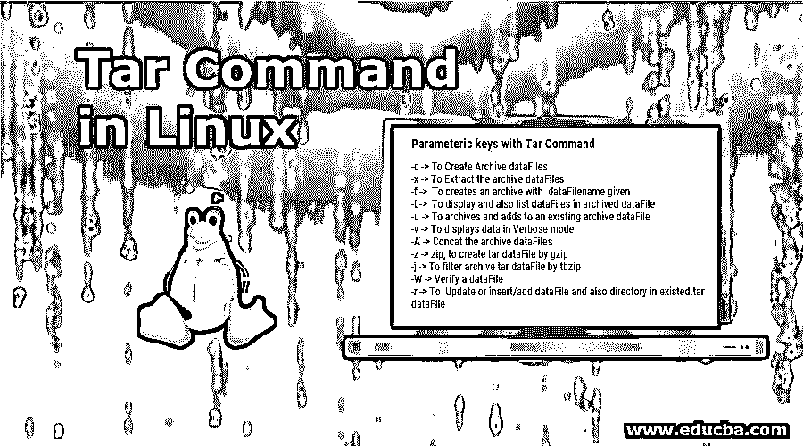

# Linux 中的 Tar 命令

> 原文：<https://www.educba.com/tar-command-in-linux/>




## Linux 中 TAR 命令简介

在 Linux 中,“tar”命令用磁带存档来表示，主要由 Linux/Unix 系统中的管理员用于磁带驱动器备份。Tar 命令主要用于创建和压缩归档数据文件，这些文件可以轻松地从一个设备移动到另一个设备。Tar 命令在 Unix /Linux 中也有不同的名称，如 gzip、tarball 和 bzip。

我们将看到 tar 命令的不同图示，其中包括使用不同压缩技术(tar、tar.gz、tar.bz2)创建归档数据文件、提取归档数据文件、单个数据文件、查看数据文件的数据、验证、向归档数据文件添加数据文件/目录，以及估计 tar 数据文件的大小等等。

<small>网页开发、编程语言、软件测试&其他</small>

### 了解归档数据文件

归档数据文件是除元数据之外还包含一个或多个数据文件的数据文件。这些数据文件将多个数据文件收集到一个数据文件中，以减少存储空间并便于携带。

**语法:**

```
tar -parameteric key  Archive_dataFile_Name  dataFile/Directory_Path to be archived
```

**用于说明:**tar-CVF archive _ test . tar/home/use

*   **cvf:** 是参数化的关键部分。
*   **存档 _ 测试. tar:** 存档 _ 数据文件名。
*   **/home/utiliser/:** 目录 _ 路径。

### 带有 tar 命令的参数键

*   **-c—**创建归档数据文件。
*   **-x—**提取归档数据文件。
*   **-f–**使用给定的数据文件名创建归档文件。
*   **-t—**显示并列出存档数据文件中的数据文件。
*   **-u—**归档并添加到现有的归档数据文件。
*   **-v—**以详细模式显示数据。
*   **-A—**连接归档数据文件。
*   **-z-**Zip，通过 gzip 创建 tar 数据文件。
*   **-j—**通过 tbzip 过滤归档 tar 数据文件。
*   **-W—**验证数据文件。
*   **-r—**更新或插入/添加数据文件以及 existed.tar 数据文件中的目录。

### Tar 命令的应用

下面详细给出 tar 命令的各种应用:


**1。使用参数键-xvf:** 从档案中提取数据文件。

**代码:**

```
#tar -xvf dataFile.tar
```

**输出:**

数据文件 2.txt

数据文件 3.txt

数据文件 4.txt

**2。检查 Linux 中现有的 tar、tar.tbz、tar.tbz 数据文件的大小:**下面的命令将以千字节(KB)为单位显示归档数据文件的大小。

**代码:**

```
#tar- czf dataFile1.tar | wc -c
```

此外

```
#tar -czf dataFile2.tar.gz | wc -c
```

此外

```
#tar czf dataFile3.tar.tbz | wc -c
```

**3。使用参数键-cvf 归档数据文件以创建未压缩的 tar:** 该命令创建一个名为 dataFile.tar 的 tar 数据文件，用于归档所有。当前工作目录中的 txt 数据文件。

**代码:**

```
#tar -cvf dataFile.tar *.txt
```

**输出:**

数据文件 2.txt

数据文件 3.txt

数据文件 4.txt

**4。使用带有参数键-z:** 的 gzip 压缩 tar 归档文件该命令将创建一个名为 dataFile.tar.gz 的 tar 数据文件，它是。txt 数据文件。

**代码:**

```
#tar -cvzf dataFile.tar.gz *.txt
```

**输出:**

dataFile.tar.gz

**5。使用参数关键字-xvzf:** 提取 gzip tar 存档数据文件(*.tar.gz)该命令从存档的 dataFile.tar.gz 数据文件中提取所有数据文件。

**代码:**

```
# tar -xvzf dataFile.tar.gz
```

**输出:**

dataFile.tar

**6。使用 Linux 中的参数 key -j 创建压缩的 tar 归档数据文件:**该命令将压缩和创建小于 gzip 大小的归档数据文件，因为压缩和解压缩需要的时间比 gzip 长得多。

**代码:**

```
# tar -cvfj dataFile.tar.tbz illustrition.txt
```

**输出:**

# tar-cvfj datafile . tar . tbz illustration . txt

illustrition.txt

#tar -tvf dataFile.tar.tbz

-rwxrwxrwx root/home 84 illustration . txt

**7。要解压缩一个单独的 tar 数据文件和提到的目录:**该命令将使用-C 参数键解压缩当前工作目录和提到的目录中的数据文件。

**代码:**

```
# tar -xvfj dataFile.tar
```

此外

```
#tar xvfj dataFile.tar -C dataFile path in the directory
```

**8。具有扩展名的数据文件的多重解压缩。tar、. tar.gz、. tar.tbz 数据文件:**该命令将提取并解压缩多个具有不同扩展名的归档数据文件。

**举例:**

此命令将从存档的数据文件中提取“数据文件 1”“数据文件 1”。

**代码:**

```
#tar -xvf dataFile1.tar "dataFileA1" "dataFileB1"
```

此外

```
#tar -zxvf dataFile2.tar.gz "dataFileA1" "dataFileB1"
```

此外

```
#tar -jxvf dataFile3.tar.tbz "dataFileA1" "dataFileB1"
```

**9。更新 Linux 中已经存在的 tar 数据文件**

**代码:**

```
#tar -rvf dataFile.tar *.txt
```

**输出:**

数据文件 1.txt

10。要列出内容并使用参数键-tf: 指定 tar 数据文件，该命令将列出存档数据文件的完整列表。我们还可以列出 tar 数据文件中的特定内容。

**代码:**

```
#tar -tf dataFile.tar
```

**输出:**

illustrition.txt

**11。我们可以使用管道来应用不同的命令:**对于 illustration“grep command”来查找不同的单词和句子:该命令将只列出提到的文本，以及来自存档数据文件的 grep 中的图像。

**代码:**

```
#tar -tvf dataFile.tar | grep "Txt to be searched"
```

此外

```
#tar -tvf dataFile.tar | grep -parameteric key dataFile_name.(dataFile name of different extension)
```

**12。dataFilename 可以作为一个参数传递，用于搜索 tar 数据文件:**该命令给出存档的数据文件及其附加细节。

**代码:**

```
#tar -tvf dataFile.tar dataFilename
```

13。使用参数键 tvf 查看存档的数据文件

**代码:**

```
#tar -tvf dataFile.tar
```

**输出:**

-rwxrwxrwx root/home 291 data file 2 . txt

-rwxrwxrwx root/home 218 data file 3 . txt

-rwxrwxrwx root/home 593 data file 4 . txt

**Linux 中的通配符:**

“通配符”，通配符是一组用于替换和显示一个或多个字符的符号。通配符通常用问号(？)表示单个字符，星号(*)表示 1 和更多字符

**14。如果我们想在。png 扩展:**该命令将使用。png 扩展名仅来自 dataFile.tar 档案馆。–通配符参数键告诉 tar 在要提取的数据文件名中考虑通配符；扩展名为(*)的数据文件名。png)用单引号括起来，以防止 shell 以不正确的方式扩展通配符(*)。

**命令:**

```
#tar -tvf dataFile.tar --wildcard '*.png'
```

*   **记住:**在上面的命令中，用“*”代替 dataFilename 来考虑该工作目录中存在的所有数据文件。
*   **实用程序:** Tar 命令用于将数据文件归档到。tar 扩展，也在。gz 扩展。其使用较少的存储器用于存储目的。

### 结论

通过这种方式，我们看到了 tar 命令中不同类型的参数键，以归档/压缩和解压缩技术实现更容易的可移植性和存储目的。

### 推荐文章

这是 Linux 中 Tar 命令的指南。这里我们讨论参数键的基本概念和 tar 命令的各种应用。您也可以阅读以下文章，了解更多信息——

1.  [Linux 中的 Chown 命令](https://www.educba.com/chown-command-in-linux/)
2.  [Linux 中的 NFS](https://www.educba.com/nfs-in-linux/)
3.  [Linux 中的 GCC 命令](https://www.educba.com/gcc-command-in-linux/)
4.  [Linux 路由命令](https://www.educba.com/linux-route-command/)


