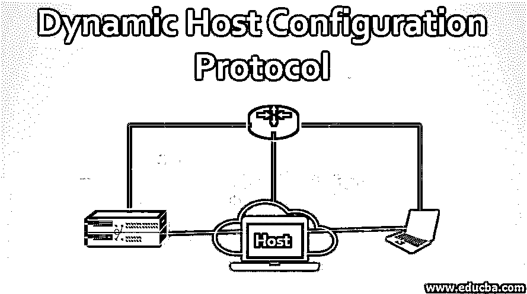
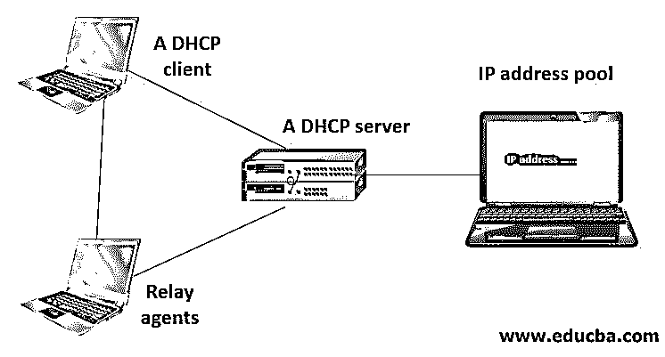

# 动态主机配置协议

> 原文：<https://www.educba.com/dynamic-host-configuration-protocol/>

## 动态主机配置协议简介

以下文章概述了动态主机配置协议。你有没有想过计算机是如何相互交流的，或者你的手机或笔记本电脑是如何与互联网交流或在任何网络内进行通信的？他们是如何立即连接到互联网或任何网络的，只要你点击一下，你就可以立即开始观看视频、玩游戏？

下面给出的是它背后的动态主机配置协议逻辑。

<small>网页开发、编程语言、软件测试&其他</small>

让我们看看它的缩写含义:

*   **动态:**随时/在运行时自动进行。
*   **主机:**连接到网络的电脑(PC)或设备。
*   **配置:**进行一些设置。
*   **协议:**电子设备间数据传输的一套规则。

**DHCP:**

*   是 IP 网络上使用的一组网络规则。
*   由一个名为 DHCP 服务器的服务器组成。
*   它会自动为网络上的每台设备分配一个 IP 地址，这样所有的设备都可以正常地相互通信。

让我们考虑一个有老板的公司&公司的一些高级雇员，许多销售人员想与他们交流推销他们的产品或服务。为此，他们需要请求 Mary(秘书)，她是安排会议的中间人。因此，Mary 就像一个小型的 DHCP 服务器，为销售人员(主机)提供约会(IP 地址)。如果每天有 20 个销售人员请求，这个任务可以由 Mary 手动完成，但是如果有 200 或 2000 个销售人员请求会见老板呢？她将如何手动安排会议？她会疲倦，会忘记一切，并开始犯错误。

为此，可以有一个自动化的服务器&软件，它自动将约会分配给请求者。该服务器将被称为 DHCP。服务器将为每台主机(销售人员)分配 IP 地址(会议日期和时间),以便与其他主机(老板或其他高级员工)通信。类似地，如果一台 PC 或主机想要在任何网络中进行通信，DHCP 服务器通过动态地给该 PC 分配 IP 地址来帮助该 PC，以便它可以与该网络上的其它计算机进行通信。

### DHCP 的组件

下面给出了 DHCP 的组件及其工作原理。

#### 1.DHCP 客户端

它是从 DHCP 服务器接收信息的设备。它可以是计算机、移动设备或任何需要连接到网络的设备。默认情况下，大多数设备已经配置为接收 DHCP 信息。

#### 2.DHCP 服务器

它是运行 DHCP 服务的联网设备，保存 IP 地址(在其 IP 地址池中)和相关配置信息。它主要是服务器或路由器，但也可以是任何充当主机的设备。

#### 3.中继代理

这些设备或路由器获取网络上客户端广播的客户端消息，以加入该网络，并将这些消息转发到已配置的 DHCP 服务器，然后该服务器将响应发送回这些中继代理，中继代理将这些响应传递给客户端。这些用于集中 DHCP 服务器。

#### 4.IP 地址池

它是 DHCP 服务器拥有的 IP 地址桶。它是可以分配给请求设备(即 DHCP 客户端)的地址范围。

IP 地址是按从低到高的顺序分配的。

*   **租用时间:**客户端设备保存 DHCP 服务器提供给它的 IP 地址信息的持续时间。当租用时间到期时，客户端必须续订。

### 动态主机配置协议是如何工作的？

DHCP 工作在客户机-服务器模型上。路由器或交换机也可以用作 DHCP 服务器。笔记本电脑或移动电话等客户端设备向服务器请求 DHCP 服务，以从 IP 地址池中获取分配的 IP 地址，从而可以与该网络上的其他设备通信。

DHCP 服务器和客户端在此过程中广播了 5 条消息:

*   **发现:**一个新的客户端在进入网络时向服务器发送这个消息。
*   **要约:**客户端可以接受任何要约，因为可以有多个服务器，所以多个要约。
*   **请求:**客户端或主机发送此请求消息。
*   **PACK:** 为客户端分配一个可用的 IP 地址，并打包其他详细信息。
*   **释放:**当客户端设备想要离开网络或加入另一个网络时。

### DHCP 服务器的优势

下面给出了一些好处:

1.轻松管理和配置网络中的多个设备。

2.IP 设置的准确性。

*   当使用像“xxx.xxx.xxx.x”这样的 IP 时，它们很容易出错。
*   这种类型很难发现和清除。为此，DHCP 可以提供帮助。

3.缓解了 IP 地址的冲突。

DHCP 通过确保每台设备都有唯一的 IP 地址来解决 IP 地址冲突的问题。

**1。无需手动操作(整个过程自动化):**使用 DHCP，不再需要手动分配、跟踪和管理 IP 地址。在过去，网络管理员必须手动跟踪每台设备及其 IP 地址，这是非常低效的。随着 DHCP 的出现，所有这些任务都被自动化&集中化了，这对网络管理员来说是个福音。

**2。修改 IP 地址:**由于有了 DHCP，编辑 IP 地址变得非常容易。DHCP 服务器会自动将更改广播到所有连接的设备。

### 结论

我们发现需要 DHCP 的主要原因是为了简化网络上 IP 地址的管理。不能有两台主机具有相同的 IP 地址，手动配置它们会导致错误。即使在小型网络中，手动分配 IP 地址也会令人困惑，尤其是对于临时需要 IP 地址的移动设备。此外，大多数用户在技术上还不足以找到计算机上的 IP 地址信息并进行分配。这一过程的自动化使用户和网络管理员的工作变得更加轻松。

### 推荐文章

这是动态主机配置协议指南。这里我们分别讨论 DHCP 的简介、组成、工作原理和优点。您也可以浏览我们推荐的其他文章，了解更多信息——

1.  [Linux 中的 DHCP 服务器](https://www.educba.com/dhcp-server-in-linux/)
2.  [什么是桥？](https://www.educba.com/what-is-bridge/)
3.  [配置 DHCP 服务器](https://www.educba.com/configuring-dhcp-server/)
4.  [网络设备的类型](https://www.educba.com/types-of-network-devices/)

