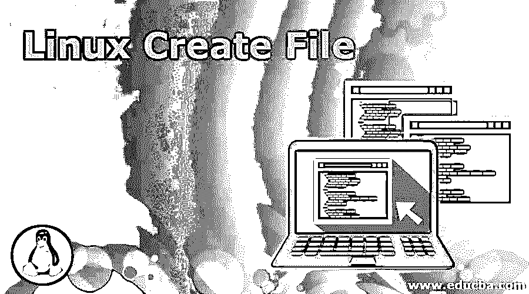
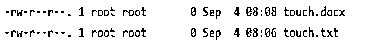
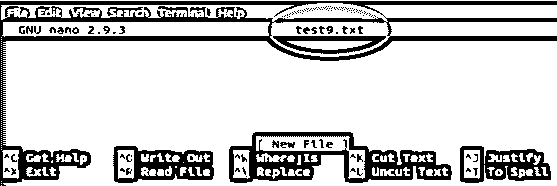

# Linux 创建文件

> 原文：<https://www.educba.com/linux-create-file/>

## Linux 创建文件简介

在 Linux 操作系统中，创建文件是一项重要的任务，因为用户或管理员可能需要在一天内多次创建文件。可以使用命令行或使用文件管理器通过[创建文件。在本文中，我们将讨论创建文件的多种方法。使用 touch、echo cat 等命令以及 nano、vim 和 vi 等打印和文本编辑器来创建新文件。](https://www.educba.com/android-file-manager/)

### 如何创建文件？

在创建文件之前，您应该检查您是否拥有在父目录中的写权限。如果您没有写权限，那么您将收到权限被拒绝的错误。使用 ls 命令查看目录的数据。

<small>网页开发、编程语言、软件测试&其他</small>

#### 1.使用触摸命令

touch 命令是在 Linux shell 中创建文件的最简单的方法之一。要创建新文件，只需键入 touch 命令，后跟文件名称和扩展名

**语法:** `$ touch filename.filetype`

**举例:**

`$ touch touch.txt
$ touch touch.docx`

如果该文件不存在，则触摸命令将创建一个，如果该文件已经存在，则该命令将修改其时间戳。使用此命令时，我们不能在创建新文件时写入任何数据。默认情况下，新创建文件的大小为 0KB。

使用 ls 命令查看新创建的文件。

**命令:**

`$ ls -l`

**输出:**

要同时创建多个文件，请输入文件名并用空格分隔。

**举例:**$ touch file 1 . docx file 2 . docx file 3 . docx

#### 2.使用重定向运算符创建文件

重定向符号(>)也用于创建新文件。顾名思义，重定向操作符通过管道将命令输出到另一个命令或文件。要使用该操作符创建文件，只需在重定向操作符后键入文件名。即使在这种方法中，您也不能直接输入文本。与 touch command 不同，您一次只能创建一个文件。这是在 Linux 操作系统中创建文件的最短方法。

**命令:** `$ > test2.txt`

如果文件名已经存在，它将覆盖该文件，否则将创建新文件。

**输出:**

#### 3.使用 Cat 命令创建文件

我们还可以使用 cat 命令创建一个文件。这种方法的一个重要优点是，您可以立即开始向文件中添加文本。要创建一个新文件，只需键入 cat 命令，后跟重定向操作符和文件名，然后按回车键。

然后，您可以立即将文本输入到文件中。完成后，按 Ctrl + D 保存文件。

**语法:** `$ cat > cat.txt`

要查看文件，请键入以下命令

**命令:** `$ ls -l cat.txt`

**输出:**

#### 4.使用 Echo 命令创建文件

该命令打印作为参数输入到命令中的文本，然后该命令被重定向到文件。要创建文件，请键入 echo 命令，然后键入要显示的文本，然后使用重定向符号将内容写入要创建的文件。

使用以下命令行通过 echo 命令创建一个文件。

`$ echo “ Linux is simple and easy to learn” > echosample.txt`

要仅创建一个空文件，请使用以下命令。

`$ echo > echosample.txt`

### 如何使用 Herdoc 创建文件？

Heredoc 或 Here document 指的是一种重定向，它允许用户将多行代码传递给一个特定的命令。当您需要创建包含多行的文件时，可以使用此方法。

使用以下命令通过 heredoc 创建一个文件

`$ << EOF > sample.txt
first line
second line
third line
EOF`

#### 1.使用 DD 命令

有时我们需要创建大文件来测试写入速度或测试网络速度。当需要创建大文件时，使用 dd 命令。

**示例:**要创建一个 1 GB 大小的文件，请运行以下命令。

`$ dd if=/dev/zero of=sample.test bs=1 count=0 seek=sample`

这里的 sample.test 是文件名。

#### 2.用 fallocate 命令创建文件

fallocate 是一个为文件分配实际磁盘空间的实用程序命令。

$ fallocate-1 克样品测试

上述命令将创建一个名为 sample.test 的文件，大小为 1 GB。

#### 3.用打印命令创建文件

该命令类似于 echo 命令，它提供了一些格式化功能。要创建包含单个文本行的文件，请使用以下命令。

`$ printf 'first line\n' sample.txt`

要添加两行，请使用\n 选项分隔每行。

`$ printf 'first line\n second line' sample.txt`

现在让我们看看如何使用文本编辑器创建一个新文件。

*   **VI 文本编辑器**

这是 Linux 系统中最古老的文本编辑器。它用于直接编辑文本文件。

要使用 Vi 文本编辑器创建新文件，请键入以下内容:

`vi sample.txt`

您的屏幕将切换到文本编辑器模式。按 I 键切换到插入模式。现在输入文件的内容。要保存文件并退出，按下按钮 **Esc:x** 并按下 **Enter** 键。

**输出:**

*   **VIM 文本编辑器**

您可能会发现 Vi 编辑器对用户不太友好。Vim 是 Vi 编辑器的修改版本。Vim 代表 Vi modified。

使用以下命令创建一个新文件。

`vim test8.txt`

该屏幕将类似于 Vi 编辑器屏幕。按 I 键键入文本，键入后，保存文件并通过键入以下内容退出。

Esc :wq Enter

**输出:**

*   **使用 Nano 编辑器创建新文件**

Nano editor 是我们迄今为止看到的三个文本编辑器中最新的、也容易得多的编辑器。

要创建新文件，请键入以下命令。

`$ nano test9.txt`

输入上述命令后，您将直接进入编辑模式。它还会在屏幕底部显示有用命令的列表。输入文本并按 Ctrl + O 保存文件。要退出 nano 编辑器，请按 Ctrl+X。

**输出:**

### 推荐文章

这是一个 Linux 创建文件的指南。在这里，我们讨论在 Linux 操作系统中创建新文件的不同方法及其示例和代码实现。您也可以浏览我们推荐的其他文章，了解更多信息——

1.  [Linux 操作员](https://www.educba.com/linux-operators/)
2.  [Linux uniq](https://www.educba.com/linux-uniq/)
3.  [Linux 过滤命令](https://www.educba.com/linux-filter-commands/)
4.  [Linux gzip](https://www.educba.com/linux-gzip/)

