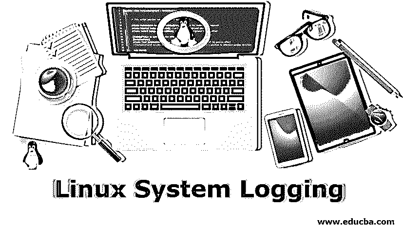

# Linux 系统日志记录

> 原文：<https://www.educba.com/linux-system-logging/>

## Linux 系统日志简介

下面的文章提供了 Linux 系统日志的概要。任何操作系统都可以让我们跟踪在其平台上执行的活动。在调查操作系统上执行的活动时，存储日志的特性非常有用。由于操作系统被用作任何服务器的核心，它通过以日志的形式存储所有用户的活动，让我们跟踪用户如何利用操作系统。与所有操作系统类似，Linux 也提供了一种存储日志的机制。在托管应用程序的一些服务器中，使用 Linux 操作系统，它存储每当用户试图访问存储在服务器上的网页时生成的所有日志。

### Linux 系统日志记录工具

Syslog 工具及其描述:在理解 Linux 中的日志记录方法之前，我们必须理解当我们谈论 Linux 中的日志记录时它到底意味着什么。日志可以定义为存储操作系统正在执行的所有活动的方法。Linux 操作系统为我们提供了一些特殊的工具，用来在系统中存储日志。日志记录通常会捕获时间戳和活动片段。日志被认为是促进任何调查的重要组成部分。尽管记录活动占用内存，但是记录的范围必须是有限的和特定的。

<small>网页开发、编程语言、软件测试&其他</small>

Syslog 工具是用于以特定方式在操作系统中存储日志的特殊关键字。有些情况下，系统管理员需要以特定的方式存储日志数据，以满足业务需求；在这种情况下，他们利用 Syslog 工具以他们想要的方式存储数据。Linux 为我们提供了几种工具，它们的功能都是独一无二的。

下面是 Linux 操作系统中经常使用的工具列表，它们作为 Syslog 工具很受欢迎。

#### 1.作家（author 的简写）

Auth 是最重要的 Syslog 工具之一，用于获取与用户名和密码相关的活动。在存储日志时，我们需要在某些地方存储与用户名和密码相关的数据；在这种情况下，auth 工具正被用于此目的。

#### 2.Authpriv

authpriv 工具实际上代表作者特权。该工具的功能类似于 auth 工具，但唯一的区别是，它将日志存储在一个文件中，拥有读取该文件权限的用户可以读取该文件。它还存储与用户名和密码相关的信息。所有的日志都存储在一个特定的文件中，该文件必须通过特定的用户进行传播。

#### 3.安慰

记录与控制台相关的信息至关重要，因为这是在调查中发挥重要作用的重要部分。发送到控制台的所有消息都是使用此功能记录的。它就像一个嗅探器，捕捉发送到控制台的消息，并以日志的形式存储它们。

#### 4.文件传输协议（File Transfer Protocol 的缩写）

该工具的作用是确保与 ftp 守护程序相关的所有消息都已记录到系统中。当用户使用 ftp 时，他通常会留下日志，使用该工具可以捕获和存储这些日志。人们可以利用这个 Syslog 工具来存储使用 FTP 时产生的每个事件。

#### 5.克恩

kern 工具用于跟踪所有基于内核的消息。内核是操作系统的灵魂，它告诉我们内核级发生的任何事情。跟踪内核级消息对于解决问题非常重要。

#### 6.邮件

该工具用于记录邮件系统中填充的所有消息。日志文件作为电子邮件相关数据的主要原因是为了研究已发送或接收的邮件类型。

#### 7.网络时间协议

ntp 工具用于存储与网络时间协议相关的数据。每当系统触发任何与网络时间协议相关的消息时，都是 ntp 工具以日志的形式嗅探或存储消息。

#### 8.新闻

新闻工具充当网络新闻协议的消息记录器。网络新闻协议调用一些带有相关特定数据的事件，新闻工具帮助存储这些数据。

#### 9.Lpr

Lpr 代表行式打印系统。该功能的作用是存储所有与行式打印系统相关的信息。它捕获数据并将其存储在日志文件中，类似于所有设施存储日志的方式。

#### 10.标记

Mark 可以被认为是一种生成时间戳并将其存储到日志文件中的工具。在这个工具中，利用伪事件来生成时间戳。

#### 11.用户

这个工具捕获与通常的用户进程相关的消息。用户所做的所有正常活动都被这个工具捕获。

#### 12.玉米

corn 工具是非常重要的工具之一，用于存储用户与 corn 系统交互时生成的与 corn 系统调度程序相关的消息。

### 结论–Linux 系统日志记录

Syslog 工具是 Linux 中带有预定义功能的关键字。这些关键字用于以满足业务需求的特定方式存储数据。存储在日志文件中的日志有多种用途，但存储日志的主要原因是为了了解用户的行为，最终有助于调查。

### 推荐文章

这是一个 Linux 系统日志指南。这里我们讨论 Linux 操作系统中经常使用的工具列表。您也可以看看以下文章，了解更多信息–

1.  [Linux 文件系统](https://www.educba.com/linux-file-system/)
2.  [什么是 Linux？](https://www.educba.com/what-is-linux/)
3.  [Linux 发行版](https://www.educba.com/linux-distributions/)
4.  [Linux 替代品](https://www.educba.com/linux-alternatives/)

