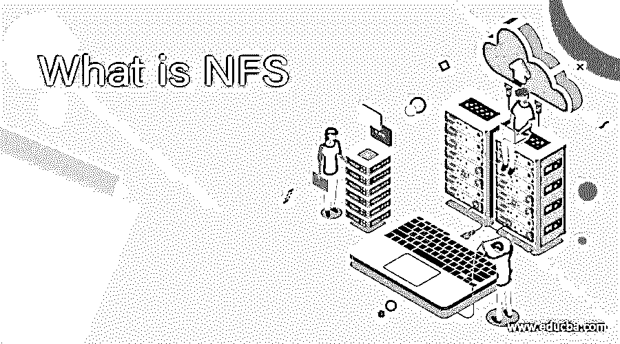
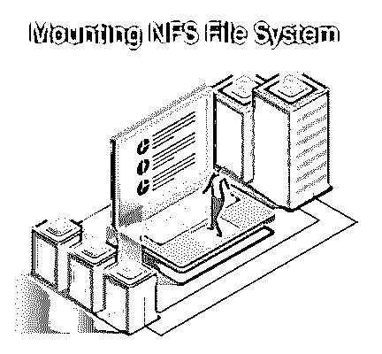

# 什么是 NFS

> 原文：<https://www.educba.com/what-is-nfs/>

## NFS 简介

网络文件系统是一种客户机-服务器应用程序，使计算机操作员能够在远程计算机上查看、存储和更新文件，它是由 Sun Microsystems 在 1984 年发明的，现在由 Internet 工程任务组(IETF)管理。NFS 协议是使用网络连接存储(NAS)的分布式文件系统标准，它允许计算机操作员通过网络访问文件，就像我们通过本地计算机访问文件一样。

NAS 是开源的，可以用来实现任何协议。它提供了通过网络/服务器挂载文件系统的全部或部分的特性，任何有权限(只读或读写)的用户都可以访问它。

<small>网页开发、编程语言、软件测试&其他</small>

NFS 使用远程过程调用(RPC)来处理服务器和客户端之间的请求。

### NFS 工作

要访问服务器或机器上的数据存储，机器将使用进程来访问客户端可用的数据。服务器管理员根据分配给用户的权限，确保用户的数据安全性和可用性。

从客户端，机器通过触发“mount”命令请求数据访问，成功访问后，客户端机器可以看到文件系统并与之交互。

### NFS 版本

以下是下面提到的几个版本。

**1。版本 2:**1989 年 3 月发布。它也被称为 RFC-1094，工作于用户数据报协议(UDP ),这是一种无状态的网络连接。它的存储容量为 32 位，最大存储容量为 4.2 GB，数据传输速率为 8kb，需要在传输完成后提交。

NFS 第二版现在已经过时，没有用了。

**2。版本 3:**1995 年 6 月发布，以 RFC-1813 为标准名称。它提供 32 -64 位存储，数据传输率超过 8kb。它基于具有自动提交功能的传输控制协议(TCP)。

这个文件系统支持 UDP 和 TCP 协议。

**3。版本 4:** 它于 2003 年 4 月发布，也称为 RFC-3530。它具有强大的认证、缓存和更好的国际支持，是一个全状态文件系统。基于确保可靠性和性能的传输控制协议。

**4。版本 4.1:** 于 2010 年 1 月发布，增加了 NFS 在全球广域网(WAN)上基于各种编码(UTF -8，ASCII)的附加功能，也由 RFC-5661 规定。

**5。版本 4.2:** 于 2016 年 11 月发布，也被称为 RFC-7862，具有分布式存储架构的特性&服务器端复制具有许多其他特性

比如安全性增强的 Linux 支持。

### 在 Linux 上配置 NFS 的步骤

以下是下面提到的步骤。

**1。安装:**要安装 NFS 服务器，请在 Unix 终端上键入以下命令:

命令: sudo 安装 nfs-kernel-server

**2。配置:**我们可以通过将目录添加到/etc/exports 来设置它们

部分:

**举例:**

/Linux *

/home *

**如何启动 NFS:** 通过执行以下命令:

sudo system CTL start NFS-kernel-server . service

**3。客户端配置:**我们可以使用“Mount”命令共享 NFS 文件或目录，这使得另一台机器能够访问文件系统:

**举例:**

sudo 挂载 file . hostname . com:/Linux/local/Linux。

****** 请确保文件/目录必须存在于客户端和服务器上。

**4。故障排除:**如果在安装 NFS 共享时出现问题，请确保 nfs-common 软件包已安装在客户端机器上。

**命令:**

sudo apt 安装 NFS-通用

**5。卸载文件系统:**该命令将挂载的文件系统从目录树中分离出来。

要分离一个已挂载的 NFS，我们使用 umount 命令，后跟目录路径，即文件/目录已挂载的位置。

**命令:**

卸载 192 . 10 . 20 . 10:/主页/备份

卸载/变量/主目录/备份

****** 如果 fstab 文件中存在 NFS 挂载，则正常的卸载命令将会失败。

因此，我们需要找到使用 fstab 文件的进程:

**命令:**

定影器-m 安装点

一旦进程找到，使用 kill -9 中止进程，然后使用正常的 umount 命令。

****** 如果在文件系统繁忙时遇到任何问题，则发出以下命令:

umount -l Mounted_point，其中 l 选项代表懒惰。

**如果 NFS 系统不可访问，请使用-f 选项强制卸载文件系统

umount -f 装载点

### 基于 Linux 的 NFS 用法& windows

Samba 是访问文件系统的另一种方式，与 NFS 并行使用。然而，每一种都有一些限制。

让我们互相简单讨论一下:

Samba 被设计为使用其他类型的操作系统与另一台 Windows 机器进行通信。这意味着它充当两台机器之间的翻译器。

如果 Linux 机器需要与其他 Linux 机器通信，则使用它们的本地协议，该协议使用 NFS，与 Samba 相比，该协议更加高效和可靠。

**用法:**

| **服务器操作系统** | **客户端操作系统** | **文件系统** |
| 窗户 | Linux 操作系统 | NFS 桑巴 |
| Linux 操作系统 | Linux 操作系统 | 网络文件系统 |
| Linux 操作系统 | 窗户 | 桑巴舞 |
| 窗户 | 窗户 | 桑巴舞 |

### 优势

1.  文件共享的低成本解决方案。
2.  它易于设置，并且可以使用现有的 IP 基础设施。
3.  它提供了一个用户友好的环境，因此用户可以使用与访问本地系统上的文件相同的过程从远程主机访问文件
4.  它消除了蓝光、DVD、CS 和 USB 驱动器等可移动介质的使用，从而增强了网络上数据的安全性和存储。

### 不足之处

1.  它在 RPC 上工作，就安全性而言，RPC 本身是不安全的，因此，一个适当的可信网络启用了防火墙，用于客户端和服务器之间的安全通信以及文件的安全存储。
2.  它还容易受到互联网恶意软件的攻击，如病毒、特洛伊木马、DOS、DDOS 攻击。
3.  NFS 版本 4.1 和 NFS 版本 4 有带宽限制，并且在可扩展性方面，由于网络流量过大，性能会下降

### 推荐文章

这是一本关于什么是 NFS 的指南。这里我们讨论 Windows 和 Linux 机器上的网络文件系统(NFS)以及它们的不同版本。您也可以看看以下文章，了解更多信息–

1.  [网络分析工具](https://www.educba.com/network-analysis-tools/)
2.  [网络发现工具](https://www.educba.com/network-discovery-tools/)
3.  [什么是 LTE 网络？](https://www.educba.com/what-is-lte-network/)
4.  [概率神经网络](https://www.educba.com/probabilistic-neural-network/)

