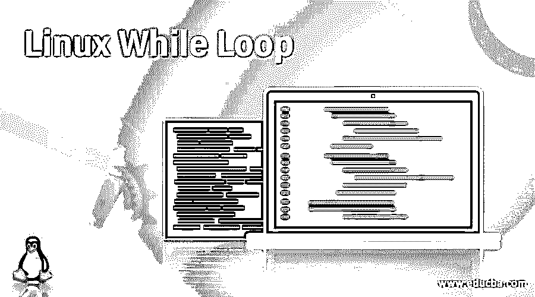
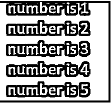
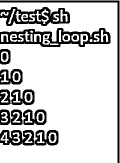

# Linux While 循环

> 原文：<https://www.educba.com/linux-while-loop/>

## Linux While 循环的定义

Linux while loop 命令是一个控制流条件，它将帮助运行命令，以便根据特定条件重复执行命令。执行必须继续，直到条件被验证为真。while 条件以关键字“while”开始，然后是条件表达式或语句。Linux while loop 命令是一个控制流条件，它将帮助运行命令，以便根据特定条件重复执行命令。

本文将帮助您理解 Linux Shell 脚本中 while 循环条件的基础知识。条件循环语句——使用 while 循环的 Break 和 continue 语句在本文中也有很好的解释。

<small>网页开发、编程语言、软件测试&其他</small>

**语法:**

使用 while 循环的基本语法如下所示:

`while [condition] do
[ Statements ] done`

这里的 from 语句将被连续执行，直到大括号中提到的条件变为真。while 循环的条件或参数也可以是布尔参数。当传递的条件从不为假时，while 循环可能会无限循环运行。

### Linux 中的 While 循环是如何工作的？

While 语句总是以“while”关键字开始，然后是条件和命令。可能有 n 个命令可以逐一执行。

`while [condition] do
command 1
command 2
.
.
command n
done`

这里从命令 1 到命令 n，将被连续执行，直到大括号中提到的条件变为真。while 循环的条件或参数也可以是布尔参数。当传递的条件从不为假时，while 循环可能会无限循环运行。
while 循环中给定的条件将在命令之前首先执行。只有当条件为真时，才执行下面的命令。否则，将不执行这些命令，从而终止 while 循环。

### Linux While 循环的例子

下面是一些在使用 while 循环的一般 shell 脚本中使用的场景。

#### 1.在输出中打印一个字符串 5 次

通过使用 while 循环，我们可以在一个循环中重复 n 次打印一个数字或一个字符串。

**命令:**

`x=1
while [ $x -le 5 ] do
echo "number is $x"
x=$(( $x + 1 ))
done`

**输出:**

上面代码片段的结果如下所示:

*   通过 while 循环在 liner 代码中打印一个字符串 n 次。我们可以通过以下方式做到这一点:

**命令:**

`x=1;
while [ $x -le 5 ];
do
echo "Hello to all $x times"
(( x++ ));
done`

**输出:**

上面代码片段的结果如下所示:

#### 2.While 循环查找一个数的阶乘

要在 shell 脚本或 bash 脚本中运行 while 循环，我们可以编写如下代码。让我们创建一个 shell 脚本‘factorial . sh’来寻找给定数字的阶乘。为了编译这个脚本，我们将使用 while 循环。

**命令:**

`cat factorial.sh
counter=$1
factorial=1
while[ $counter -gt 0 ] do
factorial=$(( $factorial * $counter ))
counter=$(( $counter - 1 ))
done
echo $factorial`

**输出:**

上述片段的结果如下所示:

#### 3.无限 While 循环条件

每当 while 循环中的 condition 参数为空时，循环将无限次重复。

**命令:**

`cat infinite.sh
while :
do
echo "infinite loops [ Press Ctrl+C to break the loop ]"
done`

#### 4.条件 While 循环

当不满足条件参数时，循环可能会一直持续重复。当一个循环将重复执行 n 次而不停止时，这样的循环称为无限循环。为了管理循环，while 循环中使用了两个条件语句。它们是:

*   破裂
*   继续
*   中断语句:

break 语句有助于停止 while 循环的执行，只有当它执行完所有代码行，直到 break 语句被提及。然后，它将跳转到 while 循环的末尾。我们可以使用“BREAK”语句来跳出 while 循环。每当我们想在条件不满足的情况下提前退出 while 循环时，我们可以通过 break 语句来实现。

while 循环中 break 语句的语法如下所示:

**语法:**

`while [condition] do
Statement 1
Statement 2
if (condition)
then
break
fi
Statement n
done`

#### 5.连续语句

continue 语句和 break 命令彼此非常相似，只是可能导致循环的当前迭代结束，而不是整个循环结束。当出现任何问题，但我们试图在循环中执行另一个迭代时，就使用这个 continue 语句。
要继续 while 循环中的迭代，我们可以使用' continue '语句。while 循环中 break 语句的语法如下所示:

**语法:**

`while [ condition ] do
Statement 1
Statement 2
if (condition)
then
continue
fi
Statement n
done`

#### 6.嵌套 While 循环

我们可以在另一个 while 循环中使用 while 循环，这个过程称为 while 循环的嵌套。嵌套 while 循环的语法如下所示:

**语法:**

`while [ condition 1 ] do
statement
while [ condition 2 ] do
statement
done
statement n
done`

**举例:**

`cat nesting_loop.sh
a=0
while [ "$a" -lt 5 ] #this is loop1
do
b="$a"
while [ "$b" -ge 0 ] #this is loop2
do
echo -n "$b"
b=`expr $b-1`
done
echo
a=`expr $a+1`
done`

**输出:**

上面的代码会给你下面的输出。您应该看到“echo n”在嵌套 while 循环中的工作方式。

### 结论

Linux 或 Unix Shell 脚本中有许多循环条件。其中，While loop 在循环中非常有用且易于使用。因此，上述文章将帮助您理解 while 循环的用法。为了便于理解，还提到了 while 循环条件的用法示例。

### 推荐文章

这是一个 Linux While 循环的指南。在这里，我们还讨论了 linux 中的介绍以及 while 循环是如何工作的？以及不同的示例及其代码实现。您也可以看看以下文章，了解更多信息–

1.  [Linux 网络命令](https://www.educba.com/linux-network-command/)
2.  [Linux 列表目录](https://www.educba.com/linux-list-directories/)
3.  [Linux 中的 Shell 是什么？](https://www.educba.com/what-is-shell-in-linux/)
4.  [Perl while 循环](https://www.educba.com/perl-while-loop/)

