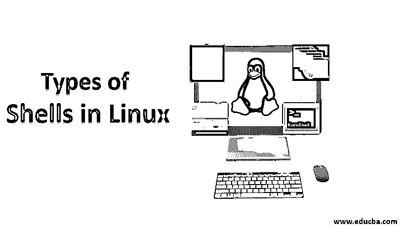
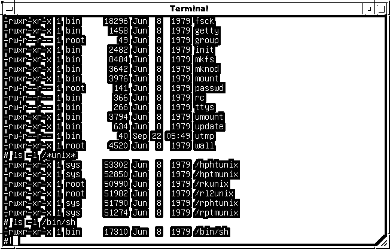
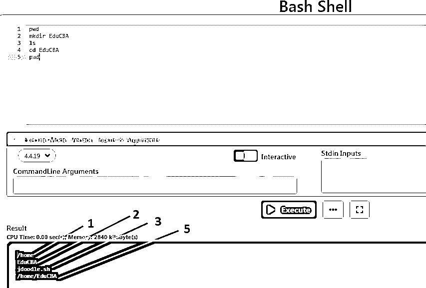
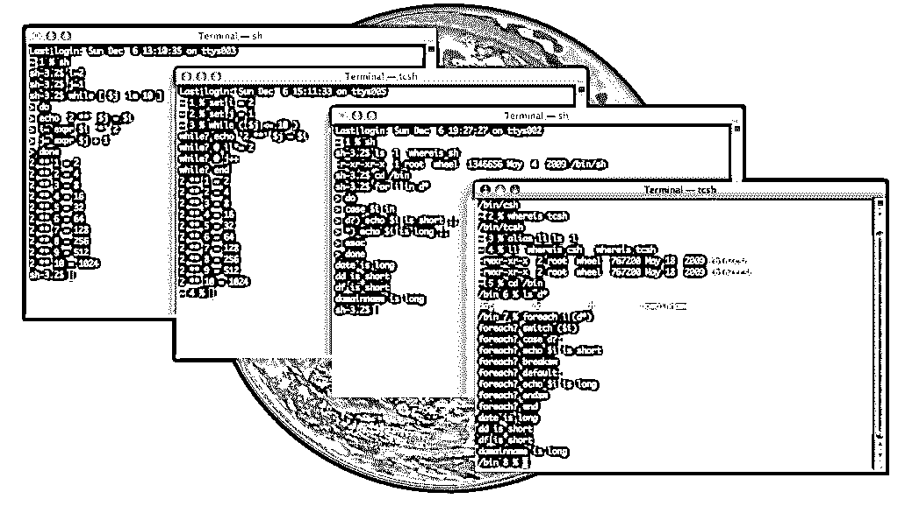

# Linux 中的 Shells 类型

> 原文：<https://www.educba.com/types-of-shells-in-linux/>

## Linux 中的 Shells 简介

什么是贝壳？外壳是一个程序，作为用户和操作系统(OS)内核之间的接口。贝壳随着时间而进化；第一个问世的 shell 是 Thompson shell，它是由美国电话电报公司贝尔实验室的 ken Thompson 编写的。从 1971 年到 1975 年，它随 Unix 版本 1 到 6 一起发布。很快，我们得到了由贝尔实验室的 Stephen Bourne 开发的 Bourne shell，它在 1979 年作为 UNIX 版本 7 的 shell 发布。Thompson shell 不是一个脚本 shell，很快它就被 Bourne shell 所取代，并伴随着许多改进。

### Linux 中的 Shells 类型

下面是 Linux 中不同类型的 Shells。

<small>网页开发、编程语言、软件测试&其他</small>

#### 1.伯恩的外壳

Bourne shell 是由 Stephen Bourne 在 Bell Labs 开发的，并在 1979 年作为 Unix 版本 7 的 shell 发布。这种外壳由这种外壳表示速度更快，但缺乏交互等功能。它也是 Solaris 系统的缺省 shell。Bourne shell 中的命令全名路径是/bin/shand /bin/sh。Root 用户提示是#而非 root 用户提示是$。

**来源**:【https://images.app.goo.gl/】T2

#### 2.Bash Shell

Bash Shell 代表 Bourne again shell，它是当今许多 Linux 发行版的默认 Shell。这个 shell 与 bourne shell 非常兼容，并对 bourne shell 进行了许多改进。一些改进包括作业控制、命令行编辑、无限大小的命令历史等。下面是一些命令的例子:

| 文件上的操作 | 平均变化 | 该命令用于移动或重命名文件或目录 |
|  | 丙酸纤维素 | 该命令将复制文件或目录。 |
|  | 触觉 | 这将创建一个空文件，也可用于更新上次修改时间 |
|  | 空间 | 该命令用于删除文件。 |
| 目录 | 显示当前工作目录 | 这将显示当前的工作目录 |
| 限位开关（Limit Switch） | 这个用来列出你所在的当前工作目录下的所有文件和目录。 |
| mkdir | 此命令将创建一个新目录。 |
| 激光唱片 | 它将改变目录；可以是相对或绝对路径 |
| 是吗 | 移除具有给定名称的目录(该目录必须为空) |

**命令说明**

#### 3.C 壳

C 壳层用 csh 表示。它是由比尔·乔伊于 1970 年在加州大学伯克利分校创建的。它是一个命令处理器，在命令中运行。window.bin/csh 是命令的完整路径名，root 用户的默认提示符是#而非 root 用户的默认提示符是 hostname %。

**Source:** [https://en.wikipedia.org/](https://en.wikipedia.org/wiki/C_shell#/media/File:Tcsh_ejecut%C3%A1ndose_en_escritorio_Mac_OSX.png)

**c 壳的一些选项有-概要:csh -l**

| 英语字母表中第二个字母 | 该参数在与 csh 一起传递时，将强制中断选项处理。 |
| 英语字母表中第五个字母 | 这可以用来退出 c shell |
| 英语字母表中第八个字母 | 这将在隐藏模式下启动 c shell。 |
| 英语字母表的第 19 个字母 | 这将从标准输入中读取命令输入。 |

#### 4.TENEX c 外壳

这是对 c shell 的改进，可以用作 shell 脚本命令处理器以及交互式登录 shell。它是 c shell 的一个增强但完全兼容的版本。它由 tcsh 命名，一些主要特征是:

*   命令行编辑
*   命令行完成
*   作业控制
*   C like 语法

#### 5.Korn Shell

Korn Shell 由 ksh 表示，由 David Korn 在 1980 年编写和开发。它整合了 c shell (csh)和 tab c shell (tcsh)的所有功能。它比 C shell 更快，是一种强大的高级编程语言。该命令的完整路径名是/bin/ksh，root 用户默认提示符是#而非 root 用户默认提示符是$。

**在 ksh 中，元字符是以下字符之一:**

*   ;
*   “&”号
*   (
*   )
*   <
*   >
*   新行
*   空间
*   标签

**ksh 特性:**

*   命令行编辑
*   新的 cd 功能—这使用户能够返回到上一个目录，而无需键入完整的路径名。
*   作业控制 ksh shell 中运行的作业可以使用 bg 之类的命令推到后台，也可以停止。
*   历史机制–一个名为。sh_history 存储了 get 在 ksh shell 中执行的所有命令，以后可以通过运行命令历史显示这些命令。
*   波浪号扩展–任何用户的主目录都可以使用~来引用，即波浪号字符。

#### 6.Z 外壳

Z Shell 由 zsh 表示，它是 bourne shell 的扩展，有许多改进，用作交互式登录 Shell。它结合了 Bash、ksh 和 tcsh shell 的特性。它还被用作 shell 脚本的命令解释器[。z shell 的一些重要特性是:](https://www.educba.com/for-loop-in-shell-scripting/)

*   插件和主题支持
*   文件名生成
*   概念索引
*   功能索引
*   拼写纠正和近似完成
*   自动 cd
*   登录/注销监视

#### 7.鱼壳

Fish Shell 是 2005 年开发的一个用户友好的 Shell。与其竞争对手不同，fish 不是基于 Bourne shell 或 C shell。

要在你的 Ubuntu 系统上安装 fish，我们可以运行下面的命令:

*   sudo apt-add-资源库 ppa:fish-shell/release-3
*   sudo apt 更新
*   sudo 安装鱼

**在 mac os 上安装:** Brew install fish

**在 windows 上安装 fish**:如果你使用的是 windows 10，那么你可以在 Linux 的 windows 子系统上安装 fish 并发出:
sudo 来安装 fish

但是，如果你有 10 以外的 windows 操作系统，那么我们可以使用 Cygwin 来安装 fish。

**特性:**

*   自动建议
*   它拥有基于网络的配置
*   它支持 256 终端技术
*   制表符结束缩写。
*   等待命令:等待后台进程
*   变量也可以用作命令

### 结论

在这篇文章中，我们学习了不同类型的贝壳。但是这个列表并没有到此结束，还有许多其他的 shell，但是我们已经介绍了到目前为止正在发展的顶级 shell。

### 推荐文章

这是 Linux 中 Shells 类型的指南。为了更好地理解，我们在这里用图片详细讨论 Linux 中不同类型的 Shells 的基本概念。您也可以浏览我们的其他相关文章，了解更多信息-

1.  [Linux 文件系统](https://www.educba.com/linux-file-system/)
2.  [什么是 Linux？](https://www.educba.com/what-is-linux/)
3.  [Linux 操作员](https://www.educba.com/linux-operators/)
4.  [Linux 中的 Shell 是什么？](https://www.educba.com/what-is-shell-in-linux/)

