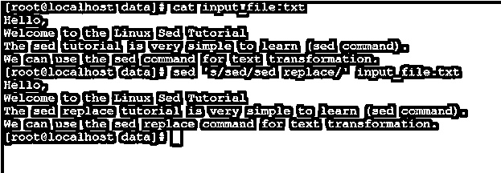
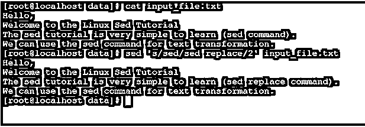
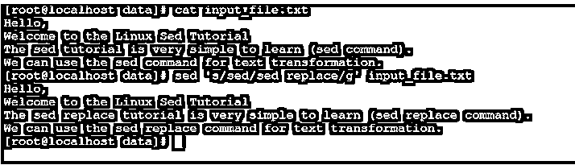
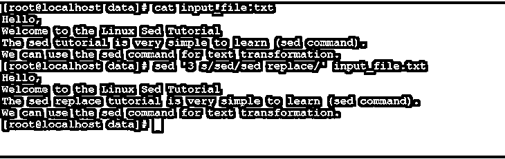
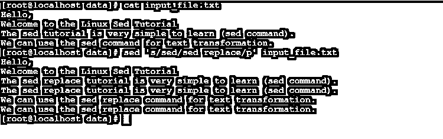

# Linux Sed 替换

> 原文：<https://www.educba.com/linux-sed-replace/>

## Linux Sed Replace 简介

在 Linux 操作系统中，sed 命令用于从输入文件中过滤文本数据并转换文本数据。sed 被称为流编辑器。sed 命令主要对输入文件执行多种操作，如文本搜索、删除、查找和替换文本数据、数据/文本插入等。sed 命令的主要优点是，在不打开文件的情况下，我们能够替换文本数据。与 sed 命令类似，我们有不同的选项来替换 awk 等文本数据。

sed 命令实用程序是由 Jay Fenlason、Tom Lord、Ken 皮齐尼和 Paolo Bonzini 编写的。

<small>网页开发、编程语言、软件测试&其他</small>

**语法:**

Sed 替换命令的语法

`sed [OPTION]... { script (only-if-no-other-script) } [input-file]...`

*   **sed:** 我们可以在语法或命令中使用“sed”关键字。它将接受不同的参数，如选项、脚本文件或输入文件。根据提供的参数，它将对其进行过滤和数据转换。
*   **选项:**我们可以提供不同的标志作为与“sed”命令兼容的选项。
*   **script:** 我们可以提供脚本文件作为 sed 命令的输入，对其执行必要的转换。
*   **输入文件:**我们可以提供输入文件作为 sed 命令的输入，在其上执行必要的文本/数据转换操作。

### Linux Sed Replace 命令是如何工作的？

在 Linux 环境中，我们正在处理多个脚本或文件，如备份、应用程序开发等。如果我们需要手动修改脚本。这是一项非常乏味复杂的工作。为了克服这种情况，我们需要使用“Linux sed replace”命令。该命令有助于转换数据。

sed 命令将接受不同的输入，如 sed 选项、输入文件或脚本。根据给定的 sed 选项和 input_file，sed 将对输入数据或文件执行数据转换操作。

sed 命令在数据转换时会考虑各种选项。以下是与 sed 命令兼容的选项列表。

| **服务请求编号** | **选项** | **描述** |
| One | 安静，安静 | 这将有助于抑制模式空间的自动打印 |
| Two | -e 脚本，–表达式=脚本 | 它会将脚本添加到命令中以执行输入脚本 |
| Three | -f 脚本文件，–file =脚本文件 | 它会将脚本文件的内容添加到要执行的命令中 |
| Four | –跟随符号链接 | 当处理到位时，它将遵循符号链接 |
| Five | -I[后缀]，–就地[=后缀] | 它将就地编辑文件 |
| Six | -c，-收到 | 在-i 模式下混洗文件时，它将使用复制操作而不是重命名 |
| Seven | -l N，–线路长度=N | 它将根据“l”命令指定所需的换行长度 |
| Eight | –POSIX | 它将禁用所有的 GNU 扩展。 |
| Nine | -r，–regexp-扩展 | 它将在输入脚本中使用扩展的正则表达式。 |
| Ten | -s，–分开 | 它会将文件视为单独的文件，而不是一个连续的长流。 |
| Eleven | -u，–无缓冲 | 它将从输入文件加载最少量的数据，并刷新输出缓冲区 |
| Twelve | -z, –null-data | 它将通过 NUL 字符分隔各行 |
| Thirteen | 救命 | 它将显示 sed 命令的帮助并退出 |
| Fourteen | –版本 | 它将配置 sed 命令的版本信息 |

### 实现 Linux Sed Replace 命令的示例

下面是一些例子:

**输入文件包含**

**文件名:** input_file.txt

**文件包含:**

您好，
欢迎来到 Linux Sed 教程
Sed 教程非常简单易学(Sed 命令)。
我们可以使用 sed 命令进行文本转换。

#### 1.替换字符串

“sed replace”命令是在 Linux 环境中替换字符串的一种非常简单和常见的方法。

**命令:**

`sed 's/sed/sed replace/' input_file.txt
cat input_file.txt`

**解释:**我们用第二个字符串值(sed replace)替换第一个字符串值(sed)。

**输出:**

#### 2.用“第 n 次”替换字符串

默认情况下，我们能够替换第一次出现的字符串。但是在 sed replace 命令中，我们能够在第“n”次出现时更改字符串

**命令:**

`sed 's/sed/sed replace/2' input_file.txt
cat input_file.txt`

**解释:**根据上面的命令，我们在单行中第二次出现时改变字符串。

**输出:**

#### 3.用所有匹配项替换字符串

在 Sed Replacecommand 中，我们能够替换该字符串的所有出现。

**命令:**

`sed 's/sed/sed replace/g' input_file.txt
cat input_file.txt`

**解释:**按照上面的命令，我们用“sed replace”字符串替换所有出现的“sed”字符串。

**输出:**

#### 4.用单个“第 n”行替换字符串

在 Linux 环境中，我们使用 sed 替换功能来更改字符串的具体出现(在一行中)。

**命令:**

`sed 's/sed/sed replace/2g' input_file.txt
cat input_file.txt`

**解释:**作为输入文件，我们有两个“sed”字符串。我们只替换第二次出现的输入文件。在第三行中，我们找到了第二个实例，然后它被从“sed”替换为“sed replace”。

**输出:**

#### 5.替换特定行上的字符串

在 Sed Replace 命令中，我们只能替换特定行上的字符串。

**命令:**

`sed '3 s/sed/sed replace/' input_file.txt
cat input_file.txt`

**解释:**我们只是在更换第三路线上的线。即使有匹配的字符串，它也不会影响任何其他行。

**输出:**

#### 6.Sed 替换命令–带有“p”标志

我们有这个功能，打印与替换字符串匹配的行。如果输入字符串不匹配，那么它将只打印一次。

**命令:**

`sed 's/sed/sed replace/p' input_file.txt
cat input_file.txt`

**说明:**根据上面的命令，我们可以打印两次匹配的字符串行。这些行与选项字符串不匹配，它将打印一次。

**输出:**

#### 7.替换特定行范围内的字符串

在 Sed Replacecommand 中，我们可以替换输入文件/行的特定范围内的字符串。

**命令:**

`sed '2,3 s/sed/sed replace/' input_file.txt
cat input_file.txt`

**解释:**我们正在替换第 2 行到第 3 行之间的字符串，只是字符串替换操作不起作用。

**输出:**

### 结论

我们已经看到了“Linux Sed ReplaceCommand”的完整概念，以及正确的示例、解释和带有不同输出的命令。Sed Replacecommand 用于文本过滤和转换。在 shell 和应用程序级别的作业中，这对于替换字符串非常有用。

### 推荐文章

这是一个 Linux Sed 替换指南。在这里，我们还将讨论 linux sed replace 命令的介绍和工作原理。以及不同的示例及其代码实现。您也可以看看以下文章，了解更多信息–

1.  [Linux 关机命令](https://www.educba.com/linux-shutdown-command/)
2.  [Linux WC](https://www.educba.com/linux-wc/)
3.  [Linux bg 命令](https://www.educba.com/linux-bg-command/)
4.  [Linux 睡眠](https://www.educba.com/linux-sleep/)

