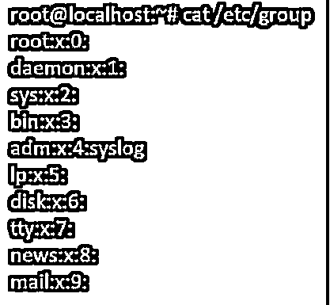
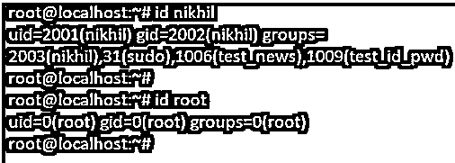

# Linux 列表组

> 原文：<https://www.educba.com/linux-list-groups/>

## Linux 列表组的定义

在 linux 中，组的主要用途是定义一组对给定资源的访问权限，如读、写或执行，这些权限在组中的用户之间共享。一组用户称为一个组。在本文中，我们将讨论如何在 linux 中使用 group 命令以及在 linux 中查看组的方法。

**Linux 组:**

<small>网页开发、编程语言、软件测试&其他</small>

以下是用户所属的组类型:

*   **主组:**这是指定给用户创建的文件的组。通常，主要组的名称与创建者的名称相似。唯一用户应该只属于一个主要组或登录组。
    **二级/补充组:**这个二级组允许用户向有限的用户授予特定的权限。该用户也可能是任何其他或许多补充组的成员。

有许多方法可以确定用户所属的组。

登录用户组位于文件–/ etc/passwd 中，辅助用户组位于/etc/group 文件中。列出组的一般方法是通过使用 linux 命令(如 less、cat 或 grep)列出上述文件的列表。另一种方法是使用提供系统组和用户信息的命令。

以下是查找组或用户信息的方法:

*   **/etc/集团档案:**用户组档案
*   **成员命令:**列出一个组的成员
*   **Lid 命令(或 Libuser-Lidon 较新的 Linux 发行版):**列出用户组或用户组的用户

### Linux 中组列表命令的语法

在 linux 中使用 groups 命令的语法有两种方法。它们是:

一个是通过提及与该组相关联的用户名。

`Groups [username]....`

其次，只需提及“组”，如下所示:

`$groups`

### Linux 列表组是如何工作的？

我们可以通过两种方式获得 linux 中的组列表:

*   /etc/group 文件
*   Getent 命令

为了更好地理解这些命令，下面使用语法和示例对其进行了简要解释。上述选项描述如下:

#### 1.使用/etc/group 文件

要获得系统中的所有本地组，我们可以转到/etc/group 文件。由于这是一个文件，我们可以打开它并看到所有的本地组。

`Cat /etc/group`

#### 2.使用 Getent 命令

linux 中的 Getent 命令将有助于从存储在名称服务交换机库中的数据库中获取条目。这样，我们就可以从群组数据库中获取群组信息。

`Getent Group`

### Linux 中的组列表命令示例

下面是在 linux 中使用 group 命令的方法及其语法和例子。

*   我们可以使用剪切命令只打印组名，如下所示。当您在系统中搜索任何特定的组名时，这个示例可能是最合适的。

**命令:**

`Cat -D: -F1 /etc/group`

**示例:**这里的 cut 命令是用冒号(:)作为分隔符来拆分一行。使用-f1 选项剪切第一个字段。

*   我们可以通过在 linux 中使用 sort 命令按字母顺序列出所有的组名。sort 命令通常有助于按字母顺序对输出进行排序。

**命令:**

`Getent Group | Cut -D: -F1 | Sort`

**输出:**

*   我们还可以使用'-c '选项来计算系统中存在的组的数量。在这里，我们可以计算/etc/group 文件中的组名，并使用 getent 命令。下面给出了语法和示例。

**命令:**

`Cat /etc/group | Grep -C ""
Getent Group | Grep -C ""`

**输出:**

要列出系统中的所有用户组，我们可以使用 groups 关键字。下面给出了语法和示例。

**语法:**

`Groups Username`

**命令:**

`Groups Admin`

**输出:**

*   要列出系统中当前用户的组，我们需要在没有任何用户名的情况下运行 groups 命令。然后，它将打印当前用户关联的组。

**命令:**

`Groups`

**输出:**

*   要列出系统中的用户组和组 id，我们需要运行 id 命令。然后，它将打印与其组 id 相关联的组。

**语法:**

`Id Username`

**命令:**

`Id Root`

**输出:**

*   要列出一个组中的所有成员，我们可以使用带有组名的 getent group 命令。下面给出了语法和示例。

**语法:**

`Getent Group Group_Name`

**命令:**

`Getent Group Admin`

**输出:**

**注意:**当上述语法没有输出时，意味着系统中没有这样的组。

### 结论

一组用户称为一个组。在 linux 中，组的主要用途是定义一组对给定资源的访问权限，如读、写或执行，这些权限在组中的用户之间共享。在本文中，我们看到/etc/group 文件和 getent 命令将为您提供 linux 中组列表的完整信息。为了修改输出，为了更好地理解，我们还使用了剪切、排序、计数选项。

### 推荐文章

这是 Linux 列表组的指南。这里我们还讨论了 linux 列表组的定义和工作原理。以及不同的示例及其代码实现。您也可以看看以下文章，了解更多信息–

1.  [Linux comm](https://www.educba.com/linux-comm/)
2.  [Linux 正则表达式](https://www.educba.com/linux-regular-expression/)
3.  [Linux 中的 rmdir 命令](https://www.educba.com/rmdir-command-in-linux/)
4.  [Linux 别名命令](https://www.educba.com/linux-alias-command/)

