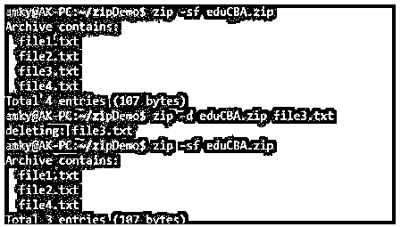
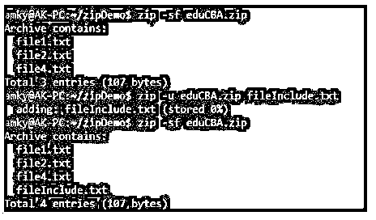
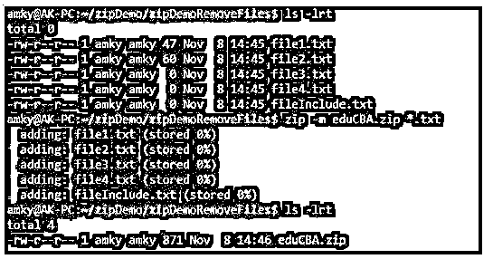
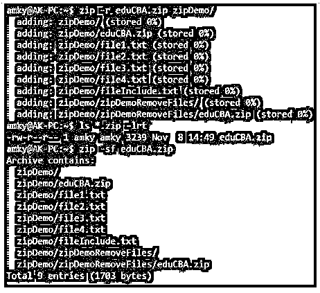
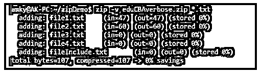

# Linux 压缩多个文件

> 原文：<https://www.educba.com/linux-zip-multiple-files/>

## Linux Zip 多文件简介

下面的文章提供了 Linux Zip 多文件的概要。压缩多个文件被定义为一个命令或工具，使用户能够压缩和打包多个文件在一起。现在，文件的压缩可以通过多种方式进行。第一个是减小文件大小，然后打包以备后续步骤使用。另一种压缩方式不是通过大小，而是在打包之前将不同位置的不同文件整理到一个位置。为了执行压缩，需要保持一个压缩比来减小文件大小，但不影响质量。实用程序 post zip 可以来自归档，为未使用的文件或目录临时节省空间。

### Linux 压缩多文件的语法

在 Linux 中，有许多 zip 实用程序可供用户使用，在本文的后面，我们将深入研究 Linux 中 zip 多文件命令的工作原理。与 zip 类似的并行命令是 tar 命令。

<small>网页开发、编程语言、软件测试&其他</small>

1.主要语法。

**语法:**

`zip [options] <name of zip file> <list of files to be zipped>`

2.从 zip 中删除文件。

**语法:**

`zip -d <name of zip file> <list of files to be removed>`

3.在 zip 中更新或包含文件。

**语法:**

`zip -u <name of zip file> <list of files to be included>`

4.压缩后删除原始文件。

**语法:**

`zip -m <name of zip file> <list of files to be removed>`

5.文件夹的递归压缩。

**语法:**

`zip -r <name of zip file> <directory to be zipped>`

6.压缩时排除文件。

**语法:**

`zip -x <name of zip file> <list of files to be excluded>`

7.压缩期间的详细模式。

**语法:**

`zip -v <name of zip file> <list of files>`

### 如何在 Linux 下压缩多个文件？

近来，经常出现从因特网上下载的文件数量太多，或者数据广泛且更重要的是数量巨大的情况。当这种情况发生时，在彼此之间共享文件是一个挑战。这需要一个直接的答案来解决所有这些问题，这就是压缩多个文件在当今世界如此重要的原因。压缩文件已经成为一种习惯了，而且对更多使用它的探索也引起了人们的兴趣。

这里我们将看看在 Linux 中压缩多个文件的过程。如果熟悉 windows 中的过程，该过程与我们在 windows 中执行的过程非常相似。唯一的区别在于我们处理的方式。在 Linux 中，我们通过命令行界面执行它，在 windows 中，有像 Zip、7Zip 等工具。，以执行相同的实用程序。

现在，让我们看看在涉及到多个文件的啜饮时，命令 zip 中的不同选项。

下面给出了选项:

*   **d:** 该选项用于删除 zip 中的文件。
*   **u:** 该选项用于更新或包含 zip 中的文件。
*   **m:** 该选项用于清除压缩后的原始文件。
*   **x:** 该选项用于排除 zip 中的文件。
*   **r:** 该选项用于文件夹的递归压缩。
*   **v:** 此选项用于压缩期间的详细打印。
*   **dc:** 该选项用于显示压缩条目的运行计数。
*   **e:** 此选项用于加密 zip 文件。
*   **sf:** 此选项用于提取内容，而不实际提取 zip。
*   **[0-9]:** 此选项用于调节压缩过程中的压缩级别(0 为最低，9 为最高)。
*   **y:** 该选项用于在压缩过程中保留符号链接。

从上面可用的选项中，我们看到不同的选项负责压缩多个文件的不同功能。虽然其中一些被广泛使用，但其中一些对于快速周转是必不可少的。例如，运行一个解压缩功能，然后提取内容需要更多的时间，而不是仅仅使用 sf 选项。更重要的一点是，我们应该在压缩大文件时确定压缩级别。我们可以达到最高压缩级别，即 9，假设用户准备好花费更长时间进行高压缩。如果不是那么重要，可以使用默认值 6。zip 中有可能存在符号链接，为了保持相同，应该使用选项 y。多个文件的压缩允许用户使用不同的压缩方法，其中之一是 bzip2。

### Linux 压缩多个文件的例子

下面给出了 Linux Zip 多文件的例子:

#### 示例#1

从 zip 中删除文件。

**语法:**

`zip -sf eduCBA.zip
zip -d eduCBA.zip file3.txt
zip -sf eduCBA.zip`

**输出:**

**<u>

</u>** 

#### 实施例 2

在 zip 中更新或包含文件。

**语法:**

`zip -sf eduCBA.zip
zip -u eduCBA.zip fileInclude.txt
zip -sf eduCBA.zip`

**输出:**

#### 实施例 3

压缩后删除原始文件。

**语法:**

`ls -lrt
zip -m eduCBA.zip *.txt
ls -lrt`

**输出:**

**<u>

</u>** 

这里我们看到所有的 txt 文件在压缩后都被删除了。

#### 实施例 4

**代码:**

文件夹的递归压缩。

**语法:**

`zip -r eduCBA.zip zipDemo/
ls *.zip -lrt
zip -sf eduCBA.zip`

**输出:**

**<u>

</u>** 

#### 实施例 5

压缩时排除文件。

**语法:**

`zip eduCBAexclude.zip *.txt -x file3.txt
zip -sf eduCBAexclude.zip`

**输出:**

这里我们看到所有文件都包含在 zip 中，除了 file3.txt。

#### 实施例 6

压缩期间的详细模式。

**语法:**

`zip -v eduCBAverbose.zip *.txt`

**输出:**

**<u>

</u>** 

### 结论

通过一组示例和对 zip 命令工作方式的解释，读者会更加清楚它的用法和用途，现在我们让读者自己去尝试示例中没有解释的其他选项，以免穷尽本文。

### 推荐文章

这是一个 Linux 多文件压缩指南。这里我们讨论一下入门，如何在 Linux 下压缩多个文件？和示例。您也可以看看以下文章，了解更多信息–

1.  [Linux Untar](https://www.educba.com/linux-untar/)
2.  [Linux Ping](https://www.educba.com/linux-ping/)
3.  [Linux Diff 命令](https://www.educba.com/linux-diff-command/)
4.  [Linux nslookup](https://www.educba.com/linux-nslookup/)

