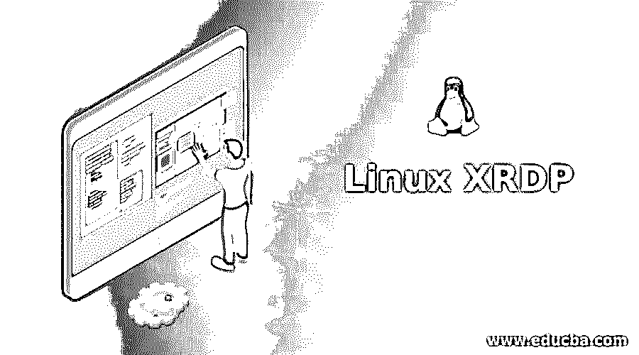

# Linux XRDP

> 原文：<https://www.educba.com/linux-xrdp/>

## Linux XRDP 简介

下面的文章提供了 Linux XRDP 的概要。XRDP 被定义为桌面协议的开源实现，也称为微软远程桌面协议，使用户能够以图形方式控制远程系统。任何用户都可以登录到远程机器，并且在登录之后，创建了一个真正的桌面会话，这给人一种登录到他们自己的本地机器或环境的感觉。XRDP 协议使操作系统能够与 Microsoft Windows 分离，提供无缝且全功能的 RDP 兼容远程桌面体验。使用 XRDP 的主要原则是从 X windows 系统桥接图形，然后将控件从客户端转发回 X Windows 系统。

### Linux XRDP 是如何工作的？

*   我们看到 XRDP 是 RDP(远程桌面协议)的一个版本，它允许 Windows 以外的操作系统中的用户远程连接到另一台计算机。在 RDP 的工作中，不同类型的网络技术被用于成功和无缝的互动。在此过程中，不同类型的数据通过多个独立的通道在网络上安全地进行通信。
*   RDP 协议通过端口 3389(默认)向用户提供远程访问。使用该端口，应用程序和服务包(支持 RDP)被传输，允许微软通信服务将数据定向到 RDP 通道。然后，操作系统对 RDP 数据进行加密，这样就可以将数据添加到帧中进行传输。现在是终端服务设备重定向器(TSDR)任务来处理 RDP 协议活动。
*   TSDR 支持处理用户界面、传输、压缩、加密和成帧，并负责封装协议，以便允许通过 TCP/IP 网络传输。以类似的方式，接力回来也发生，完成了整个过程。

### 如何使用 Linux XRDP？

为了使用 Linux XRDP，需要在系统中安装 XRDP。在最近的 Linux 发行版中，经常可以看到 XRDP 作为一个包出现在发行版中。发行版中附带的这个 XRDP 通常是 XRDP 的最新版本。此外，还需要 xorgxrdp 包来获得最佳体验。现在让我们看看 Linux XRDP 的使用。

<small>网页开发、编程语言、软件测试&其他</small>

#### 1.安装 XRDP

首先，如果 apt-get 包不是最新版本，我们需要执行一个 *s* udo apt-get 更新。执行 sudo 的原因是拥有超级用户或管理员权限来执行安装或更新过程。一旦 apt-get 处于最新版本，我们将需要执行*的* udo apt-get install xrdp。这个命令将能够找到 XRDP 的存储库并连续安装软件包。请注意，sudo 命令会询问管理员密码。

#### 2.安装 XFCE4

XFCE 是一个桌面环境，对于 UNIX 操作系统来说是轻量级的。这种环境旨在快速但在其他方面系统资源低。拥有所有这些品质，并不妨碍它在视觉上的吸引力。

#### 3.配置 XRDP

现在我们已经安装了 XFCE4，我们需要修改 2 个文件，以确保 XRDP 使用 xfce4。这个 xfce4 是我们在上一步中安装的环境。最好使用 nano 命令对文件进行更改。虽然一个简单的 echo 语句也可以完成这项工作。我们需要更改的下一个文件是 XRDP 的启动文件(startwm.sh)。需要进行必要的更改来启动 XFCE4。

#### 4.允许防火墙中的 RDP 端口

在上面提到的配置之后，我们需要允许防火墙中的端口，默认情况下，通过执行命令 sudo ufw allow <port number="">/tcp 关闭该端口，确保用实际的端口号替换<port number="">。</port></port>

#### 5.正在重新启动 XRDP

为了使更改生效，需要通过执行命令 sudo service xrdp restart 来重启 xRDP。

#### 6.测试 XRDP 连接

现在，要测试 XRDP connect，可以运行标准的远程桌面客户端，这是 Windows 发行版附带的。然后，您需要输入运行 XRDP 的机器的 IP 地址。根据 RDP 客户端的功能，你可能看不到登录页面，但是如果你看到了，输入 ubuntu 用户名和密码，然后点击 ok。

### 优点和缺点

下面给出了 Linux XRDP 的优点和缺点:

#### 优势:

*   通过 RDP 可以轻松实现设备的监控、控制和维护。
*   使用远程访问实现快速故障排除。
*   可以轻松访问连接的设备、服务器或网络上的文件。
*   通过远程框架功能降低运营成本。

#### 缺点:

*   在某些情况下，剪贴板是不同步的，因此机器之间的复制粘贴很难完美地工作。
*   在 XRDP 的情况下，网络依赖性恰好是不可避免的。
*   在某些情况下，根据主机系统的资源能力，可能会导致瓶颈，从而大大降低性能。
*   一些罕见的情况，尽管是真实的，限制了系统的再次使用，直到一些重要的修复没有完成。

### 特征

XRDP 有许多可用的特性，主要分为两类。

#### 1.远程桌面访问

*   支持连接到世界上任何地方的 Linux 桌面表单。该连接需要 xorgxrdp Xorg 模块。
*   任何现有会话都可以重新连接。
*   可以调整会话的大小。
*   使用另一台服务器的代理，即连接 RDP/VNC(通过 xrdp)。

#### 2.访问远程资源

*   剪贴板的传输是可能的，甚至双向传输。这些剪贴板可以包括文本、位图或文件。
*   通过构建额外的模块，音频的重定向是可能的。
*   通过在远程机器上安装客户机驱动器，可以重定向驱动器。

### 结论

由于本文涉及了不同的方面，我们现在已经对 XRDP 和该功能的重要方面有了清晰的了解。作为进一步的任务，应该尝试使用 XRDP 进行远程连接，并鼓励共享资源。

### 推荐文章

这是一个 Linux XRDP 的指南。这里我们讨论引言；Linux XRDP 是如何工作的？用途、优点、缺点和特点。您也可以看看以下文章，了解更多信息–

1.  [Linux Untar](https://www.educba.com/linux-untar/)
2.  [Linux Ping](https://www.educba.com/linux-ping/)
3.  [Linux LVM](https://www.educba.com/linux-lvm/)
4.  [Linux 大小](https://www.educba.com/linux-size/)

