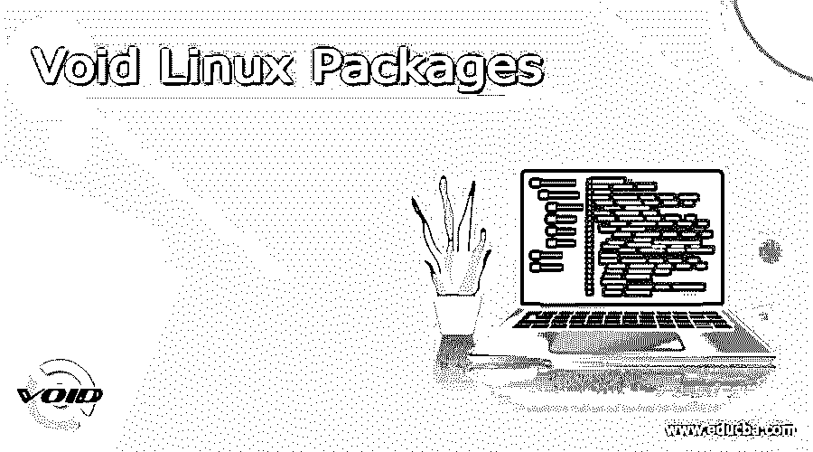

# 作废 Linux 包

> 原文：<https://www.educba.com/void-linux-packages/>

## Void Linux 包的定义

Void Linux packages 定义为基于 Linux 的系统中存在的模块列表，用于交付和维护 Linux 发行版的 Void Linux 版本中的新软件。Void 是作为一个通用操作系统构建的，它是基于一个单片 Linux 内核构建的。内核是任何操作系统的核心，它是一个整体，使得文件系统、驱动程序、打印机、VFS 和核心功能等服务共享同一个空间，并作为一个紧密结合的团体。Void Linux 中的包系统非常方便，允许用户根据需求快速安装、更新或删除软件。这个包系统提供了二进制形式的包，或者也可以使用源包的 XBPS 集合来构建。

### 作废 Linux 包

正如我们前面讨论的，Void Linux 发行版中的包有助于在 Linux 版本中交付新软件。在这一节中，我们将讨论如何在 Void Linux 中处理包，以及哪些元素使得包的处理更加简单和方便。这些包由 XBPS 包管理器(这里 XBPS 代表 X 二进制包系统)处理，管理由下面提到的命令完成:

<small>网页开发、编程语言、软件测试&其他</small>

*   XBPS-query:XBPS 中的这个实用程序使开发人员能够搜索所需的包以及关于存储库的信息。运行查询的语法是:

`xbps-query [OPTIONS] MODE [ARGUMENTS]`

在 CLI 上执行命令时，有各种选项可用，此命令返回已查询的特定程序包的信息，甚至列出目标根目录中存在的程序包。

*   xbps-install:这个命令使开发人员能够根据用例的需要安装或重新安装或更新包。这些更改是在目标根目录下完成的。相同的语法是:

`xbps-install [OPTIONS] [PKG...]`

*   xbps-remove:该实用程序帮助从目标根目录中删除软件包。移除过程发生的方式是预定义的时序，并且在完成移除任务时作为逐步过程来遵循。执行相同操作的语法是:

`xbps-remove [OPTIONS] [PKGNAME...]`

*   xbps-reconfigure:这个实用程序有助于重新配置 Void Linux 发行版中已安装的软件包。这分两步完成，第一步是对安装脚本执行 POST 操作，随后软件包状态更改为 XBPS _ PKG _ 状态 _ 已安装，以指示配置成功。获得所需结果的语法是:

`xbps-reconfigure [OPTIONS] [PKGNAME...]`

*   xbps-alternatives:void Linux 发行版中的这个实用程序有助于处理替代方案。这将设置并列出由已安装的软件包作为符号链接提供的备选方案。然后在设置组时应用这些备选方案。执行该命令的语法是:

`xbps-alternatives [OPTIONS] MODE`

*   xbps-pkgdb:为了修改或报告包中的问题，可以使用这个实用程序来检查任何缺少的依赖项、被修改的文件、被更改的符号链接，以及在 xbps 的新版本中需要处理的许多这样的错误。这些中的各种选项有助于在使用该实用程序时获得所需的功能。

`xbps-pkgdb [OPTIONS] [PKGNAME...]`

*   xbps-rindex:使用这个工具，可以通过创建、更新或删除存储在本地存储库中的任何过时的包来管理任何本地二进制包存储库。获得所需功能的语法是:

`xbps-rindex [OPTIONS] MODE [ARGUMENTS]`

可以从手册页中研究以上实用程序。除了使用 XBPS 包管理器之外，为了在 Void Linux 中正确使用包，还需要完成各种事务。这些交易是:

*   系统更新:为了获得最新的功能，你必须保持系统更新，这也包括软件包更新。为此，可以使用 xbps-install 实用程序。
*   重新启动服务:服务的重新启动不会自动发生，因为它为管理员留出了安排维护的空间，以便在协调之前充分考虑备份和其他与工作相关的应用程序关闭等事项。
*   紧急发布更新:在不希望的情况下，当 Linux 进入紧急发布任何更新时，很可能是系统空间不足，在这种情况下，手动干预删除旧内核有助于恢复正常情况。

现在，存储库的概念是我们拥有所有二进制包的列表，任何人都可以在 void Linux 的现有系统上使用和构建。存储库可以是本地的，也可以是远程的。void 包可用的存储库使 XBPS 能够使用我们在上面几段中提到的实用程序为 Linux 发行版构建二进制包。捆绑分为 3 种不同类型:

*   Common:这些包含了确保在 Void Linux 发行版中构建二进制包的通用工具
*   Etc:它包含所需的配置文件，这些文件也有助于构建二进制包。
*   Srcpkgs:这些包含了所有有助于使 Linux 的 void 发行版可用的实用程序的列表。LuaJIT 就是其中的一些例子，它包含了为 Lua 编程语言部署即时编译器的二进制文件。另一个例子是 R-cran-R6，它指向 R 基础设施的主页，帮助学习 Void Linux 发行版中的 R 编程语言。

除了所有这些包之外，还有一些受限的包，它们不是发行版的一部分，是官方维护的。这些包也可以由模板在发行版的本地空包中构建。

### 结论

随着这篇文章接近尾声，我们已经了解了 void Linux 发行版中的包可以提供什么。我们还研究了 Void Linux 发行版的各种元素，如 XBPS manager、它的实用程序等。这使得包的使用是无缝的。

### 推荐文章

这是一个无效 Linux 包的指南。这里我们讨论 Void Linux 发行版的定义和各种元素。您也可以看看以下文章，了解更多信息–

1.  [Linux man 命令](https://www.educba.com/linux-man-command/)
2.  [Linux 中的 GNU](https://www.educba.com/gnu-in-linux/)
3.  [Linux 格式](https://www.educba.com/linux-format/)
4.  [Linux 按大小排序](https://www.educba.com/linux-sort-by-size/)

