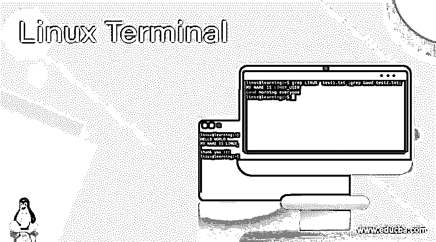
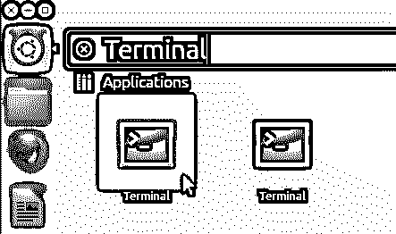
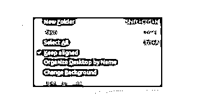
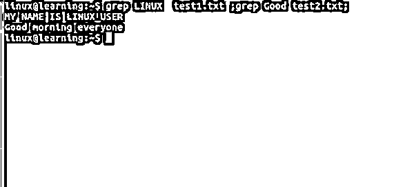

# Linux 终端

> 原文：<https://www.educba.com/linux-terminal/>

## Linux 终端简介

在 Linux 操作系统中，Linux 终端是一个程序，用户输入 Linux 命令，终端将其交给操作系统进行处理，处理后的输出显示在终端窗口上。简单地说，Linux 终端是一个界面，您可以在其中键入和执行基于文本的命令。当您由于任何系统崩溃或配置问题而无法使用图形用户界面应用程序时，Linux 终端会非常有用。在这种情况下，Linux 终端非常有用。

以下是终端的替代名称列表:

<small>网页开发、编程语言、软件测试&其他</small>

*   安慰
*   壳
*   命令行
*   命令提示符

### 如何打开 Linux 终端窗口？

**选项 1)**–搜索关键字 Terminal，然后单击相关图标打开新的终端会话。

**选项 2)–**打开终端窗口最简单的方法就是使用快捷键 **CTRL+ALT+T** 或者按下 **Alt+F2** ，键入 gnome-terminal，然后回车。输入这个快捷方式将立即打开终端窗口。

**选项 3)**–右击桌面壁纸的任意位置，选择打开终端**。**

### 使用 Linux 终端的优势

当使用终端完成一些任务时，它比任何图形用户界面都要快得多。Linux 的命令行非常先进，对于开发来说，我们可以使用命令行界面来执行我们的大部分工作。我们可以通过使用命令行界面来安装不同的存储库和包。另一个优点是，使用 Linux 终端，我们有许多命令和脚本选项。与通过 GUI 窗口导航相比，安装应用程序的简单终端任务可以在单个命令内完成。

Linux 终端使您能够以任何其他 GUI 所不能的方式使用 Linux，例如在重复任务的脚本中。您可以编写一个脚本来持续监控系统，以检查磁盘使用情况，并在达到特定级别时发送邮件。

Linux 终端可以用于多任务目的批处理工作，如打印一个大文件或下载一个大文件，然后我们可以使用另一个终端窗口同时执行其他任务。Linux 擅长处理这种多任务处理，不会对我们的系统产生影响。

### Linux 终端的基本概念

您在终端窗口中看到的第一样东西如下所示:

根据上面的截图，它被称为提示窗口。它为用户命令或用户输入做好了准备。在上面的例子中，登录用户名是“linux”，主机名是“learning”。

*   “@”符号用于区分登录用户(即“linux”)和主机名(即“learning”)。
*   “:”符号(冒号)用于将作为主机名的“学习”与当前登录或工作目录分开。
*   “$”符号表示它是一个普通用户，没有超级用户权限。登录用户不是超级用户。
*   “#”符号表示它是超级用户，拥有所有超级用户权限。

### 概念

1.  Linux shell 窗口或终端是对 Linux 操作系统的直接访问。
2.  在 Linux 环境中，如果我们将终止终端窗口，那么在同一个窗口中运行的应用程序也将被终止。
3.  终端被认为是命令的解释器。与操作系统通信。
4.  任何作业或命令的输出都返回一些值。相同的值将打印或显示在相同的输出屏幕上。
5.  在终端窗口中，我们可以将输入作为参数传递。相同的参数将作为输入命令的输入。

### 命令语法

让我们讨论命令语法。

*   #### Single command

根据需要，我们可以在 Linux 终端窗口中使用不同的命令。该命令可能因用户、应用程序或作业、操作系统等而异。这里，我们只是在 Linux 终端中使用单个命令。

**语法:**

`ls`

**说明:**

按照上面的命令，我们在终端窗口中运行“ls”命令。它将打印“ls”命令输出。

**输出:**

*   #### Command with parameters

在 Linux 环境中，我们有向命令传递或提供参数的功能。

**语法:**

`cat test1.txt`

**说明:**

按照上面的命令，我们使用带有参数的 cat 命令，即文件名(test1.txt)。

**输出:**

*   #### Command with default options

在 Linux 生态系统中，一些命令使用默认参数运行。

**语法:**

`ls -r`

**说明:**

按照上面的命令，我们递归地列出了文件的数量。它将在同一个终端窗口中打印命令输出。

**输出:**

*   #### Run multiple commands

如果我们需要完成复杂的工作或复杂的命令，我们需要运行不同组合的多个命令。在 Linux 终端中，我们有运行这些命令的功能。

**语法:**

`grep LINUX test1.txt ;grep Good test2.txt;`

**说明:**

按照上面的命令，我们同时运行两个 grep 命令。

**输出:**

*   #### Command

    with pipeline

当需要将命令 1 的输出作为命令 2 的输入时，可以使用管道字符“|”。请找到下面的管道语法。

**语法:**

`ls | sort`

**说明:**

在上面的命令中，我们在 is 和 sort 命令之间使用了管道选项。

**输出:**

**T2】**

 **### 基本 Linux 终端命令

*   **清除命令**用于清除累积了过多命令的终端。
*   为了安全地停止终端中的任何命令，可以使用 Ctrl+C 。如果它没有停止，那么使用 **Ctrl+Z** 强制停止。
*   使用**退出命令**从终端退出。
*   要使用命令行关闭或重启计算机，请使用 Sudo **halt** 和 **sudo reboot** 。

### 结论

我们已经看到了“Linux 终端”的基本概念，以及正确的示例、解释和带有不同输出的命令。理解 Linux 命令的所有基础知识非常重要。而在终端窗口上运行命令非常快，因为它直接与操作系统通信。

### 推荐文章

这是一个 Linux 终端指南。这里我们也讨论一下 Linux 终端窗口的介绍和如何打开？以及命令和优势。您也可以看看以下文章，了解更多信息–

1.  [Linux 存储库](https://www.educba.com/linux-repository/)
2.  [Linux 加入](https://www.educba.com/linux-join/)
3.  [Linux 连接文件](https://www.educba.com/linux-concatenate-files/)
4.  [Linux 观察命令](https://www.educba.com/linux-watch-command/)

**