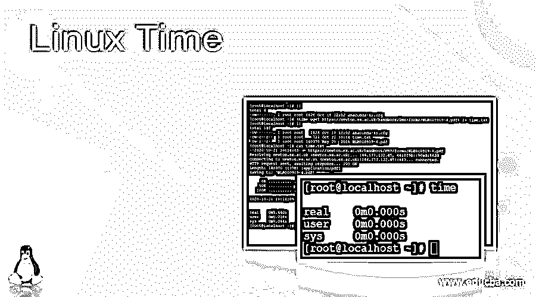
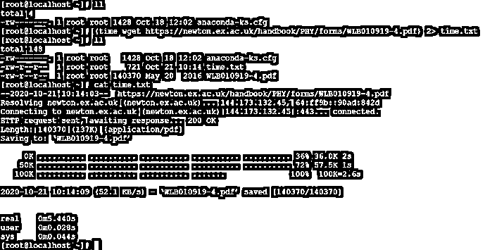
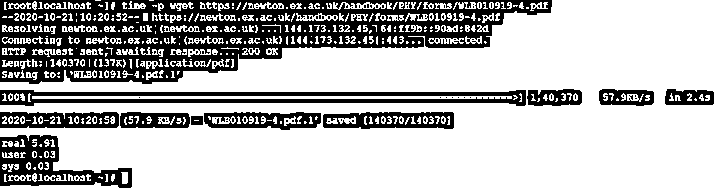

# Linux 时间

> 原文：<https://www.educba.com/linux-time/>

## Linux 时间简介

在 Linux 操作系统中，时间将运行带有特定或兼容输入参数的特殊程序。当命令或作业将完成执行时，时间命令将给出以下计时统计信息

*   **经过时间:**流程或作业调用到流程终止之间经过的时间。
*   **用户 CPU 时间:**是 tms_utime 时间和 tms_cutime 时间值的相加。
*   **系统 CPU 时间:**是 tms_stime 时间和 tms_cstime 时间值的相加。

注意:一些登录 shell 环境具有内置的时间功能。但不会提供更多信息。如果我们需要关于它的更多信息，我们需要使用 time 命令的完整路径，即/usr/bin/time。

<small>网页开发、编程语言、软件测试&其他</small>

**语法:**

`time [ OPTION ] [ COMMAND ]`

*   **time :** 我们可以在语法或者命令中使用“time”关键字。它需要不同的参数，比如选项和命令。根据所提供的参数，它将打印不同类型的时间选项，如运行时间、用户 CPU 时间和系统 CPU 时间。
*   **选项:**我们可以提供不同的标志作为与“时间”命令兼容的选项。
*   **命令:**根据条件或要求，我们可以提供或使用带有 time 关键字的不同命令。

### Linux 时间是如何工作的？

Linux 是一个支持多用户的操作系统。它将支持多个服务器或应用程序。在运行这些服务器或应用程序时，它们会产生大量数据。一旦数据产生并行，在其上进行读或写操作的时间也会增加。时间命令将考虑与命令兼容的不同选项。根据输入，它将给出详细的时间信息，包括运行时间、用户 CPU 时间和系统 CPU 时间。

以下是与 time 命令兼容的选项列表。

| **服务请求编号** | **选项** | **描述** |
| One | 英语字母表中第三个字母 | 它将给出名称和正在计时的命令行参数的信息(根据命令) |
| Two | 英语字母表中第四个字母 | 它将给出关于非共享数据区域中进程平均大小的信息。信息将以千字节为单位。 |
| Three | 英语字母表中第五个字母 | 这个过程将使用挂钟时间。它将采用小时:分钟:秒的格式。 |
| Four | 英语字母表中第九个字母 | 它将通过进程获得文件系统输入的数量。 |
| Five | 英语字母表中第十一个字母 | 它将考虑进程的数据、堆栈和文本内存使用的平均值。它将以千字节为单位。 |
| Six | 英语字母表中第十三个字母 | 由于进程的生存期，我们可以设置进程的最大驻留时间。它将以千字节为单位。 |
| Seven | 英语字母表中第十五个字母 | 该过程将考虑文件系统输出的数量。 |
| Eight | 英语字母表中第十六个字母 | 它是用户和系统时间之和除以总运行时间。我们将获得作业所获得的 CPU 的百分比。 |
| Nine | 英语字母表的第 19 个字母 | 就进程而言，它将是系统使用的总 CPU 秒数。该值将以秒为单位。 |
| Ten | 英语字母表中第二十一个字母 | 在用户模式下，进程使用的总 CPU 秒数。该值将以秒为单位。 |
| Eleven | 英语字母表中第二十三个字母 | 它将给出进程交换次数的内存信息。 |
| Twelve | 英语字母表中第二十四个字母 | 它将给出在该过程中共享文本的平均数量的信息。该值将以千字节为单位。 |
| Thirteen | 英语字母表中第二十六个字母 | 它将为系统提供页面大小信息。该值将以字节为单位。 |
| Fourteen | 英语字母表中第五个字母 | 这将是进程使用的挂钟时间。该值将以秒为单位。 |
| Fifteen | 英语字母表中第十一个字母 | 它将给出传递给过程的信号数量的信息。 |
| Sixteen | 英语字母表中第十六个字母 | 它将给出平均非共享堆栈大小的进程信息。该值将以千字节为单位。 |
| Seventeen | 英语字母表中第十八个字母 | 该进程将接收套接字消息的数量。 |
| Eighteen | 英语字母表的第 19 个字母 | 该进程将发送多少个套接字消息。 |
| Nineteen | 英语字母表的第 20 个字母 | 它将给出进程的平均驻留集大小的信息。该值将以千字节为单位。 |
| Twenty | 英语字母表的第 24 个字母 | 它将给出命令的退出状态。 |

### 例子

让我们讨论 Linux 时间的例子。

#### 示例#1

在 Linux 环境中，我们可以运行简单的 time 命令，获得运行时间、用户 CPU 时间和系统 CPU 时间的基本信息。

**命令:**

`time`

**说明:**

按照上面的命令，我们正在运行简单的时间命令。它将给出运行时间、用户 CPU 时间和系统 CPU 时间的基本信息。

**输出:**

#### 实施例 2

在 time 命令中，我们可以使用不同的 Linux 命令。

**命令:**

`time wget https://newton.ex.ac.uk/handbook/PHY/forms/WLB010919-4.pdf`

**说明:**

我们将 wget 命令与 time 命令一起使用。Time 命令将计算执行命令所用的时间、用户和 CPU 时间。

**输出:**

#### 示例# 3–重定向时间命令输出

在时间命令中，我们能够将时间命令输出重定向到不同的文件。

**命令:**

`(time wget https://newton.ex.ac.uk/handbook/PHY/forms/WLB010919-4.pdf) 2> time.txt`

**说明:**

按照上面的命令，我们将时间命令输出重定向到“time.txt”文件。它将用于进一步的分析。

**输出:**

#### 示例# 4–带选项“-p”

在时间命令中，我们能够以 POSIX 格式打印时间

**命令:**

时间-p wget https://newton.ex.ac.uk/handbook/PHY/forms/WLB010919-4.pdf

**说明:**

在上面的命令中，我们能够以 POSIX 格式打印时间命令输出。根据需要，我们可以使用 time 命令的不同选项。

**输出:**

### 结论

我们已经看到了不完整的“Linux 时间”概念，以及正确的示例、解释和带有不同输出的命令。根据需要，我们可以将 time 命令与不同的 Linux 命令一起使用，并从运行时间、用户 CPU 时间和系统 CPU 时间方面获得详细的时间信息。

### 推荐文章

这是 Linux 时间指南。这里我们用例子讨论一下简介，语法，命令，以及 Linux Time 如何工作？分别是。您也可以看看以下文章，了解更多信息–

1.  [Linux 网络栈](https://www.educba.com/linux-network-stack/)
2.  [Linux 存储库](https://www.educba.com/linux-repository/)
3.  [Linux 加入](https://www.educba.com/linux-join/)
4.  [Linux 连接文件](https://www.educba.com/linux-concatenate-files/)

