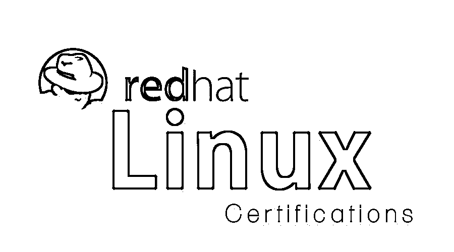

# 为什么红帽 Linux 认证很重要？

> 原文：<https://www.educba.com/red-hat-linux-certification/>

## 红帽 Linux 认证简介

Linux 是互联网和超级计算的底盘。到处都是。几乎所有的公司，无论大小，都部署了 Linux 解决方案。世界各地的组织更愿意雇用对 Red Hat Linux 认证环境有深刻理解的 IT 专业人员。然而，如何对专业人员的证书进行适当的验证呢？自然，最有效的方法是让他或她展示一个公认的证书。

在 Linux-sphere 中有一个令人兴奋的不依赖于发行版和特定于供应商的认证组合，包括对那些寻求 Linux 专业知识和有长期目标的人的多级认证阶梯。本文将向读者介绍最流行的[红帽 Linux](https://www.educba.com/course/ultimate-red-hat-linux-training/) [认证](https://www.educba.com/trending-certification-training/)。

<small>网页开发、编程语言、软件测试&其他</small>

### Red Hat Linux 认证:RHCSA、RHCE 和 RHCA

以下是列出的 Red Hat Linux 认证:

这些认证验证了您在 Red Hat Enterprise Linux (RHEL)发行版上的技能。Red Hat Linux 认证在商业 Linux 市场占有很大的份额，它的认证在业界享有盛誉。Red Hat Linux 是许多公司的首选认证，它提供了三个级别的认证阶梯——管理员(RHCSA)、工程师(RHCE)和架构师(RHCA)。认证考试以表现为基础，持续两个多小时。这些证书的有效期为 3 年，但每次通过考试都会重设有效期。

*   #### Red Hat Certification System Administrator (RHCSA) 【T1]

它是一个基础认证，重点是 Red Hat Enterprise Linux 环境的安装、配置、管理用户组和基本安全性。这是一个实践考试，不需要任何先决条件。但是，Red Hat 建议考生具有 Linux 工作经验或参加过 Red Hat 系统管理一级和二级课程。

有效期:3 年
费用:400 美元(美国)/15000 卢比(印度)
网址:[https://www . red hat . com/en/services/certification/rhcsa #受众](https://www.redhat.com/en/services/certification/rhcsa#Audience)

*   **红帽认证工程师(RHCE)**

此证书的持有者能够处理所有 RHCSA 任务以及其他任务，如路由、包过滤、配置日志记录、自动化系统维护，使系统能够通过 HTTP、FTP、SMTP 和其他协议提供网络服务。RHCE 要求 RHCA 作为先决条件。RHCE 旨在验证高级 Linux 系统管理员的技能。Red Hat 建议有 1-3 年 Unix 或 Red Hat System Administration I、II 和 III 课程管理经验的考生(如果经验很少)。这是最受欢迎的认证之一。

有效期:3 年
费用:400 美元(美国)/15000 卢比(印度)
网站:【https://www.redhat.com/en/services/certification/rhce】T2

*   [T0】 RHCA Red Hat Certified Architect

RHCA 是红帽提供的旗舰认证，获得它需要大量的时间和努力。要获得 RCHA 资格，需要 RHCE 或 Red Hat 认证 JBoss 开发人员(RHCJD)获得至少 5 项 Red Hat 认证，这些认证侧重于云、开发运维、数据中心、[云、](https://www.educba.com/course/cloud-computing-for-business-users/)应用开发或应用平台。RHCA 为你准备了一个以平台为中心的商业世界的道路。

有效期:3 年
费用:2000 美元(美国)/75000 卢比(印度)
网站:【https://www.redhat.com/en/services/certification/rhca】T2

### Linux 专业协会认证:LPIC 1 级，LPIC 2 级，LPIC 3 级，CompTIA Linux+

Linux Professional Institute 是一个非营利组织，它与世界各地的各种组织合作，鼓励采用 Linux。这些认证是独立于厂商的，LPI 被认为是世界上最大的提供开源 Linux 认证的组织。在你的简历中加入 LPIC 有助于你的工作前景和 Linux 专业知识。

*   #### CompTIA Linux supported by LPI+

该认证为您的入门级管理角色做好准备。考试涵盖的重要技能包括基本维护、安装和配置、 [UNIX](https://www.educba.com/course/unix-7/) 命令行、脚本和网络基础知识。需要注意的是，这个认证的有效期是终身的。尽管没有任何先决条件，但在尝试考试之前，还是建议您具备一些 Linux 工作经验。

有效期:终身
费用:206 美元
网站:【https://certification.comptia.org/certifications/linux】T2

*   #### LPIC-1: system administrator

这是 LPI 多级认证计划的首次认证。它验证考生在命令行上执行基本系统维护、安装和配置基本网络的能力。候选人应该熟悉系统架构，在命令行上工作，处理文件并执行简单的维护任务。要获得认证，考生需要通过考试 101 和 102。

有效期:5 年
费用:400 美元
网站:【http://www.lpi.org/our-certifications/lpic-1-overview】T2

*   LPIC 2 号:Linux 工程师

该高级 Linux 认证的持有者能够通过执行高级系统管理、设置安全性和配置基本网络服务(如 SFTP、TCP、SSH 等)来管理中小型网络。该认证计划涵盖的主题包括 Linux 内核、文件系统和设备、Web 服务、文件共享、电子邮件服务和系统安全。LPIC-1 是获得 LPIC-2 的先决条件，获得 LPIC-2 需要考生参加 201 和 202 考试。

有效期:5 年
费用:400 美元
网站:【http://www.lpi.org/our-certifications/lpic-2-overview】T2

*   #### LPIC-3: Linux Enterprise Professional Edition

LIPC-3 是 LPIC 多级认证中的最高级别。它需要有效的 LPIC-2 认证和 300 系列(300、303、304)下的任何单项考试。考试 300 开辟了混合环境跟踪，并涵盖了诸如 OpenLDAP、Samba 和使用 Linux 和 Windows 客户端等主题。303 是安全性考试，重点是加密、访问控制以及与应用程序、操作和网络相关的安全性。考试 304 是关于[虚拟化](https://www.educba.com/course/server-virtualization/)和高可用性[集群管理](https://www.educba.com/course/cluster-analysis-course/)和存储。

有效期:5 年
费用:200 美元
网站:【http://www.lpi.org/our-certifications/lpic-3-300-overview】T2

### 甲骨文 Linux 认证:OCA 和 OCP

Oracle 提供两种级别的 Linux 认证——助理和专业认证。这些特定于供应商的考试是为那些希望在 Oracle Linux 领域发展的人准备的。

*   [T0】 Oracle certification assistant (OCA)-Oracle Linux 5 and 6 system administrator

本考试涵盖与 Oracle Linux 相关的基础知识，以及配置引导过程和服务、管理内核模块、用户组和网络配置。基本安全也是课程的一部分。Oracle Linux 针对 Oracle 产品进行了全面优化，这一认证将使 IT 专业人士做好使用 Oracle 解决方案的准备。该证书不要求任何先决条件，但是，Oracle 建议参加系统管理课程和/或 Linux 基础课程。

有效期:终身
费用:$245/Rs.9701
网址:[http://education . Oracle . com/pls/web _ prod-plq-dad/db _ pages . getpage？page _ id = 654&get _ params = p _ id:251](http://education.oracle.com/pls/web_prod-plq-dad/db_pages.getpage?page_id=654&get_params=p_id:251)

*   #### **Oracle Bone Inscriptions Certified Expert (OCP)–Oracle Bone Inscriptions Linux 6 System Administrator**

该考试涵盖了与 Oracle Linux 系统相关的高级主题。候选人必须具备集群文件系统、虚拟化、网络和电子邮件服务、控制组和高级软件包管理方面的知识。OCA 是获得该认证的先决条件，Oracle 建议您学习更多高级管理课程。这是 Oracle Linux 下最高级别的认证，强烈推荐给那些希望在这个方向发展职业生涯的人。

有效期:终身
费用:$245/Rs.9701
网址:[http://education . Oracle . com/pls/web _ prod-plq-dad/db _ pages . getpage？page _ id = 654&get _ params = p _ id:251](http://education.oracle.com/pls/web_prod-plq-dad/db_pages.getpage?page_id=654&get_params=p_id:251)

EduCBA 提供了一个完整的 Linux 学习路径，不仅深入到 Red Hat、Kali、Ubuntu 和 Cent OS 等流行发行版，还侧重于高级管理和故障排除、使用 C、bash 和 [Python](https://www.educba.com/course/video-analytics-using-opencv-python-shells/) 的应用程序开发以及虚拟化。我们的认证培训计划将帮助您发展部署强大 Linux 解决方案的技能，并帮助您加快职业发展。这些自定进度的课程是在订阅的基础上提供的，给您完全的自由和灵活性，适用于初学者和有经验的用户。此外，选择 EduCBA 会员资格可以开放学习内容，包括所有不同形式的技术以及 Linux。

下面的统计数据显示在 Tom 的 IT Pro 上，探讨了各种工作门户网站上的 Linux 认证工作要求。

### 工作委员会调查结果

| **认证** | [**简单雇佣**](http://www.simplyhired.com/) | [**果然**](http://www.indeed.com/) | [**领英乔布斯**](https://www.linkedin.com/jobs/) | [**衔接**](http://linkup.com) | **总计** |
| **GCUX(无 gic)** | Thirty-five | Forty-two | Thirty-six | Thirty-one | **144** |
| **Linux+ (CompTIA)** | Seven hundred and sixty | Nine hundred and twenty-four | Nineteen | Four hundred and seventy-six | **2179** |
| **LPIC (LPI)** | Twenty-six | Thirty-three | Ninety-six | Sixty-nine | **224** |
| **甲骨文 Linux OCA** | Twenty-one | Twenty-one | Twenty-four | Eleven | **77** |
| **甲骨文 Linux OCP** | Forty-six | Fifty-three | Sixty-two | Thirty-three | **194** |
| **RHCA(红帽)** | Sixty-two | Sixty-seven | One hundred and sixty-three | Thirty-two | **324** |
| **RHCE(红帽)** | Three hundred and seventy-seven | Four hundred and seventy-nine | Five hundred and twenty-six | Two hundred and twelve | **1594** |
| **RHCSA(红帽)** | Three hundred and thirty-nine | Four hundred and two | Four hundred and thirty | Two hundred | **1371** |

*借用自 http://www . tomsitpro . com/articles/Linux-certificates，2-654.html*

### 结论

IT 专业人员的首选 Red Hat Linux 认证取决于他或她的职业选择和抱负。RHCE 是最受欢迎的，因为它的需求和声誉。通常情况下，在 Linux 中进行全人教育是一个好主意，因为这将建立基础知识并打开各种机会。感谢您的阅读；我希望你喜欢它。

最后但不是最不重要的；最后，我想提出我对 Linux 认证的五大选择。

1.  RHCE
2.  LPIC-2
3.  RHCSA
4.  CompTIA Linux+
5.  Oracle OCA

### 推荐文章

1.  [优势 ITIL 认证基础考试学习(指南)](https://www.educba.com/itil-certification-study-guide/)
2.  【2016 年 15 大最佳说服认证(技能)
3.  [2017 年要参加的 6 个热门认证培训](https://www.educba.com/trending-certification-training/)

