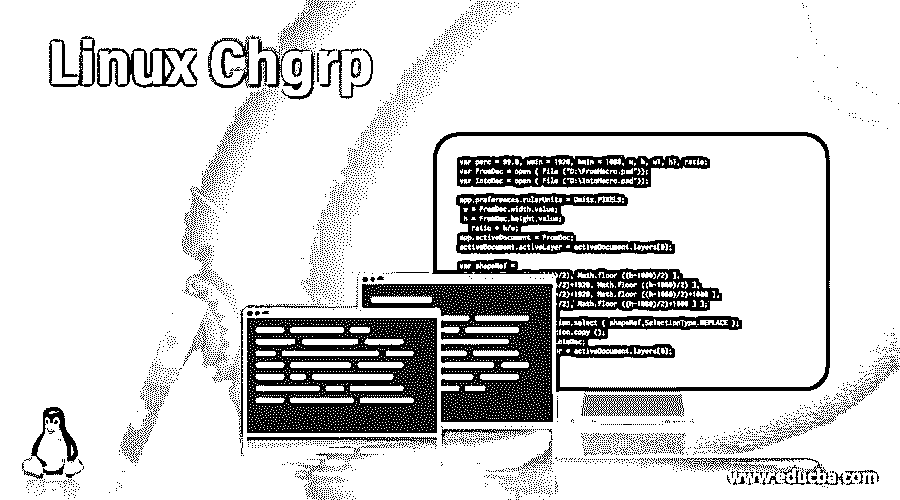
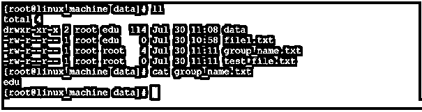
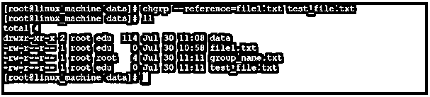
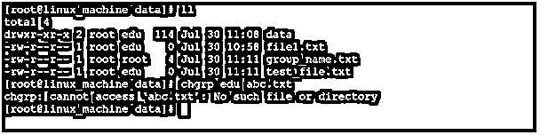
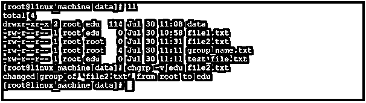

# Linux Chgrp

> 原文：<https://www.educba.com/linux-chgrp/>

## Linux Chgrp 简介

在 Linux 操作系统中，每个文件或目录都与各自访问类型的所有者和组相关联。chgrp 命令用于更改目录或文件的组所有权。我们还有一种方法来改变文件的所有权，即“chown”。要更改文件所有者，我们可以使用“chown”命令。要更改文件的组所有权，我们可以使用“chgrp”命令。在这个主题中，我们将学习 Linux Chgrp。chgrp 实用程序是由 David MacKenzie 和 Jim Meyering 编写的。**注意:**如果我们不知道有效的组或者你想创建一个组。我们应该有管理员或 sudo 权限。因此，我们可以创建一个新组，并根据新创建的组更改组所有权。

### Chgrp 命令的语法

`chgrp [OPTION]... [ GROUP NAME ][ FILE ] ...
chgrp [OPTION]... –reference=RFILE FILE...`

<small>网页开发、编程语言、软件测试&其他</small>

*   **chgrp:** 我们可以在语法或命令中使用“chgrp”关键字。它将接受三个参数，如选项、组名和文件名。按照提供的参数，它改变文件或目录的组所有权。
*   **选项:**我们可以提供不同的标志作为与“chgrp”命令兼容的选项。
*   **GROUP:** 我们可以向“chgrp”命令提供组名。
*   **FILE:** 我们需要在“chgrp”命令中保留文件名或者目录名。

### Linux Chgrp 命令是如何工作的？

在 Linux 中，我们有不同的方法来改变文件和目录的所有者和组所有权。我们可以使用“chgrp”命令来更改文件和目录的组所有权。“chgrp”命令将接受不同的参数，如选项、组名以及文件或目录(名称或路径)。根据给定的输入,“chgrp”命令将使用相应的组名更改文件的组所有权。下面是“chgrp”命令选项的列表，

| **服务请求编号** | **选项** | **描述** |
| One | -c，–变化 | 它将打印详细消息，但只有当它报告更改时才会打印 |
| Two | 安静，安静 | 它将抑制大多数错误消息 |
| Three | -v，–详细 | 它将在处理每个文件时打印诊断的输出 |
| Four | –取消引用 | 这是默认的性质；它将影响每个符号链接的所指对象，而不是符号链接。 |
| Five | -h，–不取消引用 | 它将影响符号链接，而不是任何参考文件 |
| Six | –不保留根 | 它不会将“/”视为特殊(默认)。 |
| Seven | –保留根 | 对“/”递归操作失败是有用的 |
| Eight | –引用=RFILE | 它将使用 RFILE 的组，而不是组值 |
| Nine | -R，–递归 | 这将有助于对文件和目录进行递归操作。 |

### 实现 Linux Chgrp 命令的示例

以下是下面提到的例子。

#### 示例 1–更改文件的组所有权

“chgrp”是在 Linux 环境中改变文件的组所有权的一种非常简单和常见的方法。

**命令:**

`chgrp edu file1.txt`

**说明:**

根据下面的截图 1 (a)，我们有“文件 1.txt”。在屏幕截图 1 (b)中，我们将组所有权从“root”组更改为“edu”组。

**输出:**

截图 1 (a)

截图 1 (b)

#### 示例 2–更改目录的组所有权

默认情况下，新创建目录的组所有权仅与所有者相同。但是我们也可以更改目录的组所有权。

**Co**T2】mmand:

`chgrp edu data`

**说明:**

按照上面的 chgrp 命令，我们可以将“data”目录的组所有权从 root 更改为 edu 组。

**输出:**

截图 2 (a)

截图 2 (b)

#### 示例 3–递归地更改组所有权

在 chgrp 命令中，我们可以递归地更改文件或文件夹的组所有权。不需要单独更改组所有权。

**命令:**

`chgrp -R edu data`

**说明:**

按照上面的命令，我们将文件数量的组所有权从“root”组更改为“edu”组。

**输出:**

截图 3 (a)

截图 3 (b)

#### 示例# 4–使用文件引用更改组所有权

在 Linux 环境中，我们可以在文件引用的帮助下改变文件或目录的所有权。注意:提供文件引用时，请确保引用文件的关联组在 Linux 环境中可用。

**命令:**

`chgrp --reference=file1.txt test_file.txt`

**说明:**

按照上面的命令，我们使用“file1.txt”文件作为组引用，将组所有权从 root 更改为 edu。

**输出:**

截图 4 (a)

截图 4 (b)

#### 示例# 5–带“-f”选项

在 Linux 生态系统中，我们有抑制 chgrp 错误消息的功能。为了抑制错误消息，我们需要在 chgrp 命令中使用“-f”选项。

**命令:**

`chgrp -f edu abc.txt`

**说明:**

按照上面的命令，我们抑制了在使用“chgrp”命令时出现的错误消息。我们在上面的命令中使用了“-f”选项。

**输出:**

截图 5 (a)

截图 5 (b)

#### 示例# 6–带“-v”选项

在 chgrp 命令中，我们可以打印所有非活动以及正在进行的活动。

**命令:**

`chgrp -v edu file2.txt`

**说明:**

在上面的“chgrp”命令中，我们使用了“-v”选项。它将打印所有的信息，同时做任何组所有权的变化。它将在文件和目录级别上工作。

**输出:**

### 结论

我们已经看到了“Linux Chgrp 命令”的完整概念，以及正确的示例、解释和具有不同输出的命令。chgrp 命令用于更改文件和文件夹的组所有权。chgrp 命令的主要优点是文件引用。

### 推荐文章

这是一个 Linux Chgrp 的指南。在这里，我们讨论 Linux Chgrp 命令是如何工作的，以及命令和输出的例子。您也可以看看以下文章，了解更多信息–

1.  [Linux 粉碎](https://www.educba.com/linux-shred/)
2.  [Linux 正则表达式](https://www.educba.com/linux-regular-expression/)
3.  [Linux 网络命令](https://www.educba.com/linux-network-command/)
4.  [Linux More 命令](https://www.educba.com/linux-more-command/)

