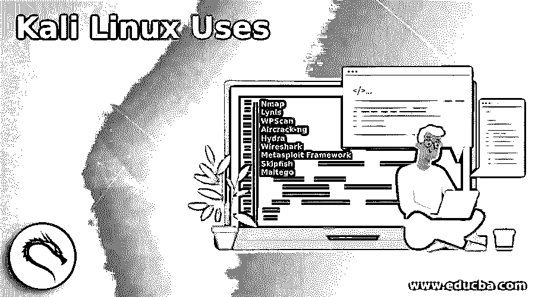

# Kali Linux 使用

> 原文：<https://www.educba.com/kali-linux-uses/>

## Kali Linux 用途的定义

Kali Linux 被定义为 Linux 的一个基于 Debian 的发行版，它是专门为执行渗透测试和安全审计而设计的，因为这个发行版附带了数百个用于此目的的工具。基于 Debian 的发行版是来自 Linux 的开源软件发行版，由 Debian 项目社区提供支持，该项目由伊恩·默多克于 1993 年首次发起。虽然 Linux 中的 Kali 发行版是在 2013 年首次发布的。虽然在被称为 Kali 之前，它被 Linux 世界称为回溯。在本文中，我们将讨论 Kali 的不同用例，以及这个发行版在这些实用领域中使用时带来的实用工具！

### Kali Linux 在不同领域的使用

在我们了解 Kali Linux 发行版在当今世界中的各种用例或使用领域之前，让我们先了解一下 Kali Linux 发行版的历史，以便用例在执行任务时更有前途。

<small>网页开发、编程语言、软件测试&其他</small>

在开发 Kali Linux 之前，承担的第一个项目是 Whoppix，它代表 WhiteHat Knoppix。这里很明显，Knoppix 是这个 Linux 发行版的操作系统，而互联网中的 WhiteHat 是黑客的俚语，但在伦理上。这就是它开始使用这个发行版进行道德黑客攻击的地方。现在，道德黑客本身包括更多层次的划分，如渗透测试、研究组织信息系统的安全性等。在 Whoppix 之后，它开始向 WHAX 转型，底层操作系统从 Knoppix 变成了 Slax。与此同时，另一个名为 Auditor Security Collection 的操作系统也开始生产，然后 WHAX 和 Auditor 的努力结合起来，形成了 BackTrack。根据从各种版本的回溯中获得的经验，决定在基于 Debian 的许可条款和条件下为这个发行版提供一个新的面貌，因此 Kali 从那时开始，一直处于基于 Debian 的发行版的保护之下，并最终成为一个滚动的操作系统。

有了历史记录，这个发行版有数百个专门为信息安全任务设计的工具，如渗透测试、安全研究、计算机取证以及逆向工程。在接下来的几个段落中，我们将更详细地了解每个使用领域，并从核心上理解 Kali Linux 发行版如何有助于可用性。

#### 1.渗透测试领域的用途

在渗透测试领域，Kali Linux 是所有测试人员的一致选择。Kali Linux 中可用的工具来自安全和取证领域的不同领域。Kali Linux 发行版中的工具被分为不同的类别，虽然并不详尽，但却是最常用的，它们是:

*   Nmap
*   琳妮丝
*   WPScan
*   空气裂化
*   水螅
*   Wireshark
*   Metasploit 框架
*   鲣鱼
*   马耳他之鹰

不仅仅是工具，Kali Linux 还为用户提供了元包，这使得用户可以根据自己的需要灵活地安装一些工具子集。最后但并非最不重要的是，Kali Linux 是一个滚动的操作系统发行版，因此有一个标准的版本控制，版本跟踪页面使用户能够比较当前的上游版本与 Kali 中的版本。

#### 2.在安全研究领域的应用

使用目前用于渗透测试的工具，人们可以很容易地通过参与 IT 安全类型的研究并在此基础上不断发展工具，将安全性提高一个档次。Kali Linux 的这个用例领域与渗透测试密切相关。

#### 3.在计算机取证领域的应用

在当今世界，任何组织甚至个人都被外部攻击和安全漏洞所包围。这些行为通常由网络攻击者实施。现在，一旦实施了攻击，就可以使用计算机取证来了解攻击实施的根本原因以及应对攻击的适当行动。这就是 Kali Linux 发行版发挥作用的地方，使用渗透测试工具和 Kali Linux 发行版中存在的大约 14 个计算机取证专用工具使其成为广泛使用的计算机取证操作系统。在这方面发挥重要作用的一些工具有:

*   Binwalk 工具
*   散装提取工具
*   哈希深度工具
*   神奇的救援工具
*   手术刀工具
*   Scrounge-NTFS 工具
*   Guymager 工具
*   Pdfid 工具
*   Pdf 解析工具
*   Peepdf 工具
*   尸检工具
*   img_cat 工具
*   ICAT tool
*   Srch _ 字符串工具

你会觉得上面提到的许多工具与医学科学中的法医部门有某种联系。Kali Linux 发行版中存在的另一点是，当在引导菜单中运行时，通过其独特和特殊的取证模式功能，该工具可以避免任何可能导致数据分析修改的活动

#### 4.在逆向工程领域的应用

在我们年轻的时候，我们经常玩拼图游戏，一个人把包装好的拼图拆开，然后把碎片拼在一起，以学习和开发人类的思维。使用 Kali Linux 的安全专业人员的逆向工程也是如此。通过取证，我们可以找到攻击的原因，安全专业人员使用逆向工程将使我们能够通过识别他们的技术来找出漏洞，并构建更强大的系统，以便在不久的将来避免此类攻击！使我们能够在 Kali Linux 发行版中执行逆向工程的工具有:

*   Apktool
*   Dex2jar
*   发行版 3
*   edb 调试器
*   Jad 调试器
*   Javasnoop
*   ollydbg
*   Valgrind

借助这些工具，安全专家将逆向工程视为维持竞争和开发防御系统以应对未来攻击的重要手段！

### 结论

在本文中，我们了解了安全专业人员使用 Kali Linux 发行版的各种情况，但要记住的一点是，所有用例都围绕着一把伞，即“安全”,这是该发行版最初的目的！让读者在实际生活场景中尝试一下这里提到的一些工具。

### 推荐文章

这是 Kali Linux 使用指南。在这里，我们还讨论了 kali linux 的定义和在各个领域的使用，并给出了解释。您也可以看看以下文章，了解更多信息–

1.  [Linux 分割命令](https://www.educba.com/linux-split-command/)
2.  [Linux 中的 Vim 命令](https://www.educba.com/vim-command-in-linux/)
3.  [Linux vs FreeBSD](https://www.educba.com/linux-vs-freebsd/)
4.  [Kali Linux 命令](https://www.educba.com/kali-linux-commands/)

