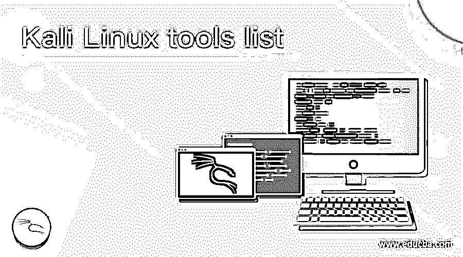

# Kali Linux 工具列表

> 原文：<https://www.educba.com/kali-linux-tools-list/>

## Kali Linux 工具列表简介

Kali Linux 工具列表被定义为 Kali Linux 发行版中存在的工具列表，它帮助用户执行渗透测试，并了解 Kali Linux 是全世界道德黑客最推荐的发行版。但是工具的使用不仅仅局限于道德黑客，即使对于一个网站管理员来说，这些工具也是同样有效和有价值的。这些工具通过支持用户在测试、黑客攻击或任何数字取证中的任务来帮助用户进行渗透测试。不管是谁在使用这些工具，也不管这些工具的实用空间是什么样的，我们在这里要讨论的列表都迎合了 Kali Linux 中的顶级工具！

### Kali Linux 工具列表及其解释

在 Kali Linux 中，有一堆我们将要讨论的工具是预装的。如果您没有找到预安装在发行版中的工具，您可以很容易地下载并安装它，以便在实用程序中轻松使用它！我们将确保我们在此提及的列表照顾到所有渗透测试循环程序，即侦察、扫描、开发、后期开发。我们将试着把重点放在一些重要的工具上，因为谈论所有的工具可能是一个无止境的讨论，因为工具太多了。事不宜迟，让我们根据他们的效用将列表分成几个小组。

<small>网页开发、编程语言、软件测试&其他</small>

#### 1.收集信息

TracerRoute:这是 Kali Linux 中的一个实用程序，它使用户能够进行网络诊断。它显示连接路由，并测量数据包在 IP 网络中传输的延迟。

*   **WhatWeb:** 该实用程序支持信息收集功能，类似于网站指纹。这类似于一个审讯代理人试图审讯一个网站，以获得该网站是由什么组成的答案。为了帮助 WhatWeb，有 1800 个插件，每个插件都有自己的实用程序。
*   **Nmap:** 另一个常用的工具是 Nmap，用于网络发现和安全审计。选项，它通知目标上可用的每个开放端口。
*   顾名思义，这个工具是用来破坏网站中隐藏的对象、文件甚至目录。使用一组预先配置的单词列表发起基于字典的攻击，并分析响应以找到隐藏的宝石！

#### 2.Web 应用分析

*   该工具是 SQL 注入简单和大规模漏洞扫描器最常用的工具之一。这是列表中少数几个没有预装在 Kali Linux 发行版中的，但仍然是使用最广泛的！
*   **BurpSuite:** 这是对 web 应用程序分析的又一补充，web 应用程序分析本身由一组工具组成，这些工具被捆绑在一起，形成一套从零开始的 web 应用程序安全测试，即分析攻击面。
*   OWASP-ZAP: 这是一个基于 Java 的工具，用于测试 web 应用程序的安全性，它承诺了一个直观的 GUI 来执行任务，包括模糊化、爬行、脚本等。，同时还提供了一些插件来简化手头的任务。

#### 3.脆弱性分析

*   **Nikto:** 用于评估漏洞和安全威胁的常用工具之一。该工具能够扫描 6500 多个文件或程序，这可能是潜在的危险。

#### 4.密码攻击

*   **Hash-identifier:** 该工具帮助用户识别用于数据和密码加密的各种哈希。除了他的工具之外，另一个名为 findmyhash 的工具用于通过在线服务破解数据。假设我们收到一个加密的文本。它通过 hash-identifier 来计算附加到它的散列类型，然后 findmyhash 将数据分解为原始字符串。
*   Crunch: 这个工具就像一个工具，允许用户创建自定义单词表。对于标准字符集或特定字符集，所有种类的排列和组合都是为了利用密码攻击而产生的。
*   **开膛手约翰:**另一个广泛使用的离线密码破解服务，它将许多密码破解者组合成一个软件包。它负责识别散列类型、定制破解程序和许多类似的东西，在离线模式下也是如此！

#### 5.评估数据库

*   **SQLMap:** 这是最广泛使用的数据库评估工具之一，用于检测和利用 SQL 注入存在的漏洞，从而接管数据库。为了继续下去，我们可能需要找到一个易受 SQL 注入攻击的网站，对于这个网站，上面讨论的另一个工具 SQLiv 将会派上用场！

#### 6.无线攻击

*   **Aircrack-NG suite:** 顾名思义，这是一个套件，一个扫描器、WEP 和 WPA/WPA2-PSK 破解程序、一个数据包嗅探器和一个分析工具串联在一起，执行任务来破解或识别任何无线介质中的漏洞！该工具由 16 个子工具组成，用于继续该实用程序。
*   **Fluxion:** 这就像是创建目标 Wi-Fi 网络的克隆。现在，当用户连接到无线网络时，会弹出一个身份验证窗口，用户输入密码，密码将被捕获！

#### 7.欺骗和嗅探

*   Wireshark: 这是另一个用于审计安全性的优秀且广泛使用的网络分析工具。Wireshark 通过使用显示过滤器来执行一般的数据包过滤，包括获取捕获密码的过滤器。
*   BetterCAP: 另一个很棒的工具，用于对网络进行中间人攻击。这是通过实时操纵 HTTP、HTTPS、TCP 流量、凭据嗅探和许多类似的攻击来实现的！

#### 8.保持匿名

*   当一个人在执行上述不同的任务时，我们必须确保我们的身份不被泄露，如果忽略了任何预防措施，那将是愚蠢的。这个工具允许改变用户的 MAC 地址，以保持身份匿名！

### 结论

在本文中，我们了解了 Kali Linux 中的所有工具，以及 Kali Linux 中的不同实用程序。在每一个实用程序中，我们已经查看了使用最广泛的实用程序，我们鼓励读者试用它们，感受一下这个实用程序！

### 推荐文章

这是 Kali Linux 工具列表的指南。在这里，我们将讨论 Kali Linux 中的所有工具，以及 Kali Linux 提供的不同实用程序。您也可以看看以下文章，了解更多信息–

1.  [Kali Linux 命令](https://www.educba.com/kali-linux-commands/)
2.  [Kali Linux 软件包](https://www.educba.com/kali-linux-packages/)
3.  [安装 Kali Linux](https://www.educba.com/install-kali-linux/)
4.  [卡夫卡的听众](https://www.educba.com/kafka-listener/)

