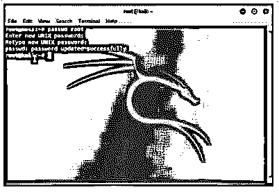

# Kali Linux 根密码

> 原文：<https://www.educba.com/kali-linux-root-password/>

## Kali Linux root 密码介绍

Kali Linux root 密码被定义为获取 Kali Linux 中特定权限所需的秘密短语或单词。这些权限通常授予 Kali Linux 中的一个名为 root account 的帐户，因此有“Root password”一词。Root 帐户是允许对系统执行任何任务的单一超级用户帐户，正如我们所知，自由越大，责任越大，因此 root 密码不得向任何人透露，以保护系统免受任何破坏或隐私侵犯。

**语法:**

<small>网页开发、编程语言、软件测试&其他</small>

在 Kali Linux 中，除了理解 root 密码如何工作之外，我们还需要知道在发行版中处理各个实用程序的语法，这样理解工作将更加实际。

在这里，我们将看看在处理 Kali Linux 根密码更改时会很方便的一些实用程序。

**更改 root 密码:**

`passwd root`

**进入超级用户账户:**

`sudo su`

### Kali Linux 中的 root 密码是如何工作的？

为了理解 root 密码的工作原理，我们需要了解 root 密码适用于什么。在定义中，我们知道 root 密码是用于超级用户帐户或 root 帐户的，这些帐户有权在系统中执行任何任务。与系统中任何其他用户的区别在于，其他用户可能没有某些权限，如删除任何其他用户、安装某些软件等。而 root 帐户可以不间断地执行这些操作。

现在，随着 Kali 2020.1 的最新开始，由于通用 Kali 发行版(如其非根用户策略中所述)，因此不存在超级用户帐户，默认用户不再是特权用户，默认情况下是标准用户。非根用户策略的原因是因为，正如 Kali 网站中提到的，Kali Linux 发行版不被鼓励用作日常操作系统，但在过去几年中趋势已经改变，人们已经开始这样做了。这样做，用户不是默认的根用户，因此默认根用户的概念日益减少。此外，当 Kali 像其他发行版一样转移到传统的安全模型时，它会变得更好。

为了理解工作原理，我们需要从不同的方面来看:

#### 1.为什么需要 root 访问权限？

现在，我们想了解为什么一些工具或软件需要 root 访问权限。为了理解 root 访问的要求，让我们举一个例子，对于本文的上下文，让我们使用 Nmap。Nmap 是一个在当今的 Linux 世界中广泛用于端口扫描的命令。现在，在扫描端口时，有一种称为连接扫描的方法，通过三次握手来识别端口是否打开。这种端口扫描方式也适用于任何非 root 用户。

但是，如果需要利用特权用户在进行扫描(也称为 syn 扫描)时利用原始套接字进行扫描，那么肯定需要 root 用户。多年来，许多应用程序不需要 root 访问权限就可以安装，除非他们对系统文件进行修改。

#### 2.配置是怎么做的？

因此，默认用户没有超级用户的特殊权限。现在，结果是没有超级用户帐号，但是 root 帐号实际上是 Kali Linux 中的超级用户帐号。此外，在 Kali Linux 的安装过程中，安装允许配置 root 用户的密码，用户可以在该阶段轻松完成。在引导实时映像的情况下，i386、amd64、VMWare 和 ARM 映像使用 root 的默认密码进行配置，即 toor(仅适用于 2020 年以前的版本)。

### Kali Linux 根密码示例

以下是 Kali Linux root 密码的示例:

#### 示例#1

更改 root 密码。

**语法:**

`passwd root`

**输出:**

#### 实施例 2

进入超级用户帐户。

**语法:**

`sudo su`

**输出:**

通常，在执行该命令时，它会要求 root 密码，但是因为我们使用的是 root 用户，所以不会要求我们再次输入密码。

### Kali Linux root 密码的优势

下面是提到的优点:

这样，我们就可以确定在我们执行的任务中是否需要 root 帐户，或者这只是浪费资源和精力。

*   如果系统在许多用户之间共享，他们中的一些人会希望成为系统的管理员，并在总体级别上进行管理。因此，相应的用户可以被授予管理权限，而其他用户则被授予非 root 权限，这样对系统工作没有直接影响，并且用户之间的共享也很容易。
*   有了根用户，入侵者就很难闯入系统。sudo 的实现和根帐户的禁用将会迷惑“可能”的入侵者，因为他们不知道哪一个拥有管理员权限。
*   用户可以创建 sudo 策略，并将其部署在混合了 Unix、BSD 和其他 Linux 机器以及 Kali Linux 发行版的企业网络中。
*   拥有 root 密码还将增强审计功能，因为用户可以看到系统中的其他用户正在做什么，以及是否发生了任何入侵。

### 结论

在本文中，我们已经了解了 root 密码在 Kali Linux 中的工作方式，并且通过提到的优点，如果在发行版中使用 root 密码，用户会更加清楚。使用 root 密码时需要注意的一点是，要确保密码的安全，否则系统就有可能受到威胁。

### 推荐文章

这是一个指南卡利 Linux 根密码。这里我们讨论一下入门，root 密码在 kali linux 中是如何工作的？例子和优点。您也可以看看以下文章，了解更多信息–

1.  [卡利 Linux 侏儒](https://www.educba.com/kali-linux-gnome/)
2.  [Kali Linux 软件包](https://www.educba.com/kali-linux-packages/)
3.  [Kali Linux 命令](https://www.educba.com/kali-linux-commands/)
4.  [Kali Linux 库](https://www.educba.com/kali-linux-repository/)

