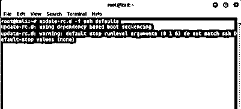
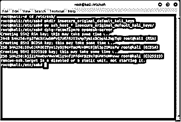
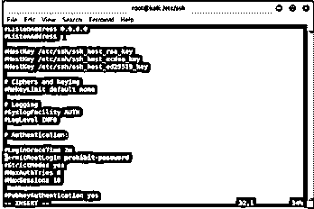

# Kali Linux SSH

> 原文：<https://www.educba.com/kali-linux-ssh/>

## Kali Linux SSH 简介

Kali Linux SSH 被定义为一种加密协议，用于通过不安全的网络管理和操作网络服务。远程命令行，登录，远程执行命令，网络服务用 SSH 保护。SSH 是 Secure Shell 的缩写。在这里，名称的安全部分是派生的，因为通过 SSH 的数据传输是加密的，这确保了在被第三方拦截的情况下，数据将被扰乱和不可读，而另一部分“shell”基于 Unix shell，因为这是用户用于进入的接口。在本文中，我们将介绍 SSH 的工作特性，如启用和禁用，然后通过示例来获得全面的理解！

### SSH 在 Kali Linux 中是如何工作的？

既然我们知道 SSH 在不安全的网络上提供了一个安全通道，那么就必须了解提供安全通道的过程背后的架构。它是客户端-服务器架构，即管理服务器和请求者(即客户端)之间的分区任务和工作负载的应用程序结构。主要用途是访问类似 Unix 的操作系统，尽管它也可以用于访问 Microsoft Windows。

<small>网页开发、编程语言、软件测试&其他</small>

为了让 SSH 工作，首先使用公钥加密对远程计算机进行身份验证，然后在需要时进行用户身份验证。为了使用 SSH，有许多方法可以完成这些任务，最流行的方法是生成公钥-私钥对来加密网络连接，然后使用密码认证来登录。首先，用户输入命令，该命令有 3 个不同的部分:

`ssh {user}@{host}`

使用上面的命令，系统被指示打开一个安全的 shell 连接，确保它是加密的。{user}是要访问的帐户。例如，如果有人想以管理员身份访问系统，该用户就想以根用户身份访问。另一方面，{host}是想要访问的计算机地址。这个地址可以是域名，甚至可以是 IP 地址。一旦输入并执行了上述命令，就会提示用户输入该帐户的密码(如果需要的话)。此外，一旦你输入密码，可能会出现什么也没输入，因为什么也没出现在终端上，但事实并非如此；您键入的字符会在您键入时传输。输入正确的密码后，用户将会看到一个远程终端窗口，通过这个窗口可以在远程环境中执行所有操作。

### 如何在 Kali Linux 中启用和禁用 SSH？

现在我们已经了解了 SSH 在 Kali Linux 中的工作原理；现在是我们迈出在 Kali Linux 中启用 SSH 的第一小步的时候了。一旦我们理解了如何在 Kali Linux 上启用 SSH，我们就会理解如何在 Kali Linux 中禁用 SSH。但是即使在 Kali Linux 中启用或禁用 SSH 之前，我们也需要知道如何安装 OpenSSH 服务器。Kali Linux 没有启用 SSH，尽管 SSH 是连接远程环境的首选方式。连接是通过不安全网络上的安全通道，从服务器到客户机，客户机运行 SSH 服务器 SSH 客户机程序！下面是在 Kali Linux 中启用 SSH 的一些步骤。

1.安装 OpenSSH 服务器

安装 ssh 的第一步是打开一个终端窗口，并通过执行以下命令安装该窗口(假设已经安装了 OpenSSH-server):

`sudo apt-get install ssh`

2.持续运行的 SSH 配置

首先，我们需要通过执行以下命令来删除 SSH 的运行级别:

`update-rc.d -f ssh remove`

删除运行级别后，我们现在将通过执行以下命令来加载默认的 SSH 运行级别:

`update-rc.d -f ssh defaults`

3.SSH 默认密钥更改

现在是我们更改默认 SSH 密钥并随机生成一个密钥的时候了，我们这样做的原因是，如果我们保留默认 SSH 密钥，攻击者可能会猜测或破解它，敏感信息现在将处于危险之中，因为攻击者可能会使用中间人技术来利用系统。执行该操作的命令是

`cd /etc/ssh/
mkdir insecure_original_default_kali_keys
mv ssh_host_* insecure_original_default_kali_keys/
dpkg-reconfigure openssh-server`

4.我们现在准备启动服务，换句话说，通过执行下面的命令在 Kali Linux 上启用 ssh:

`sudo service ssh start`

5.在某些情况下，系统可能会抛出一个错误，提到拒绝访问；同样，需要在/etc/ssh 文件夹下打开一个名为 sshd_config 的文件，找到 PermitRootLogin 的参数行，并将参数作为 prohibit-password。如果还是不行，就把 yes 作为自变量。

至此，我们知道了在 Kali Linux 上启用 SSH 的过程。现在下一步是知道如何禁用 SSH。我们应该知道禁用，因为当 SSH 不再被使用时，我们不应该保持服务器运行，因为任何人都可以闯入机器，敏感信息可能会被泄露。

要停止 SSH 服务器，我们需要执行以下命令:

`sudo service ssh stop`

为了保持 SSH 运行，但禁用 SSH 的 root 登录，我们可以遵循启用步骤的第 5 点中提到的相同步骤，只使用“no”作为 PermitRootLogin 的参数。

### 例子

在这里，我们将看看如何使用 SSH:

**选项 1** : IP 地址

**语法:** ssh AmKy@192.27.09.91【这里我们可以根据需要用用户名替换 AmKy，用服务器的 IP 地址替换 192.27.09.91】

**选项二**:域名

**语法:**ssh AmKy @ eduCBAprod[这里我们可以根据需要用用户名替换 AmKy，用服务器的域名替换 eduCBAprod]

输入密码后，用户可以通过 SSH 的安全连接轻松访问远程环境。

### 结论

在本文中，我们试图带您了解 SSH 的工作原理，然后一步步地在 Kali Linux 中启用和禁用 SSH。有了上面的知识，读者可以开始尝试 SSH，如果有信心的话，我们鼓励读者继续阅读本文，但是请记住一点，如果不小心处理，SSH 可能会很危险。

### 推荐文章

这是一个 Kali Linux SSH 的指南。这里我们讨论 SSH 如何在 Kali Linux 中工作，以及如何启用和禁用 SSH。您也可以看看以下文章，了解更多信息–

1.  [Kali Linux 库](https://www.educba.com/kali-linux-repository/)
2.  [安装 Kali Linux](https://www.educba.com/install-kali-linux/)
3.  [Kali Linux 命令](https://www.educba.com/kali-linux-commands/)
4.  [Linux 中的 Vim 命令](https://www.educba.com/vim-command-in-linux/)

