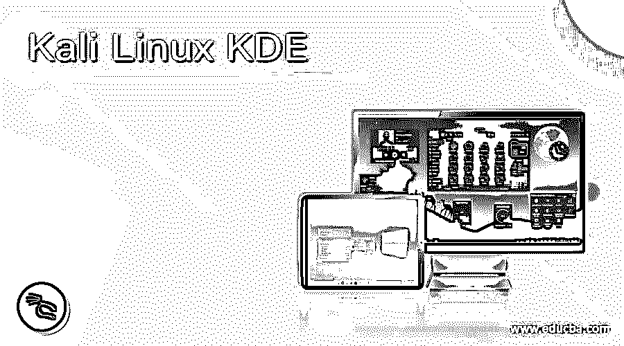
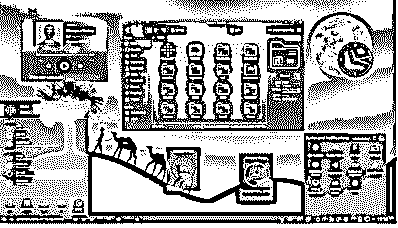
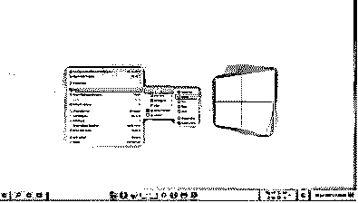

# 卡利 Linux KDE

> 原文：<https://www.educba.com/kali-linux-kde/>

## Kali Linux KDE 简介

Kali Linux KDE 被定义为 Kali Linux 的环境，Kali Linux 是基于 Linux 的操作系统。KDE 是环境的缩写，可以看作是 Kali Linux 操作系统的 GUI 提供者。对于 windows 操作系统中类似 DOS 的情况，这就是没有 KDE 的 Kali Linux。在类似的情况下，Windows 是 DOS 的 GUI 提供者，KDE 也满足了这个需求，除了 KDE 通过 x 服务器而不是操作系统与 Linux 相关联。KDE 作为一个环境已经被证明非常容易让用户使用 Kali Linux，就像他们在一个类似的 windows 机器上工作一样！

### KDE 是如何在 Kali Linux 中工作的？

Kali Linux 中的 KDE 是为运行在后端的 Linux 操作系统提供 GUI 的环境之一。该项目由 KDE 社区的知名软件开发人员构建和维护。这个项目包括三个部分，这些部分在 Kali Linux 中的 KDE 的工作中起着关键的作用。在这一节中，我们将详细讨论这三个部分，从而全面理解 KDE 在 Kali Linux 中的工作。

<small>网页开发、编程语言、软件测试&其他</small>

KDE 等离子:这是一个平台用户界面，由不同的工作区组成，如等离子桌面或等离子移动。该元素允许用户拥有接口技术，当调整后，允许用户运行各种外形，如智能手机、台式机、笔记本电脑、平板电脑等。在撰写本文时，KDE 等离子 5 的最新功能是 KRunner，这是一个具有几个插件的搜索功能，允许用户在搜索功能之外快速启动应用程序。另一个特点是“活动”，有自己的布局和壁纸。第二，在多个可连接的屏幕上灵活定制桌面、布局和面板。会话管理是另一个需要注意的特性。

**KDE 框架:**有一些现成的框架，它们构建在“QT”之上，包含 80 多个免费使用的库，可供最终用户使用。该元素是 KDE 应用程序的基石，可以作为任何其他项目的一部分，这些项目可能需要这些框架的工具来构建应用程序的需求。一些值得注意的框架是:

*   Kirigami: 这是一个 QML 框架，允许开发者编写和构建在 Android、iOS、windows 等平台上运行的应用。，而不对代码进行任何调整。这个框架是高度收敛的、响应迅速的、优雅的。而且，它是开源的；用户不需要支付任何费用。
*   ThreadWeaver: 这是一个框架，它为用户提供了一个通过基于作业和队列的接口来管理线程的高级 API。通过定义依赖关系，可以很容易地调度线程执行，从而简化多线程的使用。
*   **KConfig:** 为了存储和检索配置设置，这个框架对用户来说很方便，这个框架的特点是面向组的 API。生成的代码基于 XML 文件。

KDE 应用程序:有为 KDE 构建的应用程序，并且是所有基于 Linux 的操作系统的实用程序，而不仅仅是 Kali Linux。应用程序是一个软件包，是 KDE 官方发布的一部分，主要构建在我们上面讨论的 KDE 框架上。KDE 应用程序已去品牌化，并作为发布服务的一部分提供。

KDE 在 Linux 中的工作从此与我们上面讨论的所有元素绑定在一起，与这些元素同步工作就是 KDE 在 Kali Linux 中的工作方式。

### 为什么我们需要 Kali Linux 中的 KDE？

KDE 在 Kali Linux 中是必需的，原因有很多，比如:

*   **集成:** KDE 与很多应用程序和各种应用程序集成，不需要专门为 KDE 编写应用程序。
*   UI 提供者:有了 UI，Kali Linux 在后台运行，KDE 减轻了用户的负担，用户不必总是使用终端，只需点击一个按钮就可以完成工作。
*   多个桌面:单个桌面可能会很杂乱，有时一个人需要两个或更多的桌面来让事情变得更有条理，这就是 KDE 派上用场的地方。

### 优点和缺点

我们现在对 KDE 的工作有了一个清晰的了解，并对 Kali Linux 中的 KDE 的时间需求有了一个清晰的了解。现在是时候讨论一下优缺点了，这样你就能清楚地知道在什么情况下需要使用 KDE，在什么情况下使用 KDE 可能没用。

#### 优势

*   KDE 具有众所周知的灵活性，可以根据用户对桌面外观和感觉的喜好进行塑造和定制。
*   这是一个非常轻量级的包，开始很简单，但一切都在用户的手中，用户可以尝试用它来制作任何想要的东西。
*   在 KDE 有许多工具允许用户使用一些重复性的工作，这通常是操作系统的用户所需要的。类似计算器、互联网等东西。是人们经常使用的工具的例子。
*   KDE 有自己的办公套件，名为 KayOffice，显然在操作系统中拥有它是一件很酷的事情。
*   除了灵活性和工具，KDE 还为用户提供了很多选项，这使得用户也可以做很多复杂的事情。

#### 不足之处

*   KDE 使用了大量的系统内存和资源，这使它感觉臃肿。这是由于在许多领域缺乏优化，而不仅仅是众多 KDE 工具的可用性。
*   安装应用程序还不容易，因为用户必须打开终端来安装应用程序。
*   定制的灵活性对于 Kali Linux 的初学者来说可能不是一件好事，而且可能会迷失在探索的道路上！

### **例题**

卡利 Linux 中 KDE 等离子体的黑暗与光明主题的一些例子。

**淡紫色等离子主题(深色):**

**We10XOS 主题(灯光):**

### 结论

在本文中，我们试图带您了解 Kali Linux 中广泛的 KDE 主题，以及 Kali Linux 中 KDE 作为一个整体的利与弊。有了这些信息，任何人都可以根据用户的需求更容易地评估和使用 KDE 作为用户界面提供者！

### 推荐文章

这是一个指南卡利 Linux KDE。在这里，我们讨论了 Kali Linux 中广泛的 KDE 主题以及 KDE 的优缺点。您也可以看看以下文章，了解更多信息–

1.  [Kali Linux 库](https://www.educba.com/kali-linux-repository/)
2.  [Kali Linux 软件包](https://www.educba.com/kali-linux-packages/)
3.  [安装 Kali Linux](https://www.educba.com/install-kali-linux/)
4.  [Kali Linux 命令](https://www.educba.com/kali-linux-commands/)

