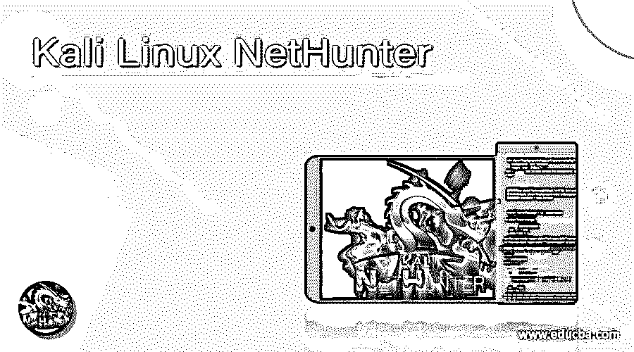

# Kali Linux 网络猎人

> 原文：<https://www.educba.com/kali-linux-nethunter/>

## Kali Linux NetHunter 的定义

Kali Linux NetHunter 被定义为一个免费的开源平台，为 android 设备提供移动渗透测试实用程序。该平台基于 Kali Linux。Kali NetHunter 适用于各种 android 设备，对于非根设备，我们有 NetHunter Rootless，对于具有自定义恢复功能的根 android 设备，我们有一个名为 NetHunter Lite 的定制版本。这个平台包括市场上所有种类的 android 设备，甚至包括一加、三星和谷歌 Nexus 的高端设备。这个平台由一个由志愿者组成的社区维护，该项目由进攻性安全组织资助。

### Kali Linux NetHunter 是如何工作的？

我们刚刚了解到 Kali Linux 中的 NetHunter 将为 android 设备提供渗透测试工具，关键元素构建了我们用于渗透测试的 NetHunter。在这里，我们将看看 NetHunter 的不同组成部分，它们本质上是 NetHunter 工作的组成部分。NetHunter 的 ROM 由几个部分组成，这些部分相互作用并相互依赖才能正常运行。下面，我们将看到 NetHunter 中包含的三个部分，第一部分是 Android 内核，这是一个定制的内核，第二部分是 Kali Linux Chroot，最后一部分是 NetHunter Android 应用程序。现在让我们来详细研究一下它们，以便全面了解 NetHunter 的工作原理。

<small>网页开发、编程语言、软件测试&其他</small>

*   **定制 Android 内核:**内核是一个软件组件，使应用程序能够连接到硬件，以满足用户的要求。除了支持通信能力，内核还管理系统资源。现在，出于安全性和防止被利用的考虑，android 内部的股票内核并不提供所有实用程序，但通过定制的 android 内核，每个设备都可以使用股票内核中不可用的独特功能。这些自定义内核提供了 HID(键盘到计算机支持)、OTG 无线支持、CD-ROM 仿真支持等功能，以及许多其他此类功能，使 WhiteHat 测试人员能够发现可能导致漏洞利用或任何安全漏洞的问题。这些内核还能够提供额外的补丁或修复，这些补丁或修复可能是添加外部无线设备的结果。
*   **Kali Linux Chroot:** Chroot 本质上是 Kali Linux 的完整安装，支持与 android 共享网络、存储和其他资源。Kali Linux 的 chroot 本质上是 NetHunter 的核心，配置文件以 NetHunter 与 Android 生态系统良好配合的方式进行了修改。NetHunter 有一个 chroot 管理器，可以方便地下载和安装 chroot，从而允许共享网络、存储和其他资源。该组件位于内部应用程序存储区域，必须符合安装的空间要求。
*   **NetHunter Android app:**NetHunter 的最后一个元素是应用程序，它提供一个 UI 来方便用户完成需要完成的任务。这个应用程序为管理 Kali Linux chroot 提供了一个简单的界面。当我们提到它是一个简单的 UI 时，并不意味着它不强大。应用程序的 GUI 也很强大。该应用程序包含 NetHunter 所需的所有配置文件，并在首次运行时复制到 sdcard。除了 UI 之外，该应用程序还充当启动服务，便于在设备启动时运行该服务。

有了上面的组件，我们现在知道了 NetHunter 在 Kali Linux 中的工作原理。

### 为什么我们需要 Kali Linux NetHunter？

现在，这篇文章需要知道为什么需要使用 NetHunter。为了查看 NetHunter 的这一部分，我们应该明白，不是每个人都可以访问 Kali Linux 机器，这就是 NetHunter 可能能够将 android 设备转换为 Kali Linux 机器的地方。

不仅如此，人们还可以解锁 android 设备上的许多功能，而这些功能并不是原始内核的一部分。最后但同样重要的是，它将允许用户，如果他们对道德黑客感兴趣，探索 android 设备的不同方面，并找到任何漏洞，以保护他们的设备！

### 优点和缺点

我们现在对 NetHunter 的工作以及 Kali Linux 中对 NetHunter 的需求有了一个清晰的了解。现在，让我们来看看它的优点和缺点，这样我们就可以清楚地知道在什么情况下需要使用 NetHunter，在什么情况下使用 NetHunter 可能没有用。

**优点:**

*   NetHunter 传播 android 设备基本内核中默认不内置的功能。
*   骁龙 SOC 中的高通芯片支持监视器。
*   内核构建器的出现有助于简化尚未呈现给人们的内核的构建。
*   使用 GitLab CI 加快了发布工作流程。
*   默认情况下，完全支持人机界面设备小工具，用户需要通过用户空间控件来启用和配置它。

**缺点:**

*   并非所有的 android 设备都支持 NetHunter 官方版本，因此在下载和安装时需要小心，因为在某些情况下，安装错误的 NetHunter 可能会损坏手机。
*   您可能需要使用外部 USB wifi 适配器，因为一些内部 wifi 不支持监控模式或数据包注入。

### Kali Linux NetHunter 的使用

要使用它，我们首先需要安装 NetHunter 应用程序。一旦我们安装了应用程序，我们将需要安装 Termux，黑客的键盘，Nethunter Kex 客户端。

现在我们需要打开 Termux 应用程序，然后看看 Kex 是否正在运行。如果它正在运行并且没有密码，我们将需要再次 KeX 并通过执行命令输入所需的密码

`fg <job id>`

现在，要在后台发送 KeX，我们需要执行

`bg <job id>`

这样，您就可以在 android 设备中使用 NetHunter 了！

### 结论

在本文中，我们试图带您了解 Kali Linux 中有关 NetHunter 的广泛主题，以及如何将任何 android 设备转变为 Kali Linux 环境。我们已经考虑了利弊，这将使您在需求实现中做出使用 NetHunter 的明智决定。

### 推荐文章

这是一个 Kali Linux NetHunter 的指南。在这里，我们讨论定义，如何 Kali Linux NetHunter 工作和优缺点。您也可以看看以下文章，了解更多信息–

1.  [Kali Linux 软件包](https://www.educba.com/kali-linux-packages/)
2.  [Kali Linux 库](https://www.educba.com/kali-linux-repository/)
3.  [安装 Kali Linux](https://www.educba.com/install-kali-linux/)
4.  [卡莉 Linux vs Ubuntu](https://www.educba.com/kali-linux-vs-ubuntu/)

