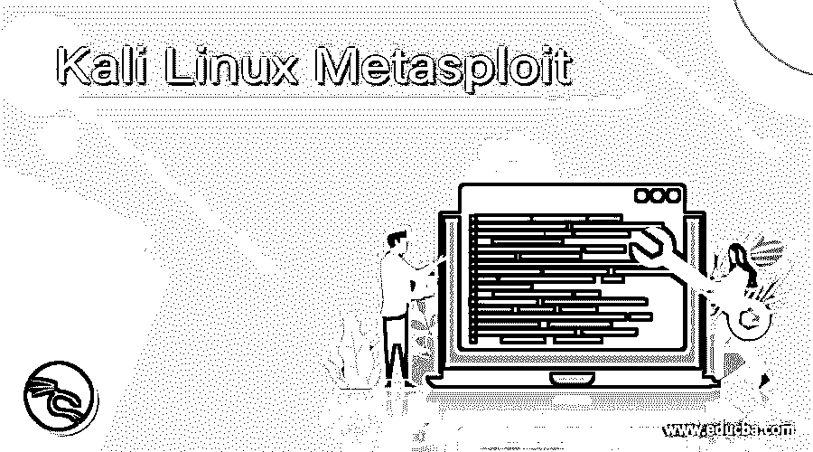
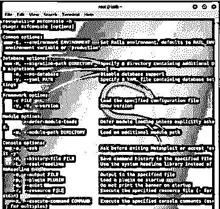
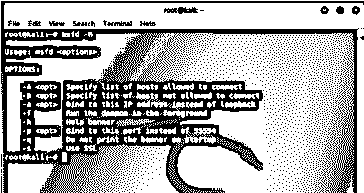
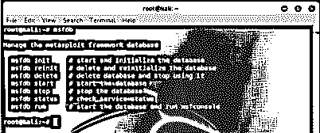
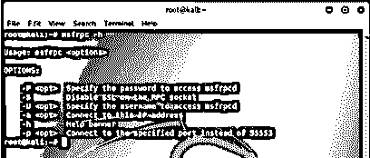

# Kali Linux Metasploit

> 原文：<https://www.educba.com/kali-linux-metasploit/>

## Kali Linux Metasploit 的定义

**Kali Linux Metasploit** 被定义为一个开源框架，使用户能够执行渗透测试，包括查找、利用和验证漏洞)以及使用户能够构建和开发平台，从而为各种应用程序、操作系统和平台提供漏洞。这是渗透测试中使用最广泛的工具之一，也是 Kali Linux 发行版中内置的一个特性。该框架提供了用于执行渗透测试的基础设施、内容和工具，并且还允许用户广泛地审计证券以及定期添加新模块，以保持该框架是最新的，并为任何危及安全的情况做好准备！

### Kali Linux Metasploit 如何工作？

既然我们已经了解了 Metasploit 的简要描述，那么了解 Metasploit 的工作方法就变得非常重要，因为它为用户提供了大量的实用工具。Metasploit 建立在许多组件之上，这些组件称为模块。模块不过是小块的独立代码或软件应用程序，允许用户使用 Metasploit 打算提供的功能。总共有 6 个模块，即有效载荷，利用，nops，编码器，职位和辅助。现在，为了理解 Metasploit 的工作原理，我们需要理解其中的每一个元素，在本节的后面，我们将尝试把所有元素结合起来，提供 Metasploit 工作原理的更大的图像。Metasploit 的主要组件是有效负载和漏洞。

<small>网页开发、编程语言、软件测试&其他</small>

**有效载荷**

Payload 是 Metasploit 中的一个元素，或者换句话说，是使黑客能够与被黑系统进行交互的简单脚本。通过这种交互，黑客或用户能够将数据传输到受害系统。这是通过使用 3 种可用的有效载荷来完成的。

*   **单行本:**这些是用于创建沟通的小脚本，因此允许进入下一阶段。
*   **Staged:** 这是一个比 singles 更大的文件，允许攻击者将更大的文件上传到受害者系统中。
*   **Stages:** 这些是 stager 模块下载的组件，它们提供高级功能，对大小没有限制。

在执行有效负载后，会在正确的端口创建一个侦听器，然后建立一个以 SMB 服务为目标的连接。因此，向 Metasploit 提供用于创建端口的工具可以被利用其功能的人使用。

**战功**

漏洞是一系列命令，执行这些命令是为了专门针对系统或应用程序中可能存在的漏洞。此漏洞可能会发展到攻击者甚至可以访问系统的阶段。一些非常常见的攻击有缓冲区溢出、web 应用程序、代码注入等。现在，当漏洞脚本运行时，攻击计划是根据目标系统的各种特征(如操作系统、服务、漏洞信息等)构建的。需要记住的一点是，正常的认证控制机制不会被滥用。一旦漏洞被设置并运行，来自被利用系统的传入连接的数据使 Metasploit 能够提供所需的功能。

**Nops**

正如我们提到的，有效载荷和漏洞是两个重要的组成部分，因此在使用漏洞有效载荷时，我们需要确保使用 NOPS 在最终输出中增加一些随机性。Metasploit 对用户来说很方便，因为它包含了许多 NOP 生成器。NOP 生成器总是首先使用随机的一个。

**编码器**

正如我们提到的，有效载荷和漏洞是两个重要的组成部分，因此，在使用漏洞有效载荷时，我们需要对有效载荷进行编码，以便删除任何不良字符，这就是编码器将发挥主要作用的地方。需要记住的是，除了需要删除不良字符之外，当不需要接触寄存器并且在最大尺寸之下时，使用编码器。

**帖子**

该组件使 Metasploit 能够运行 Metasploit 提供的各种利用后模块，这些模块可以在受损目标上运行以收集证据，从而能够更深入地透视目标网络等。

**辅助**

任何不是利用的东西都被称为辅助模块。虽然漏洞利用需要有有效负载，但另一方面，辅助功能是一种迷人的功能，允许 Metasploit 扩展各种各样的漏洞利用。

理解了上面的各种组件之后，我们现在能够描绘出 Metasploit 工作的更大图景。

### 优点和缺点

现在重要的是，我们要知道它的优点和缺点，这样我们就可以对 Metasploit 的效用进行评分

**优势**

*   Metasploit 是开源的，因此是免费的！
*   有一个庞大的社区可以让你以更好的方式使用这些特性。
*   这个框架通常是最新的，因为它经常更新。
*   可以很容易地部署特定于用户的漏洞

**缺点**

*   学习 Metasploit 可能是一项具有挑战性的任务。
*   基于 GUI 的工具非常有限，因为它主要是 CLI 驱动的。
*   如果处理不当，会导致系统崩溃。
*   如果您的系统有防病毒软件，可能很难安装 Metasploit。

### 例子

让我们讨论 Kali Linux Metasploit 的例子。

#### 示例#1

访问 Metasploit 控制台的帮助文档

**语法:**

`msfconsole -h`

**输出:**

#### 实施例 2

访问实用工具的帮助文档，以提供远程客户端可以连接到的 msfconsole 实例

**语法:**

`msfd -h`

**输出:**

#### 实施例 3

管理框架数据库的命令

**语法:**

`msfdb`

**输出:**

#### 实施例 4

连接到 RPC 实例文档的命令

**语法**

`msfrpc -h`

**输出:**

### Kali Linux Metasploit 的使用

要使用 Metasploit，我们首先需要安装 Metasploitable。首先，我们需要建立一个虚拟环境。一旦设置了环境，我们需要确保 Metasploit 不在我们的实际网络上，并且需要相应地配置设置配置，还要确保 Kali Linux 机器在仅主机适配器上。配置完成后，我们可以启动 Metasploitable，并根据我们对框架利用率的要求来利用它。

### 结论

在本文中，我们了解了 Metasploit 在 Kali Linux 中是如何工作的，并且提到了优点和缺点，以便我们的读者在日常工作中使用 Metasploit 时能够更清楚地权衡每一点。此外，Rapid7 团队不断更新模块以保持框架最新，这也值得称赞！

### 推荐文章

这是 Kali Linux Metasploit 的指南。这里我们讨论一下定义，Kali Linux Metasploit 是如何工作的？，利弊。您也可以看看以下文章，了解更多信息–

1.  [卡利 Linux 侏儒](https://www.educba.com/kali-linux-gnome/)
2.  [Kali Linux 软件包](https://www.educba.com/kali-linux-packages/)
3.  [Kali Linux 库](https://www.educba.com/kali-linux-repository/)
4.  [Kali Linux 命令](https://www.educba.com/kali-linux-commands/)

