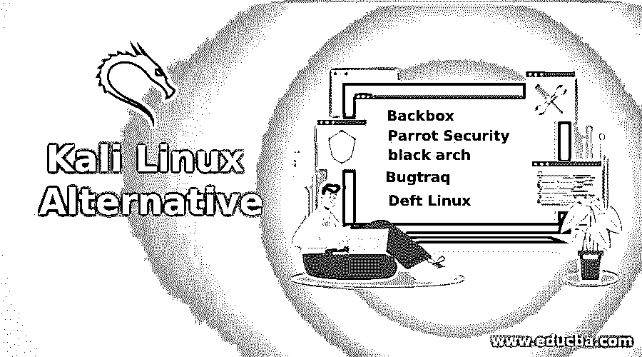

# Kali Linux 替代方案

> 原文：<https://www.educba.com/kali-linux-alternative/>

## Kali Linux 替代品的定义

Kali Linux 被定义为一个操作系统软件分发版，它是为安全审计和渗透测试目的而直观构建的，为了帮助 Kali Linux 履行其构建意图的职责，有许多工具是为此目的而构建的。kali Linux 的发行版类型是基于 Debian 的发行版，它不仅提供了一个纯粹的操作系统，还附带了预构建的软件包和预编译的软件，以便于用户机器的安装。在 Kali Linux 之前，它被一些不同的操作系统发行版称为“回溯”。在这篇文章中，我们将讨论 Kali Linux 的一些替代品，以及为什么和什么时候应该使用这些替代品来获得最大的利益！

### Kali Linux 的十大备选方案

在我们了解当今世界上 Kali Linux 发行版的各种替代方案之前，让我们先了解一下 Kali Linux 发行版本身。Kali Linux 发行版从它自己的各种前身中学习，如 Whoppix、WHAX 和 BackTrack，但始终专注于一个实用程序，那就是 IT 资源的安全性。虽然有两种黑客方式，一种是道德的，称为 WhiteHat，而另一种是不道德的黑客或 BlackHat，Kali Linux 总是领先一步，在许多方面表现出自己是交易破坏者，正如我们所知，在这个世界上没有什么是完美的，Kali Linux 也不例外。因此，我们有多种选择作为 Kali Linux 发行版的替代品。在随后的段落中，我们将讨论它们中的每一个，以及为什么或何时它们是首选的！因此，让我们从备选方案列表开始:

<small>网页开发、编程语言、软件测试&其他</small>

#### 1.后箱

Backbox 是深受黑客专业人士欢迎的发行版之一。这种替代方案是为渗透测试和安全评估而设计的系统。用于道德黑客攻击的所有工具都在存储库中，并满足黑客攻击、渗透测试、Wi-Fi 网络安全、压力测试、漏洞评估等需求。这种替代方法非常易于使用，并且是社区驱动的更新，主要用于需要执行持续安全监控和漏洞评估的情况。它提供了一个名义上但完整的 XFCE 环境供使用。

#### 2.鹦鹉安全

Parrot security 是另一个被道德黑客广泛使用的发行版，Kali 和 Parrot 的不同之处在于维护和资金组织。对于 Parrot，它是冷冻箱，这个发行版主要针对面向云的渗透测试和计算机取证。Parrot 安全发行版的桌面环境是 MATE，可用于渗透测试和计算机取证。这个发行版也支持匿名和加密工具。

#### 3.黑色拱门

因为 Kali Linux 是基于 Debian 的发行版，BlackArch 是基于 Arch 的 Linux 发行版。基于 Arch 的发行版的主要优点是它是一个轻量级的、灵活的 Linux 发行版，使事情变得简单。对于那些更喜欢基于 Arch 的发行版而不是基于 Debian 的发行版的人来说，这个发行版又是一个首选。目前，BlackArch 包含 2500 个工具，并且每天都在增长！

#### 4\. Bugtraq

Bugtraq 操作系统来自 2011 年的 bugtraq-team，也是广泛用于渗透测试的操作系统之一，它是基于 Debian 或 Ubuntu 的发行版。这个发行版中有大量的工具，并且比 Kali Linux 组织得更好。移动取证工具、恶意软件测试工具、RFID、蓝牙、无线、GSM 等审计工具。都存在。各种桌面环境，如 XFCE，GNOME，KDE 也可以在这个发行版中使用。

#### 5.灵巧的 Linux

Deft 也是最著名的发行版之一，它是使用 GNU/Linux 和 DART(数字高级响应工具包)构建的。DART 是一个专门为数字取证和情报活动设计的工具包。Deft 号称是安全和执法任务的首选。该发行版的目的是在不破坏或篡改 PC 的情况下运行实时系统。

#### 6.Samurai Web 测试框架

这是一个基于 Ubuntu 的发行版，其中包含了攻击和访问网站的最佳工具之一。这些工具被用作逆向工程的一种模式，以便人们可以采取适当的措施来保护系统免受类似的未来攻击。

#### 7.Pentoo Linux

这个发行版是一个基于 Gentoo 的发行版，侧重于安全性和渗透测试。这个发行版是 LiveCD 中为数不多的发行版之一。该实用程序启用了持久性支持，这意味着实时环境中的任何更改都将在下次启动 u 盘时应用到环境中。Pentoo Linux 使用的桌面环境是 XFCE 环境。在 Gentoo 上覆盖 Pentoo 也是可能的。

#### 8.凯恩

CAINE 的全称是计算机辅助调查环境。这是 Deft 的另一个广泛使用的发行版。该发行版还能够处理数字取证用例，提供了许多用于系统取证和分析的工具。

#### 9.网络安全工具包

与 LiveCD 中的 Pentoo Linux 类似，Network Security Toolkit 是一个基于 Fedora 的可引导的实时 ISO 发行版，与基于 Debian 的 Kali 不同。该发行版使安全专业人员能够通过发行版中提供的各种工具来测试网络安全中的漏洞。

#### 10.Fedora 安全旋转

该发行版可用于安全审计和测试目的，并使用户能够使用各种工具进行同样的工作。但是除此之外，这个发行版还有另外一个用途，那就是它被用于教学目的。在这里，教师可以通过支持学生学习信息安全、web 应用程序安全、取证分析等的实用性来支持他们。

除了 Kali Linux，还有一些发行版可供选择，我们将在下面列出，但是下面的发行版没有上面列出的那些流行。

*   大罢工
*   Sabayon Linux
*   马吉亚
*   卡诺提克斯

### 结论

在这篇文章中，我们得到了一种不同的选择，这不仅是对 Kali Linux 发行版的一种竞争，激励它对发行版中存在的不同缺点进行即兴创作，而且也是对用户的一种健康的选择，这样选项就可以用可用的最佳解决方案实现效用！让读者根据用例的需求自由选择他们的替代方案。

### 推荐文章

这是一个 Kali Linux 替代指南。在这里，我们还讨论了 Kali Linux 的定义和 10 大备选方案，并给出了解释。您也可以看看以下文章，了解更多信息–

1.  [安装 Kali Linux](https://www.educba.com/install-kali-linux/)
2.  [Kali Linux 命令](https://www.educba.com/kali-linux-commands/)
3.  [卡莉 Linux vs Ubuntu](https://www.educba.com/kali-linux-vs-ubuntu/)
4.  [Linux 中的 Vim 命令](https://www.educba.com/vim-command-in-linux/)

