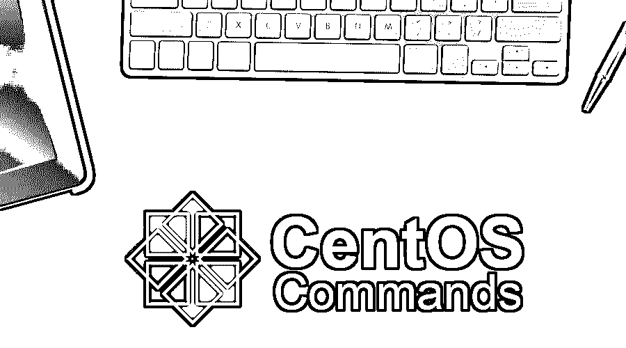

# CentOS 命令

> 原文：<https://www.educba.com/centos-commands/>

## CentOS 命令简介

我们有不同的软件用于不同的目的，同样的，它们存在不同的操作系统用于不同的目的。一个组织有几个需要不同平台来满足的技术需求。依靠简单的图形用户界面工作的普通用户通常更喜欢使用 [Windows](https://www.educba.com/introduction-to-windows/) ，而需要进入系统核心并需要命令行界面的专业人员则根据他们的具体需求更喜欢使用 Unix 或 Linux。市场上有几种操作系统可以根据用户的需要为他们服务。在本文中，我们将了解一个最重要的基于 Linux 的操作系统，它使用与 Linux 操作系统相同的命令。**T3】**

### 什么是 CentOs？

[CentOS](https://www.educba.com/what-is-centos/) 可以定义为基于 Linux 的操作系统，它利用 Linux 中使用的命令为用户提供服务。它有一个非常简单的界面，让用户轻松舒适地执行他们的任务，享受交互式界面。与其他操作系统相比，centOS 有很多优点，其中最重要的优点之一就是它的轻量级。运行 CentOS 所需的硬件不是很高，它可以在任何具有 2GB 内存和 200GB 硬盘的机器上运行。

<small>网页开发、编程语言、软件测试&其他</small>

它很好地服务于正常使用的目的，如果用户想要执行任何繁重的任务，建议他们转移到 Linux 操作系统。CentOS 也可以解释为属于 Linux 家族的操作系统，它为用户提供基于 GUI 的交互式界面。

与 Windows 相比，CentOS 中可用的功能相对较少。但是与任何其他的 Linux 发行版相比，CentOS 惊人的 GUI 给了它一个优势。使用 CentOS 不需要任何专业知识，因为如果你对 Linux 的基本命令有所了解，你就能够使用它。在下一节中，我们将了解一些用于 CentOS 的基本命令。

### CentOS 命令

为了使用 CentOS，有几个命令可用于与机器交互。关于 CentOS 有趣的事情是，它的命令与 Linux 命令相似，任何对 Linux 命令有想法的人都可以使用 CentOS。以下是使用 CentOS 时经常使用的一些重要命令。

*   **Pwd 命令**

pwd 命令用于获取当前用户实际所在的路径名。在终端中，当用户从一个目录移动到另一个目录时，没有显示用户实际上在哪个目录的显示部分。使用 pwd 命令将向用户提供路径名，以确认他们的当前目录。

*   **Mkdir 命令**

[Mkdir 命令](https://www.educba.com/mkdir-command-in-linux/)用于在计算机磁盘上创建一个新目录，其他目录或文件可以存储在该目录中。Mkdir 命令后面必须跟一个任意的名称，该名称将是新创建的目录的名称。

*   **系统控制命令**

systemctl 命令用于管理操作系统服务和启动。这被认为是在操作系统中使用服务的非常重要的命令之一。

*   **须藤命令**

Sudo 是一个命令，它允许任何其他命令使用根用户的权限。任何与 sudo 一起编写的命令都必须执行，因为它就像是来自系统所有者或创建系统的用户的指令。

*   **防火墙-命令命令**

Firewall-cmd 命令用于使用 CentOS 防火墙或安全选项。这是主要由安全专业人员使用的命令，其角色是保护系统免受网络攻击。

*   **Chmod 命令**

[Chmod 命令](https://www.educba.com/chmod-command-in-linux/)用于改变任何文件的权限。在添加或删除系统中存储的任何文件的权限时，会非常频繁地使用该命令。

*   **百胜命令**

Yum 命令用于在 centOS 中安装新的软件和软件包。当通过命令行界面向操作系统添加新软件时，它被使用。

*   **解压缩命令**

Unzip 命令用于解压缩归档文件。这是一个重要的命令，也是 CentOS 中唯一一个用于解压存档文件的命令。它也可以在 Linux 中以同样的方式使用。

*   **清除命令**

使用 CentOS 时，Clear 命令用于清除命令和输出填充的终端窗口。使用起来非常简单。一旦简单地写在终端屏幕上将导致清除一切。

*   **谁指挥**

该命令用于找出使用系统的当前用户。当要找出正在使用当前系统的用户的名字时，只需在终端中输入 who 就可以使用它。

*   **纳米命令**

Nano 命令用于文本编辑器。在终端中使用该命令时，必须在其后跟随要编辑的文件的名称。它实际上是在您想要编辑终端中的文本时使用的。

*   **Cd 命令**

当用户必须从一个目录移动到另一个目录时，Cd 命令用于改变目录。这是一个非常重要的命令，因为它是让用户能够更改字典的唯一选项。

### 结论

centOS 可以定义为属于 Linux 家族并提供交互式图形用户界面的操作系统。它使用与 Linux 操作系统相同的命令工作。Linux 操作系统轻量级发行版的易用性对于普通或专业用户来说非常有用。

### 推荐文章

这是 CentOS 命令的指南。在这里，我们以简洁的方式讨论了 CentOS 命令的基本概念和不同类型。您也可以浏览我们推荐的其他文章，了解更多信息——

1.  [PowerShell 命令](https://www.educba.com/powershell-commands/)
2.  [Matlab 命令](https://www.educba.com/matlab-commands/)
3.  [Linux 中的 Zip 命令](https://www.educba.com/zip-command-in-linux/)
4.  [如何安装 CentOS？](https://www.educba.com/install-centos/)

