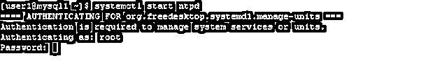
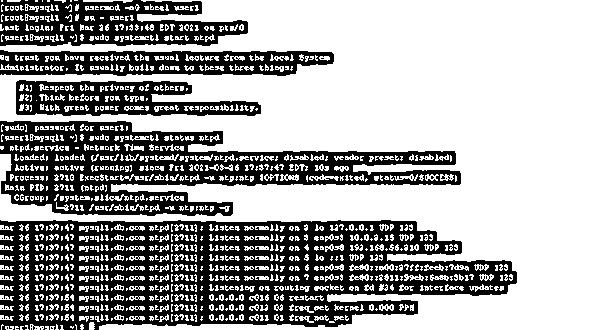
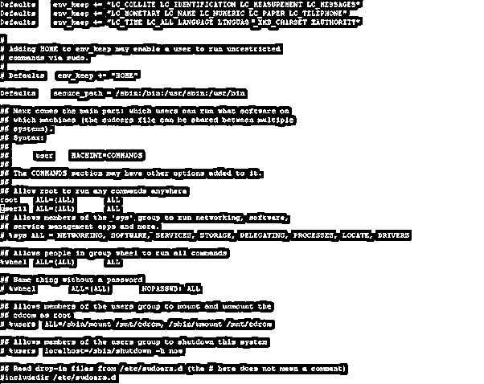
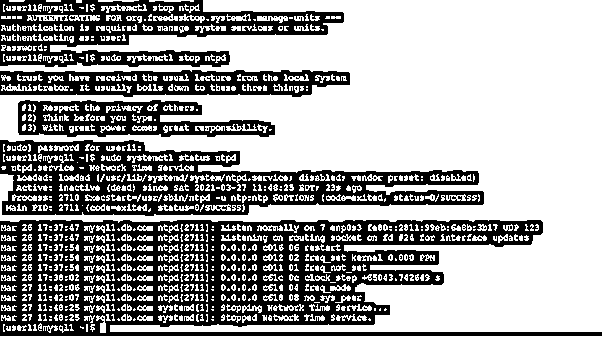

# CentOS 添加 sudo 用户

> 原文：<https://www.educba.com/centos-add-sudo-user/>

## CentOS add sudo 用户简介

在 CentOS 环境中，root 用户拥有所有特权。一些系统或安全相关的任务，它将不会完成，除非并且直到它不与根用户登录。如果我们需要为不同的用户提供相同的根级别访问，那么我们需要为相同的用户提供 sudo 访问。基本上，sudo 支持插件架构；它将支持输入或输出日志记录以及与安全相关的策略。像应用程序或通信这样的第三方可以设计这种类型的架构。它将分发自己的安全策略和输入或输出日志插件，以便与前端 sudo 用户顺利合作。在 Linux 发行版中，sudoers 是默认的安全策略。可以通过/etc/sudoers 文件配置相同的策略(也可以通过 LDAP 配置来配置)。为了更深入地研究它，我们需要研究 sudo 支持信息。在本主题中，我们将了解 CentOS add sudo 用户。

**CentOS add sudo 用户的语法**

<small>网页开发、编程语言、软件测试&其他</small>

因此，没有特定的语法可用于添加具有 sudo 权限的用户。如果我们需要 sudo 访问的任何用户，那么有不同的方法来实现它。根据需求或应用程序用例，我们需要做同样的事情。

示例方法如何编辑 sudo 访问的文件:vi /etc/sudoers

*   **vi /etc/sudoers:** 按照上面的方法，我们需要使用 vi、vim、nano 这样的编辑器来编辑文件。我们需要编辑“sudoers”文件。根据需求或访问级别，我们需要添加具有特定访问条件的用户。

### CentOS 添加 sudo 用户如何工作？

在 CentOS 操作系统中，root 用户拥有所有特权。如果任何不同的用户有什么 sudo 特权，那么我们也可以提供它。有不同的方法来提供 sudo 访问。

以下是使用 sudo 时可以考虑的选项列表。

*   **-A，–ask pass:**从用户终端，如果 sudo 需要密码，它将读取。如果使用了-A–ask pass 选项，则图形程序将执行读取用户密码，并将密码输出到标准输出。我们还可以在系统中设置 SUDO _ 阿斯帕斯环境变量。我们可以为 askpass 助手程序设置路径

例如，我们可以将其设置为“/usr/X11R6/bin/ssh-askpass”(如果没有可用的 askpass 程序，那么 sudo 将退出并显示一条错误消息)

*   **-b，–后台:**这将有助于在后台运行命令。请注意:不可能使用 shell 作业。控制由 sudo 用户启动的后台进程。交互命令的数量将无法在后台模式下正常工作。
*   **-C num，–close-from = num:**这将有助于在执行命令之前关闭所有大于或等于 num 的文件描述符。如果值小于 3，则不允许。默认情况下，sudo 将在执行命令时关闭除标准输入、标准输出和标准错误之外的所有打开的文件描述符。默认情况下，安全策略将限制用户使用该选项的能力。sudoers 策略只允许在-C 选项的帮助下使用该命令。
*   **-E，–preserve-env:**该选项将指示用户要求保留其现有环境变量的安全策略。如果登录或访问用户没有保护环境的权限，安全策略可能会收到错误消息。
*   **–preserve-env = list:**该选项将向安全策略表明，用户需要将逗号分隔的环境变量列表添加到保留的列表中(它将来自用户环境)。如果登录或访问用户没有保护环境的权限，安全策略可能会收到错误消息。
*   **-H，–set-home:**这将有助于为安全策略设置 HOME 环境变量。在目标用户的密码数据库条目中，也会设置指定的主目录。
*   **-h，–help:**将简短的帮助信息打印到标准输出。它会自动退出。
*   **-g group，–group = group:**这将有助于使用主组运行命令。在目标用户的密码数据库条目中，它将设置为 group 而不是 primary group。

### 理解 CentOS add sudo 用户的示例

下面举几个例子

#### 1.CentOS 添加 sudo 用户:授予普通用户 Sudo 访问权限

在 CentOS 环境中，我们能够为普通用户提供 sudo 访问。正如我们前面所讨论的，有不同的方法可以做到这一点。这里，我们使用组修改方法。

**命令:**

`usermod -aG wheel user1`

**说明:**

按照上面的命令，我们正在修改“user1”用户的组。在屏幕截图 1 (a)中，我们无法运行“systemctl”命令，因为我们需要 sudo 访问。一次，我们将用户添加到轮组。user1 将获得 sudo 访问权限和运行该命令的能力(请参考屏幕截图 1 (b))。

**输出:**

截图 1 (a)

截图 1 (b)

#### 2.CentOS 添加 sudo 用户:允许普通用户访问 sudo

在 CentOS 环境中，我们可以通过编辑“sudoers”文件向普通用户提供 sudo 访问

**命令:**

`vi /etc/sudoers`

**说明:**

按照上面的命令，我们正在对“sudoers”文件进行修改。我们需要添加用户名，我们需要提供 sudo 访问。这里，我们向“user11”用户提供 sudo 访问。

**输出:**

截图 2 (a)

截图 2 (b)

### 结论

我们已经看到了“CentOS add sudo user”的完整概念，以及正确的示例、解释和带有不同输出的命令。默认情况下，有多种方式向普通用户提供 sudo 访问。根据要求或需要，我们需要选择任何适用的方法。

### 推荐文章

这是一个 CentOS 添加 sudo 用户指南。在这里，我们讨论 CentOS add sudo 用户的完整概念以及示例和命令。您也可以看看以下文章，了解更多信息–

1.  [CentOS 命令](https://www.educba.com/centos-commands/)
2.  [什么是 CentOS？](https://www.educba.com/what-is-centos/)
3.  [Linux Curl 命令](https://www.educba.com/linux-curl-command/)
4.  [如何安装 CentOS？](https://www.educba.com/install-centos/)

