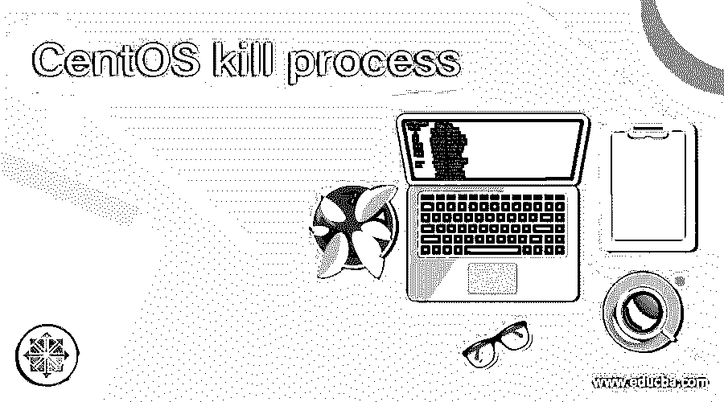
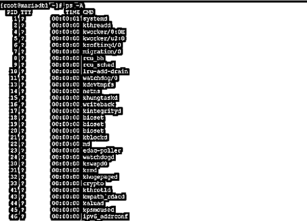

# CentOS kill 过程

> 原文：<https://www.educba.com/centos-kill-process/>

## CentOS kill 流程简介

在 CentOS 中，我们能够运行多个任务、应用或作业。当我们运行这种不同的任务时，每个任务、应用程序或作业都使用特定的进程 id 运行。进程 ID 对于在 CentOS 级别跟踪此类任务、应用程序和作业非常重要。有时可能会出现任务、应用程序或作业没有运行，并且由于某种原因而停滞不前的情况。因此，当前作业正在运行，而后续作业也将无法运行。因此，系统处于暂停状态。为了避免这种情况，我们可以监控运行 CentOS 系统的进程。如果这种情况可能发生，那么我们可以使用 kill process 实用程序来终止这些进程。在本主题中，我们将了解 CentOS kill 流程。

**Useradd 命令的语法**

<small>网页开发、编程语言、软件测试&其他</small>

`kill [ -s signal | -p ] [ -q sigval ] [ -a ] [ -- ] pid ...
kill -l [ signal ]`

**1。kill:** 我们可以在语法或者命令中使用 kill 关键字。它将接受不同选项之类的参数。我们在其中使用了不同的选项，如单个进程 id 等。kill 命令将帮助终止 CentOS 环境中的进程或单个进程。

**2。Signal / PID:** 当任何一个进程或作业在做任何一个进程时，它都会把信号发送给操作系统。(例如:如果作业被执行，那么它将发送单个值 0)。类似地，当每个任务、应用程序或作业将运行时，它将启动或与唯一的进程 id 相关联。

**3。选项:**我们可以提供不同的标志作为与 kill 命令兼容的选项。

**Centos kill process 命令的工作原理**

在 CentOS 环境中，我们看到每个任务、应用程序或作业都与一个唯一的进程 id 相关联。当作业或应用程序运行良好时，关联的进程 ID 是干净的

自己的。但是在某些情况下，由于死锁、资源减少或网络混乱，进程无法正常执行并被挂起。因此，备份的进程将不会，有时系统处于暂停状态。

在这里，我们可以借助这个实用程序使用 kill process 实用程序。我们可以将卡住的进程 ID 传递给它。它将终止与之相关的进程，并保持系统健康。这将有助于流程的顺利进行。

以下是与 rpm 软件包安装兼容的选项列表。

*   **-s，–signal 信号:**该选项有助于要求信号发送。信号将有两种不同的格式，如信号名称或信号编号。
*   **-l，–list[signal]:**这将有助于打印信号名称列表，或者能够将作为参数给出的相同信号也转换为名称。有一个特定的位置可以找到信号，比如 at /usr/include/linux/signal.h
*   **-L，–table:**该选项类似于-L。但该选项将打印信号名称及其相关编号。
*   **-a，–all:**它不会将 commandname-to-pid 通信限制为与正在运行或当前进程具有相同 UID 的进程。
*   **-p，–pid:**该选项将有助于指定终止进程应该只显示进程 id，即已命名进程的 PID。它不会发出任何信号。
*   **-q，–queue sigval:**在这个选项的帮助下，我们可以使用 sigqueue(2)而不是 kill(2)选项。sigval 参数对于指定随信号一起发送的整数值很有用。
*   **n:** 在这个选项的帮助下，n 的值大于 0。那么只有进程 id 为 n 的进程将被发信号通知。
*   **0:** 这将有助于对当前进程组中的所有进程都发出信号。
*   **-1:** 这将有助于对 PID 大于 1 的过程发出信号。
*   **-n:** 该选项将在 n 的值大于 1 时使用。在进程组中，所有的进程都被发送信号。

### CentOS kill 流程示例

理解 Centos kill process 命令的示例

#### 1.Centos kill process:获取所有进程和相关进程 ID

在 CentOS 环境中，所有作业或应用程序都使用特定的进程 id 运行。我们能够列出系统中正在运行的所有进程。

**命令:**

`ps -A`

**说明:**

按照下面的命令，我们能够列出系统中正在运行的进程的数量。它将包括进程 id、终端信息、时间和命令。

**输出:**

#### 2.Centos 终止进程:从进程名中获取进程 ID

在 CentOS 环境中，我们还可以找到带有进程名称的进程 id。

**命令:**

`pidof kblockd`

**说明:**

按照上面的命令，我们能够找到“kblockd”的进程 id。类似地，我们可以使用任何服务名并能够找到进程 id。

**输出:**

#### 3.Centos 终止进程:终止进程

在 kill 命令中，我们能够终止 CentOS 环境中的任何进程，只要用户能够访问并拥有该进程或命令。

**注意:**根用户可以从系统中删除流程。

**命令:**

`kill -9 517
ps -A | grep -i polkitd`

**解说:**

按照上面的命令，我们将从系统中删除进程 id 517。

**输出:**

#### 4.Centos kill 进程:使用 pgrep 命令

在 CentOS 环境中，我们能够列出与同一应用程序相关联的进程数量。

**命令:**

`pgrep mysql`

**说明:**

按照上面的命令，我们列出了环境中正在运行的进程的数量。有两个进程正在运行。

**输出:**

### 结论

我们已经看到了“Centos Kill Process”的完整概念，以及正确的示例、解释和带有不同输出的命令。在任何环境中，所有流程都必须平稳运行。但是，万一这种情况没有发生，我们就需要确定问题的 RCA，或者有时我们需要终止进程，保持系统健康。

### 推荐文章

这是 CentOS kill 流程的指南。在这里，我们讨论了“Centos Kill Process”的完整概念，并给出了适当的示例、解释和带有不同输出的命令。您也可以阅读以下文章，了解更多信息——

1.  [CentOS 命令](https://www.educba.com/centos-commands/)
2.  [如何安装 CentOS？](https://www.educba.com/install-centos/)
3.  [什么是 CentOS？](https://www.educba.com/what-is-centos/)
4.  [Linux 删除用户](https://www.educba.com/linux-delete-user/)

