# 如何安装 Magento？

> 原文：<https://www.educba.com/install-magento/>

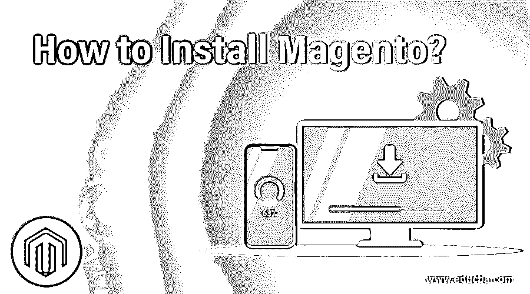

## 安装 Magento 简介

以下文章提供了如何安装 Magento？Magento 是开源的；使用 [PHP 编程语言](https://www.educba.com/career-in-php/)构建的电子商务设置。该软件和相关设置最初是由 Varien 公司(一家美国公司)开发的。初始版本于 2008 年 3 月 31 日发布，稳定版本为 2.3.0(截至 2018 年 11 月)。除了 PHP，Magento 还使用了 MySQL、MariaDB(一个 RDBMS 系统)以及 ZEND 框架。

Magento 提供了两个不同的操作平台，即:

<small>网页开发、编程语言、软件测试&其他</small>

*   Magento 开源，这以前被称为社区版。
*   Magento Commerce 早期被称为企业版。

社区版是免费的，具有多种功能。由于这是开源的，任何用户都可以用新的插件来扩展它的功能。

与社区不同，企业版不是免费的，而是内置了一些更高级的功能。Magento 企业版专为大型企业基础设施需求而设计，附带安装支持、技术支持、使用策略和故障排除。

### 如何安装 Magento？

在我们开始关于如何安装 Magento 的讨论之前，让我们看看 XAMPP；为什么我们需要这个来安装 Magento？

XAMPP 是一种软件，用户可以使用它来开发本地 web 开发设置。这个软件把我们的电脑变成了服务器。为了让这个定义更加贴切，让我们看一个场景。

“经过几个月紧张的工作，A 先生完成了一些网络开发编码。现在怎么办？

因此，他需要一台服务器来托管和查看开发情况，以及在最终完成之前需要进行哪些更改或修正。在这种情况下，A 先生需要 localhost，这意味着他可以看到他的工作的地方。"

XAMPP 提供了这个平台，通过这个平台，用户可以将编码和数据传输到本地主机服务器上。

Magento 设置的系统要求，请浏览此链接。我们还展示了与系统需求相关的屏幕。

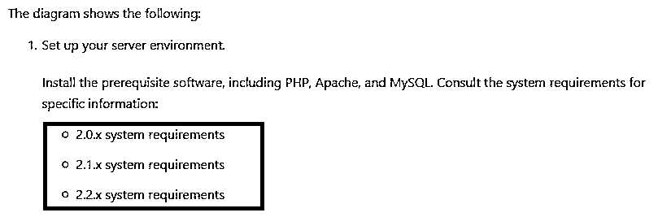

只需选择您想要安装的版本和技术要求的详细列表，如:

*   操作系统（Operating System）
*   内存管理
*   作曲者
*   Web 服务器(apache 版本详细信息)
*   数据库ˌ资料库
*   PHP 版本将会推出

现在去 Google.com 键入“Magento 2 下载”你会得到一些下载链接，更喜欢 Magento 官方网站。

这是:

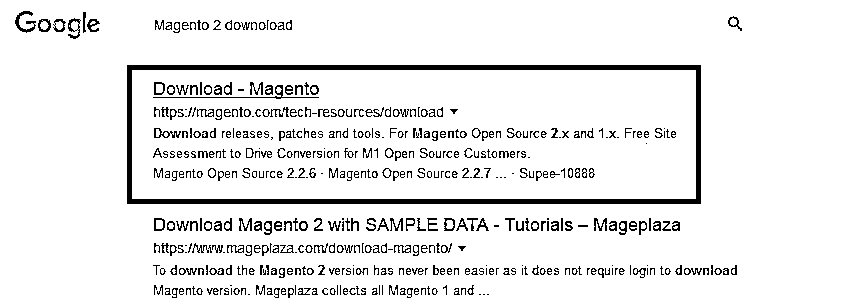

现在是下载页面。

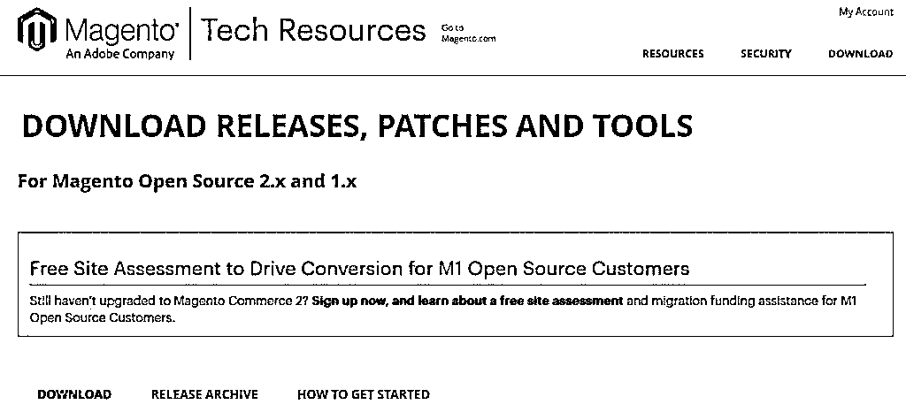

如果您向下滚动到上述页面，您将看到一些下载设置的详细信息。

*   带示例数据的完整版本
*   不带数据的完全发布

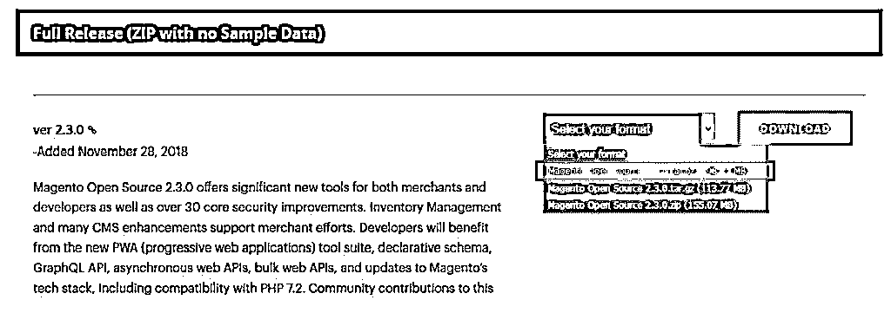

选择 zip 文件后，单击“下载”按钮，这将在您的屏幕上弹出一个屏幕。

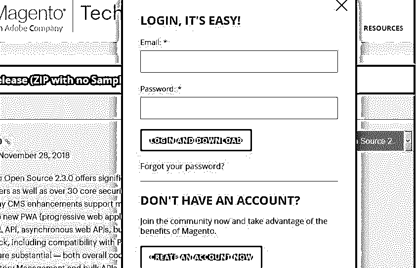

如果您已经在 Magento 中创建了帐户，请使用这些登录凭据；如果没有，请在下载完成后点击“创建帐户”按钮打开位置目录。

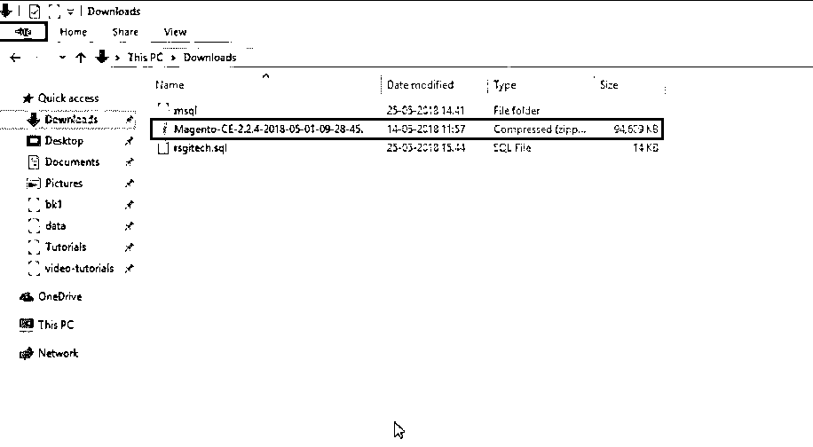

一旦 Magento 压缩文件可用，将文件复制到您的 XAMPP 文件夹。

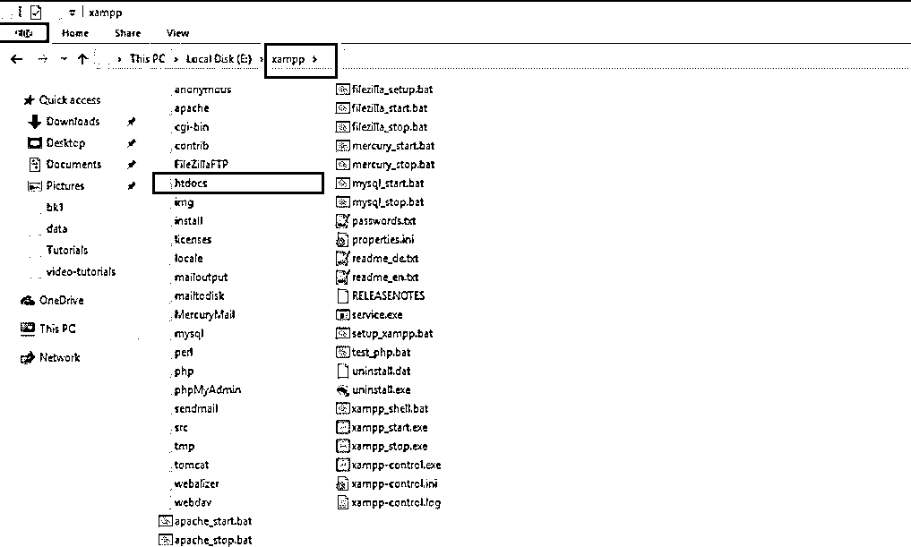

在上图中，我们可以看到有一个 XAMPP 文件夹，在这个文件夹中，有一个“htdocs”文件夹。我们必须将 Magento 的下载文件复制到这个 htdocs 文件夹中。

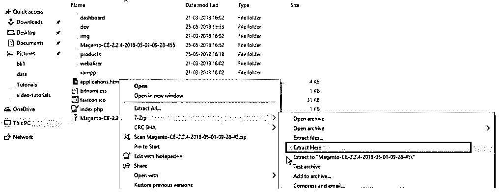

提取正常文件夹可用后，您只需重命名它(以便于与其他文件夹区分)。

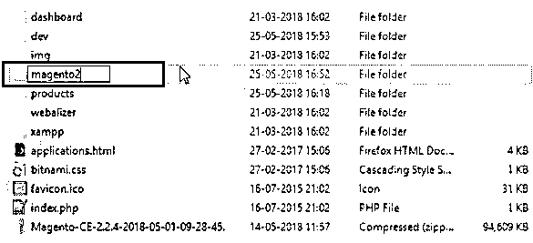

现在，转到 localhost 服务器(MyPhp 服务器)页面来创建数据库。在这里，您还必须将新创建的数据库重命名为“magento2”。

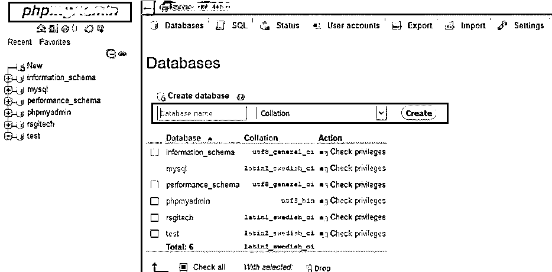

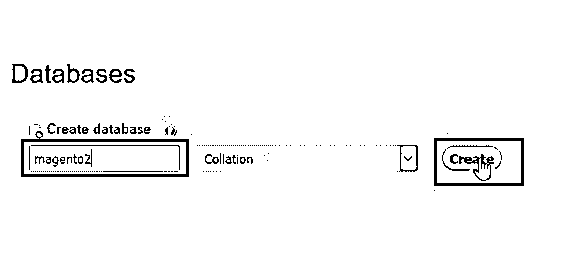

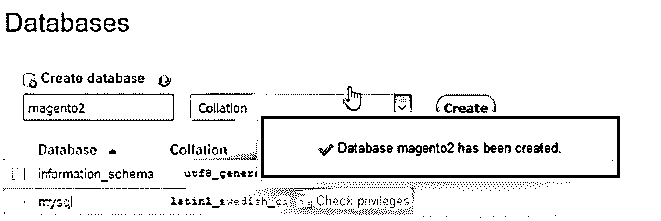

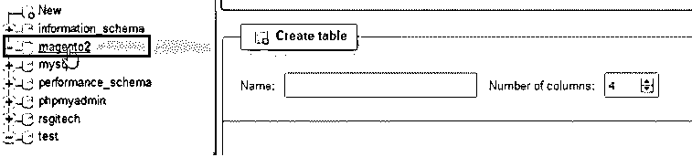

现在您的数据库已经创建好了。导航到本地主机 2。

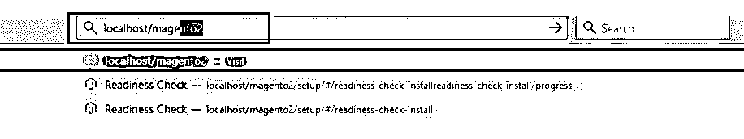

对于 localhost/magento2(由用户创建和命名)的 serac 结果，您将看到您的服务器详细信息屏幕。

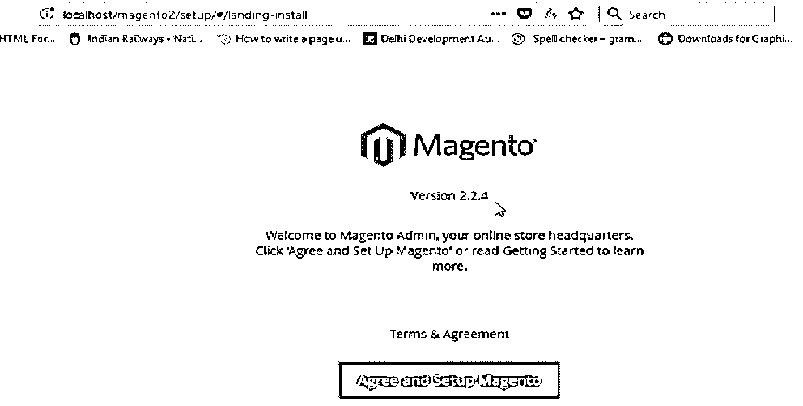

从这里开始，只剩下设置屏幕。请用户注意，如果你来到这个屏幕，就意味着在 Magento 真正开始使用之前，你只剩下最后一个设置了。

现在，用户必须点击“同意并设置 Magento”按钮，设置页面就会出现。

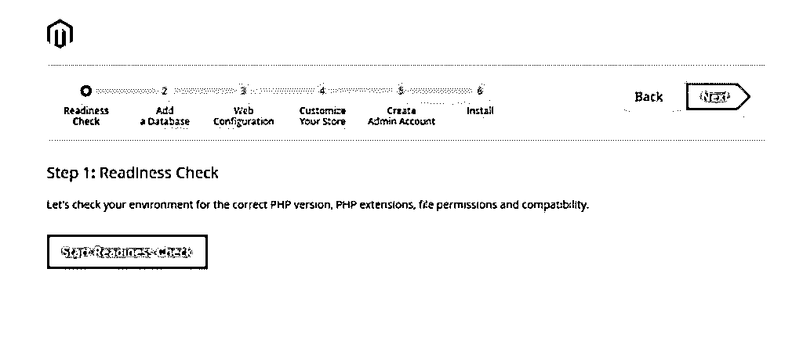

用户必须按顺序执行上述步骤——第一步是“准备就绪检查”

你必须点击“开始准备检查”按钮；在这里，系统会对 PHP 的需求、环境、相关的扩展和权限进行彻底的检查。

如果您有所有更新的要求，您将看到下面的屏幕，进入下一步。

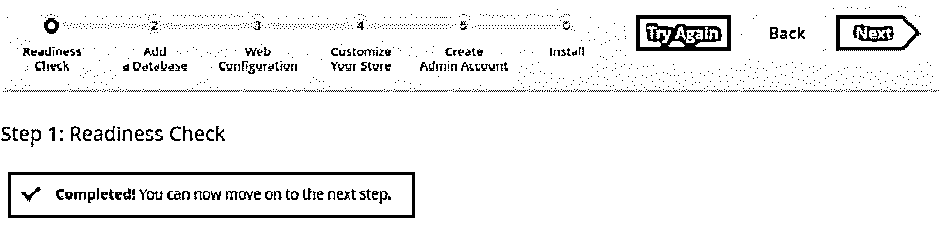

点击“下一步”按钮，您将看到一个数据库屏幕。

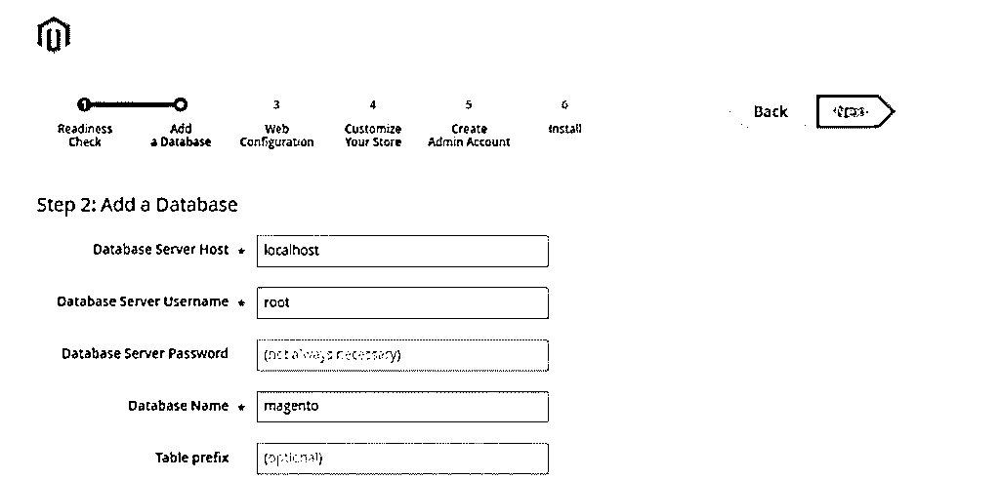

用户必须填写数据库详细信息:

*   **数据库服务器主机:**默认情况下，名称为 localhost。
*   **数据库服务器名称:**你必须提到你的服务器用户名，你在 Magento 创建注册时得到的用户名。
*   **密码字段为空/(默认):**用户必须在登录 Magento 时填写密码详情。
*   **数据库名称:**我们已经创建了 magento2，必须选择相同的内容才能继续。
*   **表前缀:**是可选配置，如有特殊需要，不需要填写。

现在，用户必须单击“下一步”按钮才能进入配置步骤。接下来是“网络配置”页面。在这里，用户必须提到他的商店地址(指的是吸引顾客到你的商店的地址)。你还必须提到一个“管理员”密码。因为每个页面都有一个管理员的最终变化，以反映在前面的商店位置。在密码字段中提供合适的密码，然后单击“下一步”。

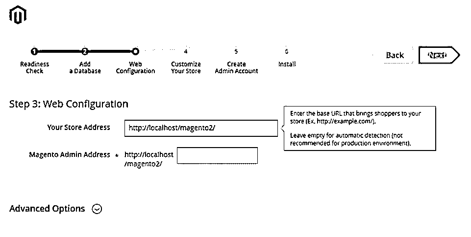

现在，用户将获得一个“定制商店”屏幕。

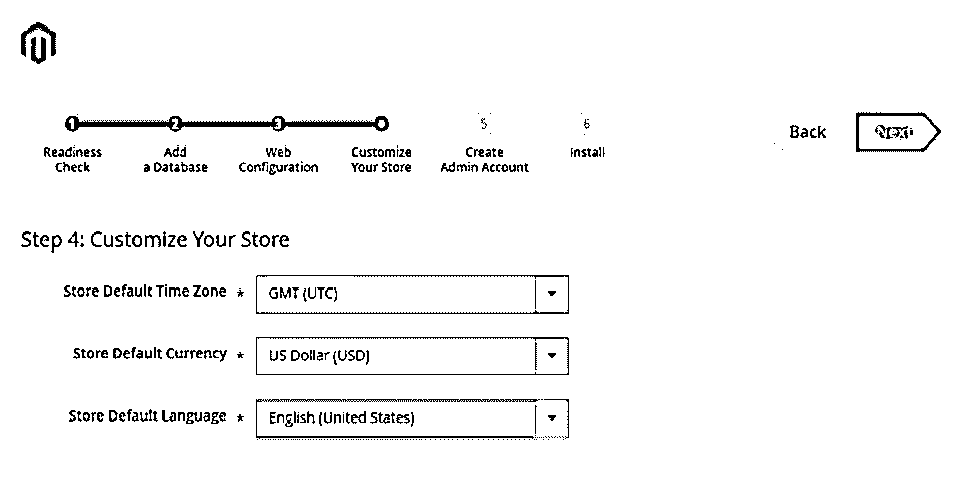

通过提供以下详细信息来自定义您的商店:

*   时区
*   货币详细信息
*   首选语言

我们不必对此屏幕进行任何更改；让默认值存储在其中，然后单击“下一步”按钮。

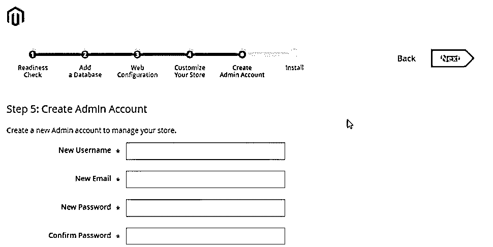

您将进入“创建管理员帐户”页面。

提供管理详细信息:

*   **用户名:**长度必须在 1 到 40 个字符之间。
*   **新邮件:**电子邮件必须是真实的，以便验证。
*   新密码和确认密码，然后再安装 Magento。

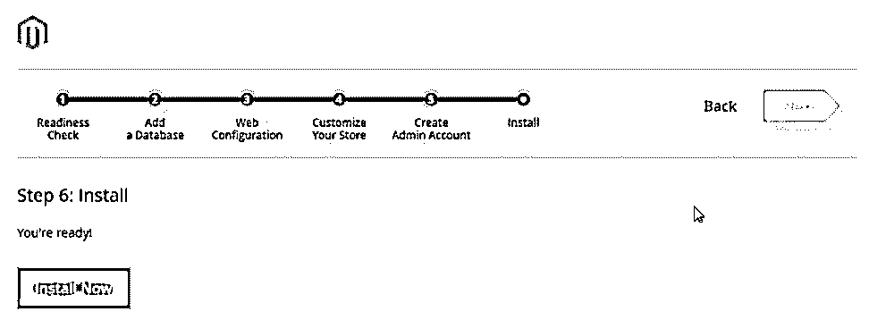

单击“安装”按钮后，安装开始。

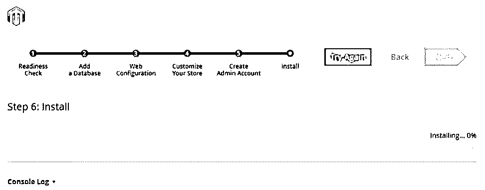

安装完成后，您必须登录您的管理员帐户才能启动电子商务业务。

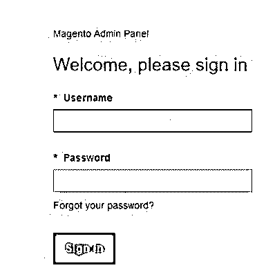

### 推荐文章

这是如何安装 Magento 的指南？这里我们讨论了安装 Magento 的不同步骤。您也可以阅读以下文章，了解更多信息——

1.  [安装硒](https://www.educba.com/install-selenium/)
2.  [安装 JavaScript](https://www.educba.com/install-javascript/)
3.  [Magento 版本](https://www.educba.com/magento-versions/)
4.  [安装 Magento 2](https://www.educba.com/install-magento-2/)

