# 安装 Magento 2

> 原文：<https://www.educba.com/install-magento-2/>

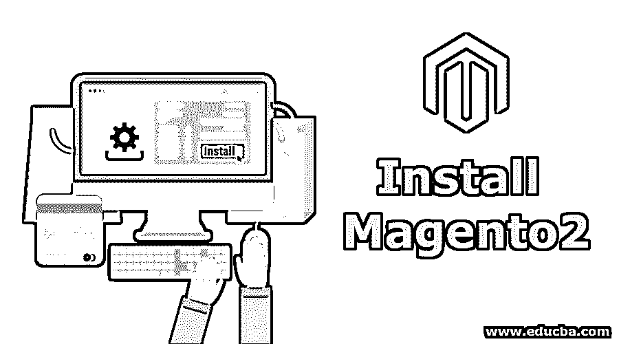


## Magento 2 安装简介

在这篇安装 Magento 2 的文章中，Magento 2 是一个领先的、强大的、非常受欢迎的电子商务平台。它使用开源技术。Magento 为在线商家提供了一个灵活且对客户友好的购物车系统。此外，它还能控制在线商店的外观、内容和功能。除此之外，该平台还提供强大的目录管理、营销以及搜索引擎优化工具。虽然 [Magento 2 的安装](https://www.educba.com/magento-versions/)很有挑战性，但我们会让它变得简单方便。随着时间的推移，当您了解系统需求和安装过程中出现的典型问题时，您会越来越熟练。请注意，Magento 2 安装不像 Magento 1 安装那样简单。但是这项任务很难完成，尽管并非不可能。

### 系统要求一览

*   操作系统是 [Ubuntu 或者 CentOS](https://www.educba.com/centos-vs-ubuntu/) 。
*   主机包含一切，如数据库、web 服务器等。
*   没有共享主机，Magento 服务器是自有的。
*   确保您的系统上已经安装了 Apache、PHP 和 MySQL。

#### 安装 Apache2 服务器

Apache HTTP 服务器被称为 Apache。这是一个免费的开源跨平台网络服务器软件。Apache 是目前流行的 HTTP 服务器中排名最高的。它运行在许多不同的平台上。后者包括 Linux、Windows、OpenVMS、NetWare 和其他操作系统。

<small>网页开发、编程语言、软件测试&其他</small>

为了安装 Apache，请在执行 Apache install 命令之前更新相关的软件包:

**代码:**

```
sudo apt update
```

```
sudo apt install apache2
```

要运行 apache，请输入以下命令:

**代码:**

```
sudo systemctl enable apache2.service
```

安装 phpMyAdmin

打开 phpMyAdmin 并为 Magento 2.0 创建数据库。

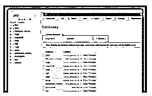


#### 下载 Magento 2 包

您可以选择从以下任何一个资源下载:

*   https://magento.com/tech-resources/download
*   https://github.com/magento/magento2/releases

#### 运行 Magento 安装向导

Magento 安装向导是一个多页向导。在其中，用户一次只能后退和前进一页。请注意，任何页面都不能跳过。在进入下一页之前，必须在每一页上输入所有必需的数据。

*   在浏览器地址栏中输入以下 URL:http://www.example1.com/magento2.·example1.com 是您的域名，如 localhost，localhost.com，127.0.0.1 或您的中转域。magento2 是 htdocs 中的 Magento 2 文件夹。通常是 http://localhost/magento2。
*   选择同意并设置 Magento 开始安装。

### 如何安装 Magento？

访问这个地址 http://localhost.com/magento2,一号将得到这个 Magento 安装向导如下:

**

** 

**胃部安装:**

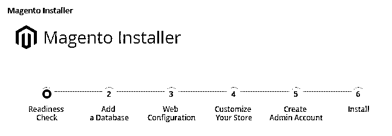


**第一步:准备就绪检查**

选择开始就绪检查。如果存在任何错误，您必须在继续之前修复它们。选择更多详细信息(如果有)以查看有关每项检查的附加数据

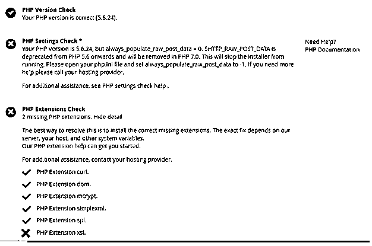


**第二步:添加数据库**

“添加数据库”将设置 Magento 数据库。

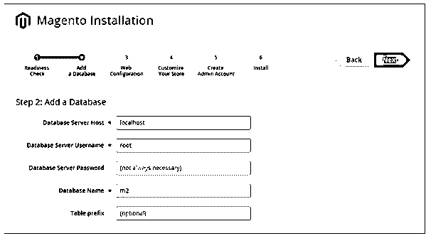


填写数据库数据，然后单击“下一步”。

**步骤 3:网络配置**

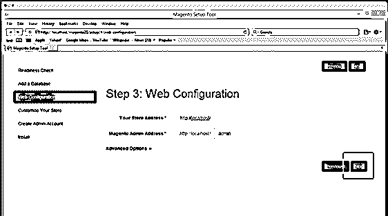


输入以下数据:

*   商店地址:http://www.example1.com。
*   Magento 管理员地址:输入 URL 以访问 Magento 管理员。
*   然后选择下一步。

**第四步:定制你的商店**

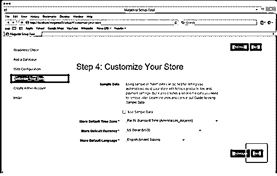


在商店默认时区列表中，选择商店时区的名称。

*   在“商店默认货币”列表中，选择要在商店中使用的默认货币。
*   在“商店默认语言”列表中，选择要在商店中使用的默认语言。
*   在安装 Magento 之前，展开“高级模块配置”可以选择启用或禁用模块。

**高级模块配置**


选择下一步

**Note:** Employ Skip dependency check for individual modules with care. The reason is that the typical cause for this error is the manual edition of the deployment configuration. Editing the deployment configuration is not advised. The reason is that future Magento software updates can undo the changes made.

**第五步:创建管理员帐户**

**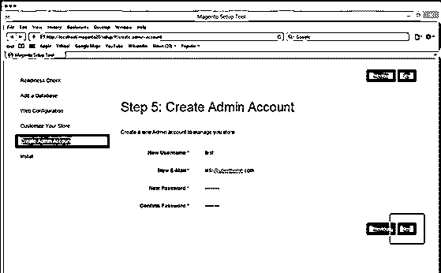

** 

首先输入管理信息。下一步选择“下一步”。

**第六步:安装**

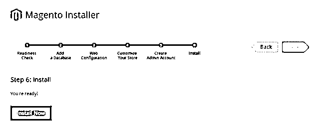


现在选择“立即安装”。

将显示消息“成功”,确认安装已完全正确完成。

**第七步:检查结果**

现在检查前端和后端，以验证 Magento 2 是否正确安装在系统上。

**安装后:**Magento 2 安装正确吗？

**验证 Magento 2 店面**

如果你已经安装了网址为 https://www.yourwebsitename.com 的 Magento 2，然后在网络浏览器中打开它。如果显示以下 storefront 页面，则 Magento 2 已成功安装在您的系统上。

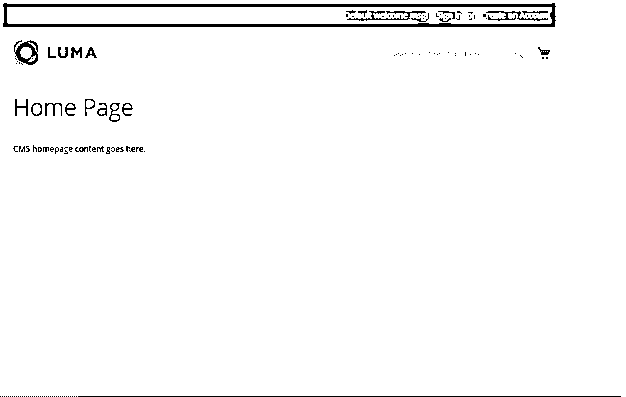


**验证 Magento 管理员**

*   在 web 浏览器中导航到 Magento。

例如，https://www.yourwebsitename.com/ Admin _ magento 2，其中 https://www.yourwebsitename.com/是您的 Magento 安装基础 URL，管理员 URI 是 admin_magento2。

*   以 Magento 管理员的身份登录。

如果以下页面显示在您的网络浏览器上，这意味着 Magento 2 已成功安装在您的系统上。

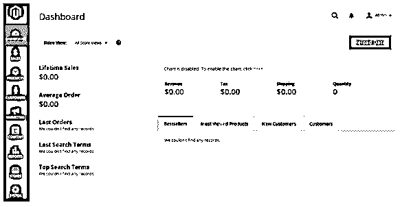


恭喜你！您现在已经安装了最新版本的 Magento 2。

### 结论

因此，安装过程已成功完成。请注意，安装过程可能因操作系统而异。但基本面是一样的。您只需要根据需求调整安装过程。如果你发现自己很难安装 Magento 2，你可以把这项工作外包给一个有资格和经验的 Magento 专家。他/她将预测安装过程中的棘手部分，并以最短、最省钱的方式无缝安装 Magento。但是，建议您自己进行安装。起初，这个过程可能看起来棘手和困难。然而，坚持下去，你会发现整个过程简单而容易。这样你就可以独立并自信地安装 Magento.1 的下一个版本

### 推荐文章

这是安装 Magento 2 的指南。在这里，我们学习了安装 Magento 2 的系统要求和各种步骤。您也可以看看以下文章，了解更多信息–

1.  [安装 UNIX](https://www.educba.com/install-unix/)
2.  [安装 Hadoop](https://www.educba.com/install-hadoop/)
3.  [Magento 面试问题](https://www.educba.com/magento-interview-questions/)
4.  [安装 Kotlin](https://www.educba.com/install-kotlin/)


