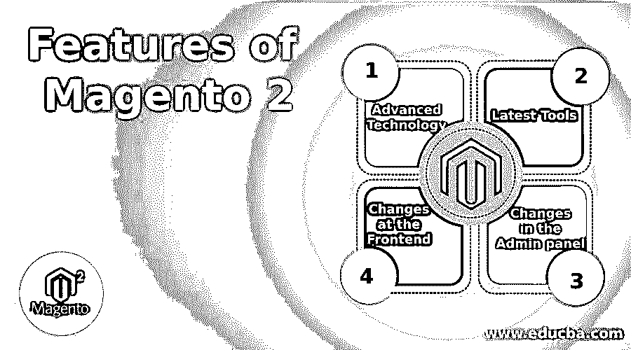

# Magento 2 的特点

> 原文：<https://www.educba.com/features-of-magento-2/>

## Magento 2 简介

Magento 是一个用户友好的可定制工具，适用于任何类型的电子商务应用程序，它是一种开源技术。Magento 工具因其显著的特性而广为人知并被广泛选择，即能够促进任何类型的基于电子商务的应用程序，可作为免费的开源软件获得，前端界面的用户友好外观，灵活和可扩展的后端数据库单元。

### Magento 2 的特点

以下是 Magento 2 的最新功能:

<small>网页开发、编程语言、软件测试&其他</small>

#### 1.先进技术

*   Composer 是一个依赖于 PHP 的管理器。我们可以声明依赖项，Composer 将帮助我们管理依赖项，分别安装和更新它们。composer 简化了安装和更新扩展以及每次更新 Magento 的过程。
*   Varnish 4 是一个开源的 HTTP 加速器，它将页面和其他资产存储到内存中，以减少响应时间和网络带宽消耗。
*   在 Magento 1 中，全页面缓存仅用于 Magento Enterprise Edition，而在 Magento 2 中，全页面缓存包含在所有版本中，允许从静态页面缓存内容，最终提高性能并减少服务器负载。
*   RequireJS 是一个动态加载 Javascript 文件的库，它减少了 HTTP 请求的数量，从而提高了 Magento 存储的速度。
*   在 Magento 1 中，前端是使用 Prototype 作为 javascript 语言开发的，而在 Magento 2 中，用于 Javascript 编码的语言是 jQuery。
*   Knockout.js 是一个开源的 Javascript 库，有助于实现模型-视图-视图模型(MVVM)模式，并提供了一种更简单的开发前端组件的方法。
*   LESS 是一个开源的 CSS 预处理器，支持开发人员为商店编写不同的样式。对扩展的维护和支持现在也非常容易。
*   Magento UI 库是一个模块化的前端库，它有一组通用元素的组合，也有助于提高开发人员处理前端任务的效率。

#### 2.最新工具

*   现在，商家和开发者可以使用 Magento performance Toolkit 对 Magento 安装进行性能测试。该工具还可以测试所做的定制。
*   Magento 2 命令行工具是一个在 Magento 安装时运行一组命令来清除缓存的工具，它也有助于存储的重新索引、备份创建和激活维护模式。
*   数据迁移工具帮助开发人员将数据从 Magento 1.x 迁移到 Magento 2。这个工具包括验证、过程跟踪、功能测试和日志记录。
*   代码迁移工具包帮助开发人员将 Magento 1.x 的扩展和定制迁移到 Magento 2。要使 Magento 1.x 扩展与 Magento 2 兼容，需要验证和更新扩展。
*   很多人抱怨 Magento 1 没有足够的文档给开发者。在 Magento 2 中，这个问题已经得到解决，并创建了一个正式的 Magento 2 开发者文档。它包含开发人员、系统管理员和质量分析师的信息。

#### 3.管理面板中的更改

*   管理面板现在也允许内嵌编辑。这有助于更有效地管理数据。
*   在管理面板中，产品添加/编辑页面是一个重要页面。使用此页面的体验现已得到增强，我们现在可以逐步管理产品，其中字段和导入工具被分成不同的部分。

#### 4.前端的变化

*   在最新版本中，Magento 还允许我们在产品中添加视频，这增强了产品的展示方式。
*   结帐页面已经被简化，现在用户可以在更短的时间内购买产品。也增加了店铺的转化率。
*   Magento 2 在订单成功页面为客户提供了注册选项，这也减少了结账过程。

### Magento 的功能一览

*   客户细分和个性化使购物体验更具互动性，从而提高了转化率。产品的动态展示，根据性别、年龄、订单历史等特征为特定客户提供促销优惠。也增加了销售的机会。
*   基于动态规则的产品关系分配规则，以了解应该为不同客户群的追加销售和交叉销售展示什么样的产品。基于条件的工具用于设置针对产品建议的规则。
*   弹性搜索为客户犯的拼写错误提供建议，进行同义词管理以增加搜索的相关性。它处理大量的目录，从而扩大了搜索能力。
*   它拥有强大的管理体验。一个高级的交互式用户界面使管理面板工作更容易。仪表板有助于监控业务，分析销售和其他业务相关数据。
*   Magento Commerce Cloud 拥有基于 AWS 的环境，具有高可扩展性和可用性，高速 CDN 提供了良好的用户体验。

### 结论

基于以上特点，我们可以说 Magento 2 是目前电子商务企业的最佳解决方案。先进技术的使用使这个平台更加以客户为中心，最终提高了商店的转化率。从 Magento 1 升级到 Magento 2 对开发人员、系统管理员和质量分析师都很有帮助。目前，像路虎、天美时、天伯伦等公司。对 Magento 2 很有信心。

### 推荐文章

这是 Magento 2 的功能指南。在这里，我们讨论 Magento 2 的功能介绍和不同的功能，如先进的技术，最新的工具等。您也可以浏览我们推荐的文章，了解更多信息——

1.  [Magento 面试问题](https://www.educba.com/magento-interview-questions/)
2.  [WordPress vs Magento](https://www.educba.com/wordpress-vs-magento/)
3.  [如何安装 Magento？](https://www.educba.com/install-magento/)
4.  [Magento 建筑](https://www.educba.com/magento-architecture/)

