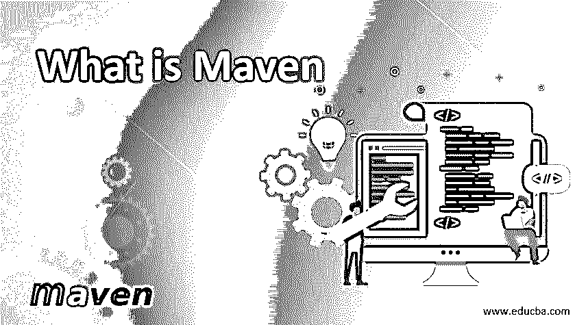
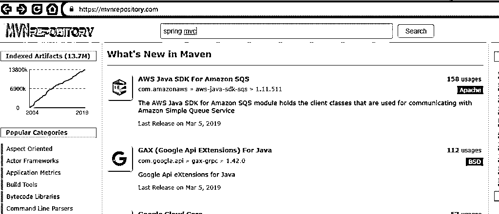
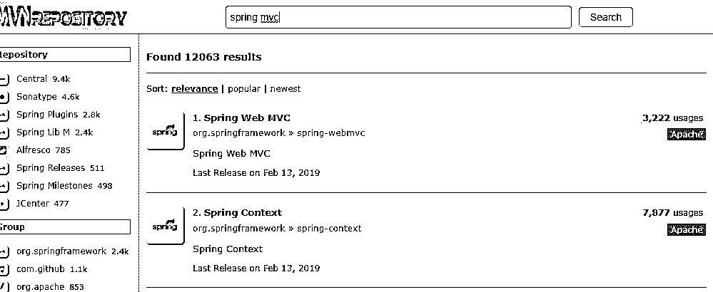
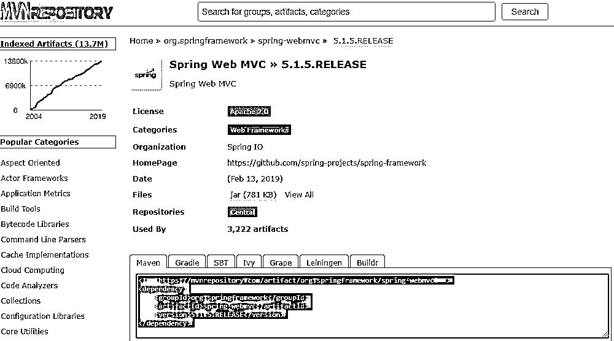
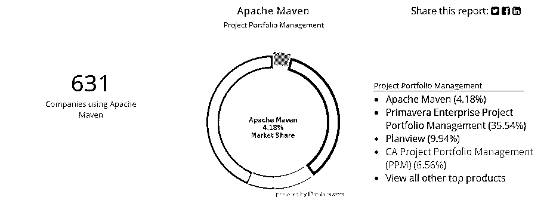
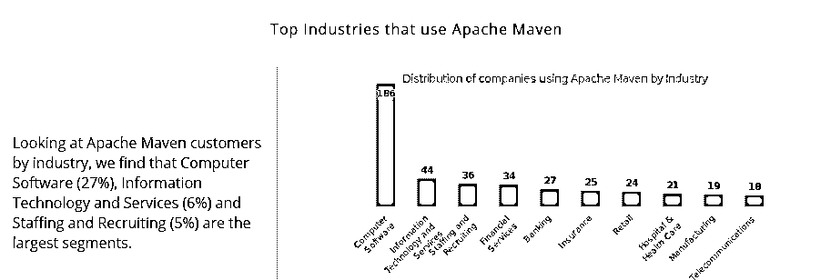
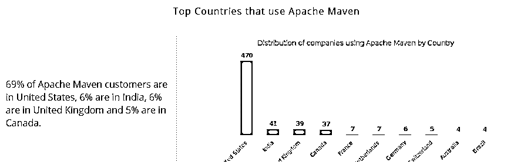
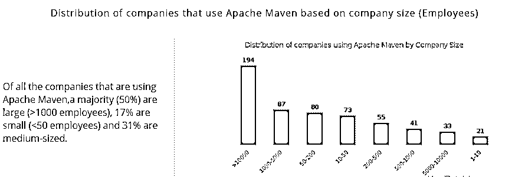
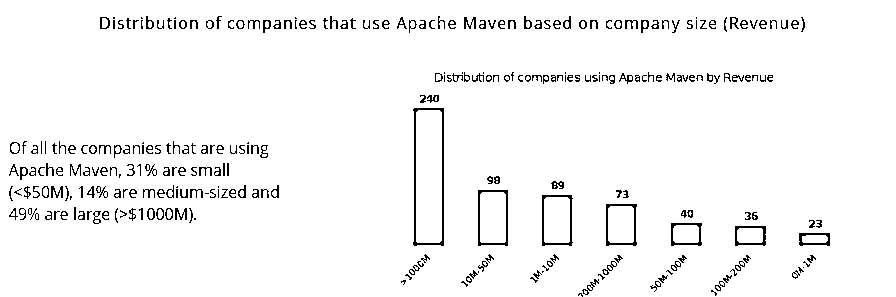

# Maven 是什么？

> 原文：<https://www.educba.com/what-is-maven/>

## Maven 简介

Apache 提供的 java 构建工具用于帮助以 Java 和 C#编写的任何复杂程度的项目的构建、文档和依赖过程，该工具使用项目对象模型(POM ),并遵循源代码、编译代码等的惯例，称为 Maven。它是声明性的，遵循。xml 文件系统，还有助于用一致的接口管理构建过程的依赖性。使用存储库，它通常被认为是一个项目管理工具，因为它可以管理所有的项目依赖和维护。

### Maven 是什么？

它意味着知识的积累。这是一个意第绪语单词，在雅加达涡轮机项目中首次出现，当时试图简化建造过程。

<small>网页开发、编程语言、软件测试&其他</small>

### 对 Maven 的理解

它是一个受 Apache 许可的项目构建工具，Maven 资源库中有大量可用的库。

在一个项目中，获得正确的 JAR 文件是一项困难的任务，因为两个独立包的版本可能会有冲突。然而，它确保所有的 JAR 文件都存在于它的存储库中，并避免任何这样的冲突场景。

为了从 Maven 获取这些 JAR 文件，我们需要访问 [Maven 仓库](https://www.educba.com/maven-repository/)并搜索确切的依赖项，比如 Spring 依赖项、Hibernate 依赖项等。

理解项目是它的首要要求。在 Maven 项目中，最重要的文件是 pom.xml 文件。现在，根据依赖关系，您需要在这个 pom.xml 文件中提到确切的名称。例如，如果您需要 Hibernate 依赖项，您需要在 dependencies 标记中指定它们。

项目到达 GroupId 后。现在，不同的公司或人建立不同的项目，这突出了确保每个项目都是独特的问题。因此，这个唯一性的问题可以通过使用唯一的 ArtifactId 或 GroupId 来解决，它将一个项目与另一个项目区分开来。这是通过将代表项目名称的 ArtifactId 与描述包的 GroupId 结合起来实现的。例如，假设一个 GroupId 被命名为 com.telus，ArtifactId 被命名为 proj，那么包名就是 com.telus.proj.web。

### 它是如何让工作变得如此简单的？

要下载依赖项，我们需要访问不同软件的官方网站，这通常会很痛苦。现在，我们可以访问[mvnrepository.com](https://mvnrepository.com/)，而不是访问单独的站点，这是 JAR 文件的中央存储库。进入网页后，转到搜索栏，键入您想要的任何依赖项。在这里，我们已经搜索了 Spring MVC，然后单击 Search。

现在，点击第一个链接——Spring Web MVC。

单击最新版本并复制 pom 文件，这样就有了所需的 JAR 文件。

它有一个远程存储库和一个本地存储库。JAR 文件将从远程存储库下载，但是我们系统中的本地存储库将首先被搜索任何依赖项，并且不成功的搜索将使它查看远程存储库。这提高了性能，因为下一次只能在本地存储库中找到依赖关系。

### 顶级专家公司

它现在已经被许多顶级跨国公司采用，这些公司希望使用一个公共框架来简化项目开发过程，该框架包含了项目中特定构建所需的所有必要的依赖项和插件。以下是世界上一些在工作流程中使用 it 的顶级公司。

1.  **摩根大通:-** 它是最大的投资银行公司之一，在其几个大数据开发项目中使用 Maven。
2.  **Edaptive Computing Inc .:-**ECI 是自动化、优化和复杂系统解决方案领域的领导者之一，为众多公共和私营部门客户提供服务。它与各种需要它理解的 Java 项目一起工作。
3.  Red Hat Inc.:- 这是一家为社区开发开源软件的美国软件公司。红帽有 Maven 的各种用法。
4.  One 97 Communications Ltd:- 这是一家印度移动互联网公司，提供酒店预订、交易、音乐、视频游戏等服务。
5.  **Agilysys Inc.:-** 提供分析、移动解决方案、文档管理等软件。

### Maven 的各种子集

以下几点是 Maven 的子集。

*   理解它要从构建工具开始。可部署的工件可以从源代码中创建，并部署在服务器上。此外，构建可以是自动化的或可重复的，它独立于集成开发环境，也可以与其他工具集成。
*   第二个子集是依赖关系管理，它帮助组织和维护项目中所需的插件和依赖关系。有一个集中的存储库，可以从其中下载项目依赖项，并解决由于项目中缺少足够的库而经常引起的问题。有时，在一个实例中使用的依赖项可能不会在另一个实例中使用。因此，指定依赖关系的范围将对何时使用以及何时不使用施加条件。
*   第三个子集是项目管理，它只包含一个 pom 文件，其中包含了我们项目的必要细节。我们还可以对一些重要的信息进行编目，比如项目版本、开发人员的名字、网站等等。不同版本代码的差异允许创建变更日志。也有一个选项来正确地记录我们正在开发的软件。为了了解代码，我们可以创建 Java 文档并生成报告，以获得关于项目的信息并解决任何缺失的任务。
*   它在多个项目之间保持一致性和统一性，这确保了效率并为所有项目维护了标准化的目录结构。它帮助 Maven 理解不同东西的位置，因为它迫使人们将所有的源代码保存在一个特定的目录中，这与 ANT 不同。这将在所有项目路径中保持同步。因此，大多数项目都遵循相同的模式，这使得它成为一个非常强大的工具。

### 使用 Maven

它有如此多的组件，通过相互交互来帮助我们的项目执行构建。首先，在命令提示符下输入命令–mvn install。

install 命令将检查 pom.xml 文件，以了解项目和要执行的构建的需求。它读取的数据部分是项目的信息，在这个空间中，我们可以找到一种方法来寻找将通过构建创建的工件。

依赖性和插件也将被查看。构建工件需要插件，因为这些是针对代码的操作，而依赖项是项目所需的库。

Maven 的依赖项管理器帮助获取插件或依赖项。它以这样一种方式工作，即依赖关系管理器会查看列出了依赖关系和插件的 pom 文件，然后它会访问各个存储库。首先，依赖项管理器将搜索本地，如果没有找到，那么它将查看远程存储库，如 Maven 中央存储库、Nexus 存储库等。在那里可以找到藏物。

一旦插件和依赖项可用，项目生命周期就开始了。这些阶段包括编译、测试和安装。所有的阶段都将与相关的插件一起执行。

### Maven 的优势

下面给出了所解释的优点。

*   简化任何项目的构建过程。
*   它在整个构建过程中保持一致性。
*   理解我们正在进行的项目是非常重要的。它提供了有关该项目的全面信息。
*   为了确保项目的质量，有必要以尽可能好的方式开发项目，它提供了实现这一点的指导方针。
*   通常在一个项目中，需要迁移到新的特性，有了它，迁移就简化了。

### 为什么要用 Maven？

我们应该使用它的原因。

*   它是一个构建工具，允许生成类似 jar 文件的库，但是代码被打包成一个可分发的库。
*   作为一个依赖关系管理工具，依赖关系的获取和管理与我们通常处理它们的方式不同。
*   它的另一个特点是它的项目管理功能，这是其他项目管理工具中最强的。像名称或版本号这样的软件信息可以作为 Maven 包含在内。因此，可以从中获得项目的总体概况。
*   如前所述，在 it 领域有一种标准化的构建软件的方式，这与其他领域的做法不同。在 Maven 中每个项目都保持了一致性，这提高了效率。
*   作为一个命令行工具，其中的所有指令都需要通过命令提示符传递，并且它会执行一组任务来构建项目。此外，像 Eclipse 这样的几个 ide 也可以用于使用 Maven 构建应用程序。

#### 范围

*   在当今的企业世界中，它有着巨大的应用范围。下面的统计数据表明，除了被监控的其他五千个产品之外，它在项目组合管理中占据了 4.2%的份额。

*   就行业用途而言，它也广受欢迎。计算机软件行业使用 Apache Maven 最多，占 27%，其次是信息技术，占 6%，招聘占 5%。

*   就使用 Apache Maven 的国家而言，美国以 67%的份额领先，其次是印度的 6%，英国的 6%，加拿大的 5%。

*   根据员工的公司规模，它在员工人数超过 1000 人的大公司中占有相当大的份额，而中型公司有 31%，小型公司有 17%。

*   就使用它的公司的收入而言，49%的公司收入超过 10 亿美元。

### 我们为什么需要它？

任何新项目都需要使用第三方库。例如，一个使用 MYSQL 和 JAVA 的项目需要一个 MySQL-connector-java jar 文件。此外，使用 Spring MVC 需要大量的依赖项。所有这些框架都需要自行下载所有的依赖项，这既繁琐又耗时。此外，在更新到最新版本的情况下，我们必须再次访问存储库并下载所有这些依赖项，这将是一个挑战。它解决了这个问题，因为它获得了项目所需的 JAR 文件并避免了任何冲突。

### 谁是学习这项技术的合适受众？

它简化了项目开发的过程，提供了开发和维护项目的标准化方法。因此，它的必要性在所有领域都是多样化的，如前所述，从计算机软件到信息技术的员工在工作中都需要 Maven。

### 这项技术将如何帮助你的职业发展？

正如本文所见，它被用于 Java 相关的项目中。现在，随着 Java 在世界范围内的广泛使用，它增强了 Maven 的重要性，因此现在大多数公司都在寻找有 Maven 经验的人来担任 Java 开发角色。最近的 LinkedIn 搜索给出了 2300 个关于 Apache Maven 技能要求的惊人结果。

### 结论

如果您是 web 开发人员或 Java 开发人员，几乎可以肯定的是，在您的项目中，您会经常需要它。此外，基于当前对 Maven 的需求，有必要了解与市场相关的技术，并制定更好的标准化项目。

### 推荐文章

这是一个什么是 Maven 的指南？.在这里，我们讨论了基本概念、工作、需求、范围、用途，以及优势和顶级 maven 公司。您也可以阅读以下文章，了解更多信息——

1.  【T0 度与腹部】T1
2.  [Maven 生命周期](https://www.educba.com/maven-life-cycle/)
3.  [Maven 排除依赖关系](https://www.educba.com/maven-exclude-dependency/)
4.  [Maven 展开](https://www.educba.com/maven-deploy/)