# 如何安装 Maven？

> 原文：<https://www.educba.com/install-maven/>

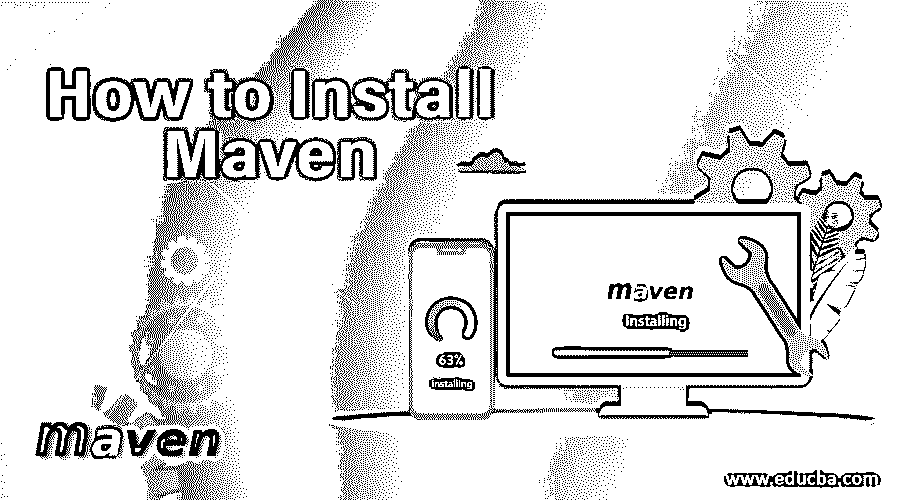

## 如何安装 Maven？

以下文章提供了如何安装 Maven？maven 是一个用来构建和管理任何基于 Java 的项目的工具。它使得维护项目、发布项目信息以及跨多个项目共享 jar 变得更加容易。除此之外，Maven 还是一个开源工具。

以下是 Maven 的一些关键特性:

<small>网页开发、编程语言、软件测试&其他</small>

*   简单的项目设置。
*   一个庞大且不断增长的库和元数据存储库。
*   能够轻松地同时处理多个项目。
*   能够用 Java 或脚本语言轻松编写[插件。](https://www.educba.com/uses-of-javascript/)
*   只需很少或不需要额外配置即可即时访问新功能。
*   易于与源代码控制系统集成。
*   jar 和其他依赖项的中央存储库。

### 下载 Apache Maven

Apache Maven 3.6.0 是最新的发行版，并推荐给 https://maven.apache.org/downloadable.的所有用户

以下是下载的系统要求:

| **JDK 版** | 对于 Maven 3.3.0 及更高版本，需要 JDK 1.7 及更高版本。为了构建 JDK 版本 1.3 和其他版本，可以使用工具链。 |
| **内存** | 没有特别的要求。 |
| **OS** | 无最低要求。 |
| **磁盘** | 10 MB 用于 Maven 安装，而额外空间用于本地存储库。近似的 500 MB 的额外空间用于本地存储库。 |

### 在 Windows 上安装 Maven

下面给出了在 windows 上安装 maven 的过程:

**1。在安装 Maven 之前，请确保您的设备上安装了所需的 [JDK](https://www.educba.com/what-is-jdk/) 版本。**

**2。**从 https://maven.apache.org/download.cgi 下载 Maven

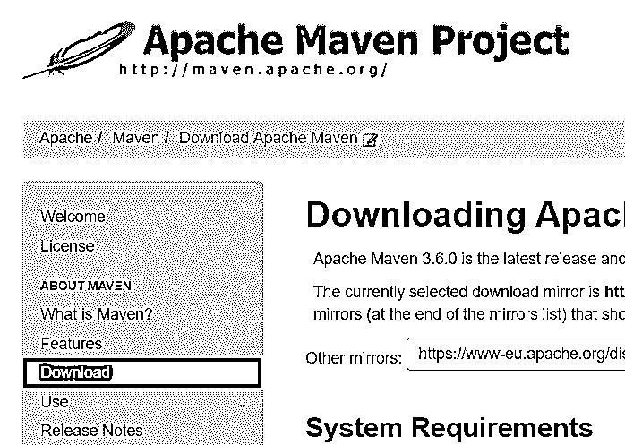

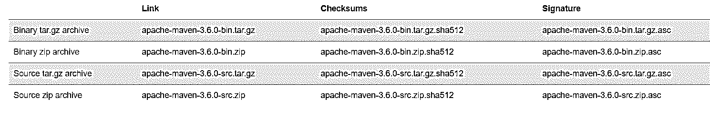

选择链接选项 Apache Apache-maven-3 . 6 . 0-bin . zip 下载 zip 文件

**3。**将文件保存在您的本地服务器上

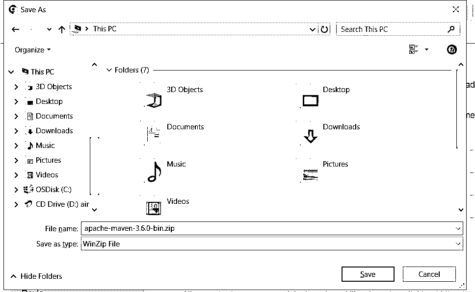

**4.1** 将文件解压到 C:(此处 C:/Maven)中一个新的用户自定义文件夹。

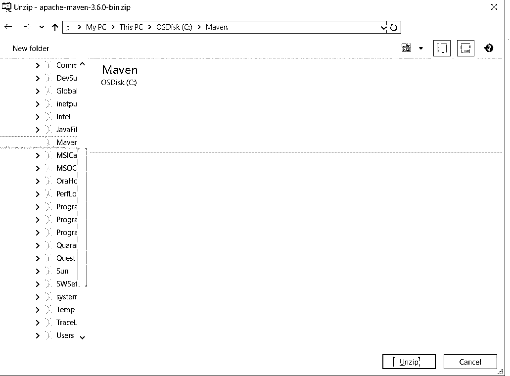

**4.2** 拉开拉链后，出现如下图:

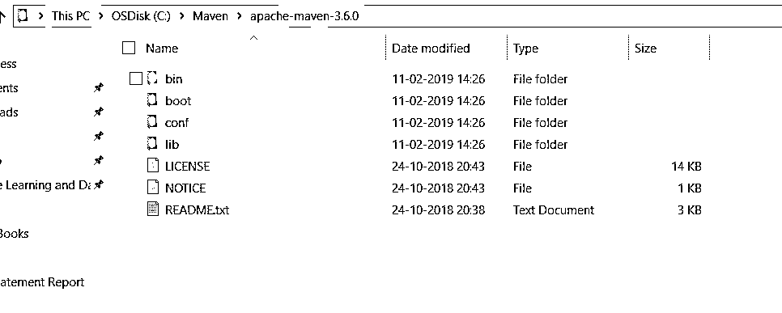

**5。** **1** 转到- >查看高级系统设置- >高级- >环境变量…- >新建。

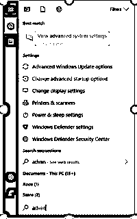

给变量名和变量值如下:

**5.2 变量名:** MAVEN_HOME

**变量值:** C:\Maven\apache-maven-3.6.0

**Note:** Here, the variable value is the path where you unzipped your downloaded Maven files, as shown in the image below.

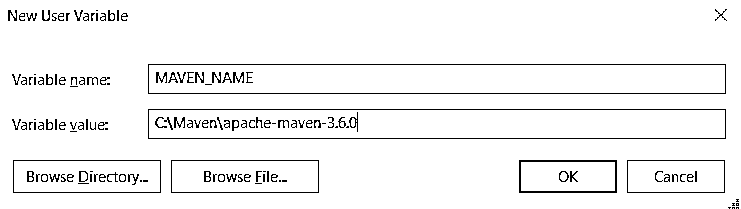

**6。**将“%MAVEN_HOME%\bin”添加到路径中

系统变量->路径->编辑->新建。

将“%MAVEN_HOME%\bin”添加到路径中。

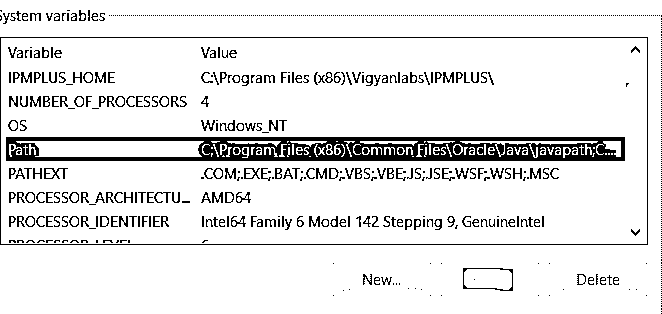

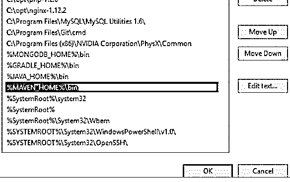

您已经成功安装了一个 Maven 应用程序。

**7。**要进行验证，请打开命令提示符。

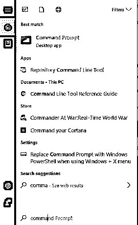

现在，键入命令“mvn–version ”,然后单击 enter。

关于工具当前版本和 MAVEN_HOME 位置的所有信息都将显示在您的屏幕上。

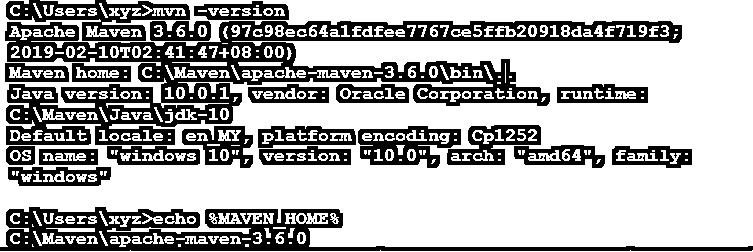

恭喜你！!Maven 安装成功！现在，您可以使用 maven 存储库来工作了。

### 当 Maven 安装时我们会得到的错误

如果出现如下错误:

#### 1.可能的错误 1

“mvn”不被识别为内部或外部命令、可操作程序或批处理文件。

**解决方案:**

检查您的%MAVEN_HOME%\bin 是否已正确添加到提到的“path”系统变量中。如果没有，添加它并再次运行命令并检查。

#### 2.可能的错误 2

JAVA_HOME 环境变量定义不正确。

运行这个程序需要这个环境变量。

注意:JAVA_HOME 应该指向一个 JDK，而不是 JRE。

**解决方案:**

如前所述，请确保您的系统上已经安装了 JDK 文件和版本。有关 Apache Maven 安装所需版本的更多详细信息，请参考需求表。如果问题仍然存在，请检查 JAVA_HOME 系统变量是否配置正确。如果没有，请进行配置并重复安装过程。

### 推荐文章

这是如何安装 Maven 的指南？这里我们已经分别讨论了安装 maven 的基本指令和不同步骤。您也可以阅读以下文章，了解更多信息——

1.  [Maven 命令](https://www.educba.com/maven-commands/)
2.  [Maven 阶段](https://www.educba.com/maven-phases/)
3.  [Maven 展开](https://www.educba.com/maven-deploy/)
4.  [Maven 面试问题](https://www.educba.com/maven-interview-questions/)