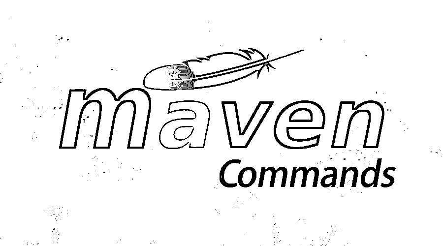
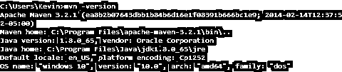
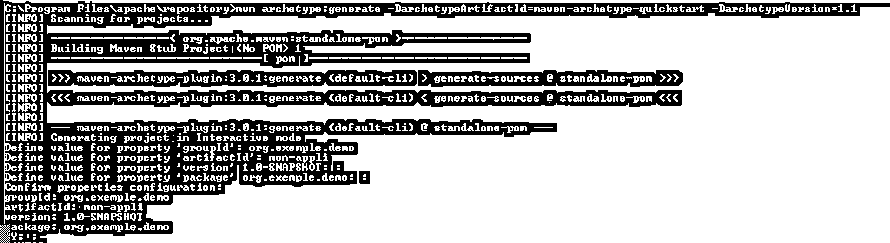
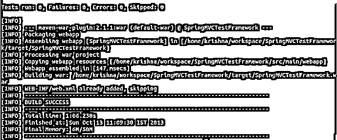
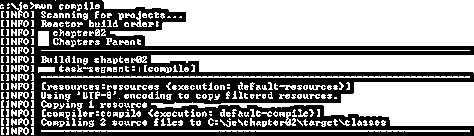
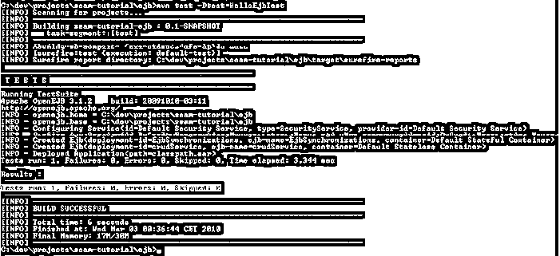
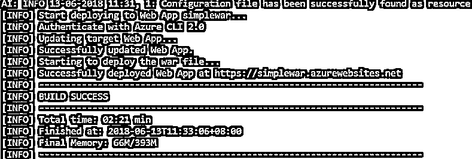
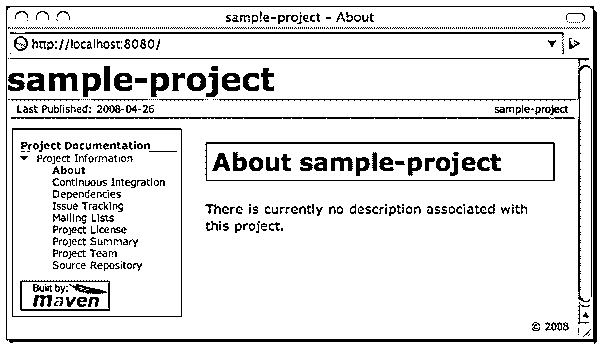
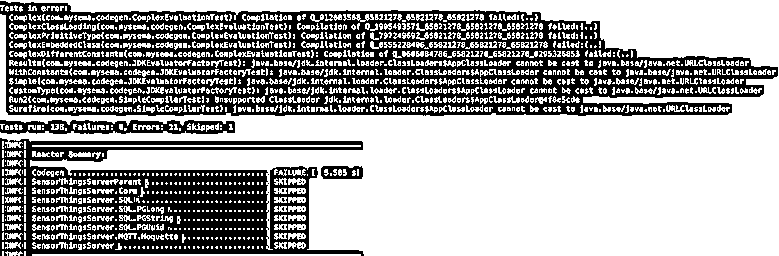

# Maven 命令

> 原文：<https://www.educba.com/maven-commands/>

## Maven 命令简介

Maven 是由 Apache 开发的[软件](https://www.educba.com/apache-interview-questions/)项目管理和理解工具。它最初于 2004 年 7 月发布。基本上是用来构建 C#、Ruby、Scala 等语言编写的项目。Maven 非常稳定，并提供了[不同的插件](https://www.educba.com/maven-plugins/)，可以帮助生成 PDF 版本，也可以生成最近所做的任何更改的列表。它很容易使用，因为每个项目都有一个项目对象模型[，它是一个 XML 文件](https://www.educba.com/xml-commands/)，包含项目的所有细节。此外，通过 Maven 很容易迁移任何新特性。让我们看一下所使用的那些命令。

### 基本 Maven 命令

以下是您应该了解的基本命令。

<small>网页开发、编程语言、软件测试&其他</small>

*   **Mvn–version:**这个命令帮助我们了解所安装的 Maven 的当前版本

*   **创建项目:**要使用下面的 MVN 架构创建项目，应使用 maven 命令。

mvn 原型:generate-DgroupId = com . my company . app-darti factid = my-app-DarchetypeArtifactId = maven-archetype-quick start-DarchetypeVersion = 1.4-DinteractiveMode = false

maven 使用的模板被称为原型。通过使用上面的命令，Maven 将获得所有的原型。它将做所有的配置，并将生成一个工作项目。通过提供有助于轻松创建应用程序的原型 ArtifactId 属性，可以简化这种架构。

*   **MVN 包:**该命令用于执行所有 Maven 阶段，直到包阶段。它完成编译、验证和构建项目的工作。它构建 jar 文件，并将其放在指定项目下的指定文件夹中。

*   **mvn clean install:** 这个 maven 命令有助于执行一个干净的构建生命周期，并在默认的构建周期中安装构建阶段。这个构建生命周期可能有其构建阶段，并且在每个构建中，有不同的构建目标。此外，这还可以确保在新的构建中删除构建目标，并添加干净的目标。

*   **mvn 编译:**该命令用于编译源代码。它还编译存储在特定目标或类中的类。

*   mvn 测试: Maven 还提供了对特定代码进行单元测试的功能。它使用合适的[测试框架](https://www.educba.com/testing-frameworks-for-java/)运行测试。

*   **mvn 部署**

Maven 还可以为项目部署代码。这种部署是在集成或发布环境中完成的。它将所有最终的包复制到远程存储库，并且可以与其他开发人员共享。

*   **mvn 站点**

该命令基于项目的 pom 上的信息构建一个站点。

可以在目标/站点下看到生成的文档。

*   **运行 maven 构建作业**

一旦 maven 项目完成，编译代码、运行测试和打包等构建活动就在这里完成了。运行下面的命令将会处理所有这些活动。

*   **maven.javadoc.skip**

该命令用于跳过任何指定 Javadoc jar 文件的生成和打包。

### 中间命令

让我们讨论一下中间命令。

1.  **mvn help:description**–该命令有助于获取插件的属性。这个 maven 命令可以找到关于这个插件的所有信息。
2.  mvn help:effective-pom–通过使用该命令，用户可以获得一个 XML 格式的有效 POM。这个 XML 可以用于当前的构建和项目中存在的活动概要文件。
3.  **mvn 相关性:分析**–为了分析项目中存在的与未使用、过期的相关性等相关的相关性，可以使用该命令。
4.  **mvn dependency:tree**–该命令打印整个项目的依赖关系的完整树。这有助于获得所有可传递的依赖关系，并获得所有由于版本而产生的冲突。这个命令带来了所有不同的依赖项。
5.  **来源。skip** :这个 maven 命令跳过项目中源 jar 的完整打包。
6.  **maven . test . skip**–如果用户想要从编译和所有测试的执行中跳过一个特定的测试脚本，那么可以使用这个命令。它可以跳过任何应用程序的单元测试和集成测试
7.  **groups = { TestNG Group Name(s)}**–该命令指定单元测试的 [TestNG group](https://www.educba.com/install-testng/) ，这些单元测试将在当前构建中执行。它运行整组测试。如果没有指定组，那么将执行所有的单元测试。
8.  **准备-打包**–使用该 maven 命令，为准备任何包所需的任何操作执行所有活动。
9.  **预集成测试**–它执行将要执行的集成测试所需的所有活动。它还可以净化环境。
10.  **mvn help:effective-POM**–运行这个命令获得最少的 Maven 项目 pom.xml。

### 高级命令

下面是高级命令列表。

1.  **恢复构建**:要让这个选项工作并恢复构建，可以使用-rf 或-resume 选项。如果用户正在处理一个大型的多模块项目，并且希望重新启动“任意构建”项目，则可以使用它。
2.  **制作项目子集**:当用户指定-am 选项时，Maven 会构建指定项目拥有的所有不同项目。它可以包含直接或间接依赖于主项目的项目。
3.  **创建 maven 包装器**:创建 Maven 包装器有两种方法

*   cd {您的项目}
*   mvn -N io.takari:maven:wrapper

这个命令有助于用最新的可用 Maven 版本为特定项目创建一个 [Maven 包装器](https://www.educba.com/install-maven/)

### 使用 Command 的提示和技巧

1.  **Maven pl 选项**:该命令用于构建特定的反应堆项目。没有必要运行整个项目。
2.  **调试单元测试:**maven-surefire 插件帮助运行单元测试。这个插件调用测试阶段，也有助于构建生命周期。

### 结论

它是项目创建、单元测试及其部署的最佳工具之一。它在一个工具中提供了所有这些步骤。它提供了更好的调试、更好的协作和更强大的构建。这也有助于通过更一致的项目结构来减少重复。最后，它通过包含所有传递依赖的更好的分层依赖树来实现更好的依赖管理。这是所有可用工具中的最佳选择之一。

### 推荐文章

这是 Maven 命令的指南。在这里，我们讨论了基本、中级和高级 Maven 命令以及使用的技巧和诀窍。您也可以阅读以下文章，了解更多信息——

1.  [HBase 命令](https://www.educba.com/hbase-commands/)
2.  [MongoDB 命令](https://www.educba.com/mongodb-commands/)
3.  [Maven 生命周期](https://www.educba.com/maven-life-cycle/)
4.  [Maven 排除依赖关系](https://www.educba.com/maven-exclude-dependency/)